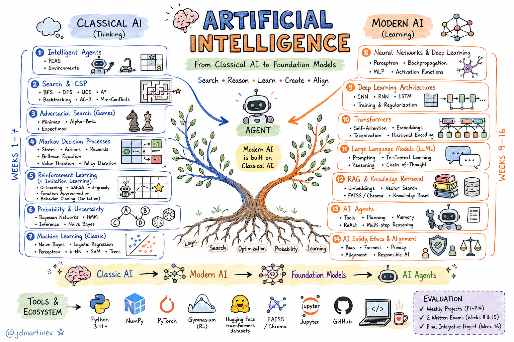

# SI3003 - Artificial Intelligence — Undergraduate Course
### 16 weeks · 1 session (3h) / week · Python

> Figure: course roadmap — Part 1 (classical foundations) → Part 2 (modern AI) → integrative final project. *(placeholder — replace with your own diagram)*

Course repository. This course follows the **rational agent tradition** (Berkeley CS188 / Stanford CS221 lineage): a 50/50 balance between classical AI foundations (search, CSP, adversarial games, MDPs, reinforcement learning, probabilistic reasoning) and modern AI (deep learning, transformers, LLMs, RAG, fine-tuning, agents). Every algorithm covered is implemented by students, not just called from a library — see [`CONTRIBUTING.md`](#course-standard) for the rigor standard this repository follows.

> This is a hard-engineering course, not an introductory/"lite" one. Audience: advanced undergraduates with a background in algebra/calculus/probability and Python. Reference courses: [Berkeley CS188](https://inst.eecs.berkeley.edu/~cs188/sp26/), [Stanford CS221](https://stanford-cs221.github.io/autumn2025/), [Harvard CS50AI](https://github.com/KevinLiTian/Harvard_CS50_AI), [ULiège INFO8006](https://github.com/glouppe/info8006-introduction-to-ai), [Universidad de Helsinki Intro to AI](https://materiaalit.github.io/intro-to-ai/).

---

## What you will learn in this course

- **Part 1 — Classical foundations (Weeks 1–7):** rational agents, uninformed and informed search, constraint satisfaction, adversarial search, Markov Decision Processes, reinforcement learning, imitation learning, probabilistic reasoning (Bayes nets), hidden Markov models, and classical ML (Naive Bayes, perceptron).
- **Part 2 — Modern AI (Weeks 9–14):** neural network fundamentals, the Transformer architecture, large language models (training, prompting, reasoning/test-time compute), retrieval-augmented generation, fine-tuning (LoRA/PEFT, RLHF/RLVR), and LLM-based agents (tool use, ReAct, planning).
- **Two written/practical evaluations** (Week 8 and Week 15) combining derivations and code reading/debugging — not multiple choice only.
- **An end-to-end integrative final project** that must combine at least one Part 1 technique with at least one Part 2 technique, with two checkpoints (Weeks 11 and 14).

---

## Evaluation

| Component | Weight |
|---|---|
| Per-topic projects (P1–P11, ~11 deliverables) | 40% |
| Evaluation 1 — Week 8 (Part 1 midterm) | 15% |
| Evaluation 2 — Week 15 (Part 2 final exam) | 15% |
| Integrative final project | 25% |
| Participation / weekly short quizzes | 5% |

Every project has **explicit, verifiable correctness criteria**: public test cases + hidden test cases, and a quantitative performance bar when applicable (e.g. "agent must win >80% of games against the random ghost", "classifier must exceed 90% accuracy on the held-out test set"). See the [course standard](#course-standard) below — no project is approved with "instructor's subjective review" as the only criterion.

---

## PART 1 — Classical Foundations

### Lecture 01 — Introduction: Rational Agents
- `Lecture01/Lecture_01.pdf` — History of AI, rational agents (PEAS), environment types, course roadmap.
- Notebooks:
  - `Lecture01/notebooks/tools_numpy.ipynb`
  - `Lecture01/notebooks/vacuum_agent.ipynb`
- Homework: implement a simple reflex agent in a vacuum-world environment (**P0**, ungraded).

### Lecture 02 — Search + CSP (compact)
- `Lecture02/Lecture_02.pdf` — Problem formulation, BFS, DFS, UCS, greedy search, A*, heuristic admissibility/consistency; CSP compressed (backtracking, AC-3, min-conflicts).
- Notebooks:
  - `Lecture02/notebooks/Search_Framework_Problem.ipynb`
  - `Lecture02/notebooks/BFS_DFS_UCS_Astar.ipynb`
  - `Lecture02/notebooks/Sudoku_Backtracking_AC3.ipynb`
- Homework (**P1**): Pacman-style search agent (multiple goals, custom heuristic), based on the CS188 project framework.

### Lecture 03 — Adversarial Search
- `Lecture03/Lecture_03.pdf` — Minimax, alpha-beta pruning, expectimax, evaluation functions.
- Notebooks:
  - `Lecture03/notebooks/Minimax_AlphaBeta.ipynb`
  - `Lecture03/notebooks/TicTacToe_Connect4_Agent.ipynb`
- Homework (**P2**): adversarial Pacman agent vs. ghosts (minimax/expectimax with a custom evaluation function).

### Lecture 04 — Markov Decision Processes
- `Lecture04/Lecture_04.pdf` — States, actions, rewards, value function, Bellman equation, value iteration, policy iteration.
- Notebooks:
  - `Lecture04/notebooks/Gridworld_ValueIteration.ipynb`
  - `Lecture04/notebooks/Gridworld_PolicyIteration.ipynb`
- Homework (**P3**): solve a configurable Gridworld with both algorithms; compare convergence.

### Lecture 05 — Reinforcement Learning + Imitation Learning
- `Lecture05/Lecture_05.pdf` — Model-free RL, Q-learning, SARSA, exploration/exploitation, function approximation; behavior cloning (imitation learning); explicit note on how this MDP/RL framework underlies GRPO/RLVR training of today's reasoning models (see Lecture 12).
- Notebooks:
  - `Lecture05/notebooks/QLearning_Gridworld.ipynb`
  - `Lecture05/notebooks/BehaviorCloning.ipynb`
- Homework (**P4**, bridge project): compare 3 ways to obtain a policy for the same environment — value iteration (L04), Q-learning, imitation learning — and discuss trade-offs.

### Lecture 06 — Probability and Bayesian Networks
- `Lecture06/Lecture_06.pdf` — Conditional probability, Bayes' rule, conditional independence, Bayes nets, variable elimination.
- Notebooks:
  - `Lecture06/notebooks/BayesNet_VariableElimination.ipynb`
  - `Lecture06/notebooks/Sampling_Inference.ipynb`
- Homework (**P5**): Bayesian inference engine applied to a realistic problem (e.g. diagnosis, genetic inheritance — CS50AI "Heredity" style).

### Lecture 07 — HMMs, Classical ML, and Part 1 Wrap-up
- `Lecture07/Lecture_07.pdf` — Hidden Markov models (filtering, forward algorithm), Naive Bayes, perceptron, logistic regression as a bridge to neural networks.
- Notebooks:
  - `Lecture07/notebooks/ParticleFilter_Tracking.ipynb`
  - `Lecture07/notebooks/NaiveBayes_TextClassification.ipynb`
- Homework (**P6**, Part 1 integrative): mini-project combining 2+ classical techniques (e.g. an agent that plans with MDP and perceives with HMM).

---

## Week 8 — EVALUATION 1 (Part 1 midterm)
- Written/practical exam covering Lectures 01–07.
- Final project kickoff: teams, scope, checkpoints (Weeks 11 and 14).

---

## PART 2 — Modern AI

### Lecture 09 — Neural Network Fundamentals (+ brief CNN/RNN intro)
- `Lecture09/Lecture_09.pdf` — MLP, activation functions, backpropagation, gradient descent variants (SGD, momentum, Adam), regularization; brief motivation of CNN/RNN and why they were superseded by attention (motivates Lecture 10).
- Notebooks:
  - `Lecture09/notebooks/MLP_from_scratch_numpy.ipynb`
  - `Lecture09/notebooks/MLP_PyTorch.ipynb`
- Homework (**P7**): image classifier (MNIST or similar) — compare "from scratch" vs. PyTorch implementation.

### Lecture 10 — The Transformer Architecture
- `Lecture10/Lecture_10.pdf` — RNN limitations, attention, self-attention, multi-head attention, positional encoding, encoder-decoder architecture.
- Notebooks:
  - `Lecture10/notebooks/SelfAttention_from_scratch.ipynb`
  - `Lecture10/notebooks/Attention_Maps_MiniTransformer.ipynb`
- Homework (**P8**): implement and visualize attention maps of a mini-transformer trained on a toy task (e.g. sequence copying, digit addition).

### Lecture 11 — LLMs: Training, Prompting, and Reasoning
- `Lecture11/Lecture_11.pdf` — Tokenization (BPE), pretraining, scaling laws, in-context learning, prompting (few-shot, chain-of-thought), hallucinations, test-time compute / reasoning models.
- Notebooks:
  - `Lecture11/notebooks/Prompting_Strategies_Benchmark.ipynb`
- Homework (**P9**): systematic LLM evaluation on a task (own small benchmark): zero-shot vs. few-shot vs. CoT.
- **Final project — Checkpoint 1** (proposal + architecture).

### Lecture 12 — RAG and Fine-tuning
- `Lecture12/Lecture_12.pdf` — Vector embeddings and similarity search, RAG architecture, full vs. efficient fine-tuning (LoRA/PEFT), alignment: RLHF (classical, human-preference reward model) → RLVR/GRPO (current, verifiable rewards). Explicit connection back to Lecture 05's MDP framework.
- Notebooks:
  - `Lecture12/notebooks/RAG_Pipeline_FAISS.ipynb`
- Homework (**P10**): question-answering system over a custom corpus using RAG.

### Lecture 13 — Modern LLM Agents
- `Lecture13/Lecture_13.pdf` — From classical agents (search/MDP) to LLM agents: ReAct pattern, tool calling, planning with LLMs, multi-agent systems. Explicit connection to Lecture 04 (an LLM agent is also a rational agent with PEAS).
- Notebooks:
  - `Lecture13/notebooks/ToolUse_Agent_FunctionCalling.ipynb`
- Homework (**P11**): agent with at least 2 tools solving a multi-step task.

### Lecture 14 — AI Safety, Ethics, and Society
- `Lecture14/Lecture_14.pdf` — AI safety (alignment, robustness, interpretability at a high level), bias, economic/labor impact, governance and regulation, recent case studies.
- Format: debate / paper discussion on a real case (bias, safety incident, or regulatory policy).
- **Final project — Checkpoint 2** (functional progress).

---

## Week 15 — EVALUATION 2 (Final exam)
- Written/practical exam covering Lectures 09–14.
- Final project dry run: quick feedback before the final submission.

## Week 16 — Final Presentations
- Integrative final project presentations, cross-team feedback, course closing: how Part 1 foundations explain and sustain Part 2 techniques.
- Deliverable: integrative project + short report (which classical technique + which modern technique it combines, and why).

---

## Course standard

All material in this repository (slides, notes, problem sets, projects, rubrics) follows a **hard-engineering, no-lite standard**:
- Every core equation of a topic must appear explicitly (not just described in prose).
- Lab code implements the algorithm — high-level libraries (PyTorch, HF `transformers`, FAISS) are only used when the week's topic is *using* that tool, not *understanding* the underlying algorithm.
- Every project has public + **hidden** test cases, plus a quantitative success criterion where applicable.
- Rubric categories have explicit, objective weights — never "general quality: 20%" left undefined.

Full checklist: [`instrucciones_hard_engineering_course.md`](instrucciones_hard_engineering_course.md).

---

## Resources

**Compute:**
- [Lightning AI Studio](https://lightning.ai/) — free CPU-only, persistent dev environment (default for the course)
- [Kaggle](https://www.kaggle.com/) — GPU notebooks (via SSH tunneling) for Weeks 9–13
- [Google Colab](https://colab.research.google.com/)
- [Weights & Biases](https://wandb.ai/site) — experiment tracking for Part 2 projects
- [Hugging Face](https://huggingface.co/) — models/datasets for Part 2

**Books:**
- Russell & Norvig, [*Artificial Intelligence: A Modern Approach*](https://aima.cs.berkeley.edu/) (4th ed.) — primary text, Part 1
- [`aima-python`](https://github.com/aimacode/aima-python) — reference implementations for Weeks 1–7
- Kochenderfer, Wheeler & Wray, [*Algorithms for Decision Making*](https://algorithmsbook.com/) — MDP/RL/imitation learning, free PDF

**Reference course repositories:**
- Berkeley CS188 — https://inst.eecs.berkeley.edu/~cs188/sp26/
- Stanford CS221 — https://stanford-cs221.github.io/autumn2025/
- Harvard CS50AI — https://github.com/KevinLiTian/Harvard_CS50_AI
- ULiège INFO8006 — https://github.com/glouppe/info8006-introduction-to-ai
- Universidad de Helsinki, Intro to AI — https://materiaalit.github.io/intro-to-ai/

---

### Notes for students
- Reports emphasize **both conceptual understanding and implementation**.
- The final project integrates a classical technique, a modern technique, and system-level design.
- The use of generative AI tools is permitted, subject to transparency and academic integrity, as stated in the course policies.
