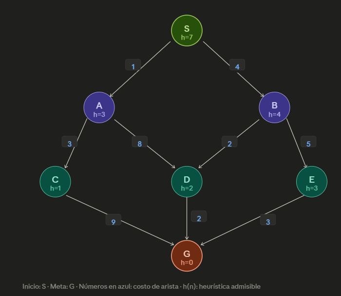

# Complejidad de los Algoritmos de Búsqueda

En esta nota se analizan cuatro propiedades fundamentales de los algoritmos de búsqueda:

1. **Completitud:** ¿Garantiza encontrar una solución si existe?
2. **Optimalidad:** ¿Garantiza encontrar la mejor solución?
3. **Complejidad temporal:** ¿Cuántos nodos expande en el peor caso?
4. **Complejidad espacial:** ¿Cuántos nodos mantiene simultáneamente en memoria?

---

## Grafo de ejemplo

Para ilustrar cada algoritmo usaremos el siguiente grafo dirigido con 7 nodos:

```

```

**Aristas y costos:**

| Origen | Destino | Costo |
|--------|---------|-------|
| S      | A       | 1     |
| S      | B       | 4     |
| A      | C       | 3     |
| A      | D       | 8     |
| B      | D       | 2     |
| B      | E       | 5     |
| C      | G       | 9     |
| D      | G       | 2     |
| E      | G       | 3     |

**Heurísticas** (admisibles):

| Nodo | h(n) |
|------|------|
| S    | 7    |
| A    | 3    |
| B    | 4    |
| C    | 1    |
| D    | 2    |
| E    | 3    |
| G    | 0    |

**Parámetros del grafo:**

- Factor de ramificación: b = 2
- Profundidad de la solución más superficial: d = 3
- Profundidad máxima: m = 3
- Costo de la solución óptima: C* = 8 (camino S→B→D→G)
- Costo mínimo de arista: ε = 1

Se asume **desempate alfabético** en todos los algoritmos.

---

# Breadth-First Search (BFS)

BFS explora el espacio de búsqueda **por niveles** utilizando una cola FIFO (*First In, First Out*).

## Completitud

✅ **Sí.**

Si existe una solución y el factor de ramificación es finito, BFS siempre terminará encontrándola.

**¿Por qué?** BFS explora exhaustivamente cada nivel antes de pasar al siguiente. Si la solución está a profundidad d, BFS necesariamente la alcanzará después de explorar todos los niveles 0, 1, ..., d−1.

## Optimalidad

✅ **Sí**, cuando todas las acciones tienen el mismo costo.

Como explora todos los nodos de una profundidad antes de pasar a la siguiente, la primera solución encontrada corresponde al camino con menor número de acciones.

**¿Y si los costos son diferentes?** BFS deja de ser óptimo. Puede encontrar un camino con menos aristas pero mayor costo total.

## Complejidad temporal

Sean:

- b: factor de ramificación.
- d: profundidad de la solución.

Antes de encontrar la solución, BFS expande aproximadamente:

$$1 + b + b^2 + \cdots + b^d$$

nodos. Como el último término domina la suma:

$$T(n) = O(b^d)$$

**Intuición:** cada nivel contiene aproximadamente b veces más nodos que el anterior. La cantidad total de nodos crece exponencialmente con la profundidad.

## Complejidad espacial

Cuando BFS termina de explorar el nivel d−1, la frontera contiene prácticamente todos los nodos del nivel d. Por tanto:

$$M(n) = O(b^d)$$

**Intuición:** la mayor parte de la memoria corresponde al último nivel almacenado en la frontera.

## Ejemplo con el grafo

```
Frontera (cola FIFO):

Paso 1: Expandir S          → Frontera: [A, B]
Paso 2: Expandir A          → Frontera: [B, C, D]
Paso 3: Expandir B          → Frontera: [C, D, E]    (D ya descubierto)
Paso 4: Expandir C          → Frontera: [D, E, G]
Paso 5: Expandir D          → Frontera: [E, G]       (G ya descubierto)
Paso 6: Expandir E          → Frontera: [G]          (G ya descubierto)
Paso 7: Expandir G          → ¡Meta encontrada!
```

- **Orden de expansión:** S, A, B, C, D, E, G
- **Camino encontrado:** S → A → C → G
- **Costo del camino:** 1 + 3 + 9 = **13** (no es óptimo porque los costos son distintos)

> **Nota:** BFS encuentra el camino con menor número de aristas (3 aristas), pero no el de menor costo. El camino óptimo es S→B→D→G con costo 8.

---

# Depth-First Search (DFS)

DFS explora primero el camino más profundo utilizando una pila (*LIFO*).

## Completitud

❌ **No.**

Si existen caminos infinitos o ciclos, DFS puede quedar explorando indefinidamente una rama sin encontrar una solución existente.

**¿Por qué?** DFS se compromete con una rama y la explora hasta el fondo antes de retroceder. Si esa rama es infinita, nunca vuelve a probar otra.

## Optimalidad

❌ **No.**

La primera solución encontrada depende completamente del orden de exploración. Puede existir una solución mucho mejor en otra rama.

## Complejidad temporal

Sea m la profundidad máxima del espacio de búsqueda. En el peor caso, DFS recorre prácticamente todo el árbol y expande:

$$1 + b + b^2 + \cdots + b^m$$

nodos. Por tanto:

$$T(n) = O(b^m)$$

**Intuición:** si la solución está en la última rama explorada, DFS terminará visitando casi todo el árbol.

## Complejidad espacial

DFS únicamente almacena el camino actual y algunos hermanos pendientes en cada nivel. Como existen aproximadamente b nodos pendientes por nivel y la profundidad es m:

$$M(n) = O(bm)$$

**Intuición:** DFS nunca necesita almacenar el árbol completo. Solo recuerda el camino actual y las alternativas pendientes. Esta es su gran ventaja frente a BFS.

## Ejemplo con el grafo

```
Pila (LIFO), se insertan vecinos en orden alfabético inverso
(para que el alfabético salga primero):

Paso 1: Pop S, push [B, A]    → Pila: [B, A]
Paso 2: Pop A, push [D, C]    → Pila: [B, D, C]
Paso 3: Pop C, push [G]       → Pila: [B, D, G]
Paso 4: Pop G                 → ¡Meta encontrada!
```

- **Orden de expansión:** S, A, C, G
- **Camino encontrado:** S → A → C → G
- **Costo del camino:** 1 + 3 + 9 = **13** (no es óptimo)

> **Nota:** DFS tuvo suerte aquí al encontrar la meta rápidamente (solo 4 expansiones). Pero encontró un camino costoso. Además, nunca exploró los nodos B, D ni E.

---

# Uniform Cost Search (UCS)

UCS utiliza una cola de prioridad ordenada por el costo acumulado g(n). Siempre expande primero el nodo con menor costo recorrido.

## Completitud

✅ **Sí**, siempre que todas las acciones tengan costo c(s, a, s') ≥ ε > 0.

**¿Por qué se necesita ε > 0?** Sin esta condición, UCS puede quedar atrapado:

- **Costos cero:** ciclos A→B→A con costo 0 generan expansiones infinitas sin progreso.
- **Costos arbitrariamente pequeños (sin cota ε):** una cadena infinita con costos 1, 0.5, 0.25, 0.125... acumula un costo que converge pero nunca llega a C*, impidiendo que UCS termine.

Con ε > 0, cada paso incrementa el costo en al menos ε, acotando el número máximo de pasos a C*/ε.

## Optimalidad

✅ **Sí**, siempre que todas las acciones tengan costo positivo.

Como los nodos se expanden en orden creciente de costo acumulado, la primera solución encontrada siempre es la de menor costo.

## Complejidad temporal

Sean:

- C*: costo de la solución óptima.
- ε: costo mínimo positivo de cualquier acción.

Si cada movimiento cuesta al menos ε, antes de encontrar la solución óptima ningún camino puede tener más de C*/ε acciones. Ese valor actúa como una **profundidad efectiva**. Por tanto:

$$T(n) = O\left(b^{C^*/\varepsilon}\right)$$

**Intuición:** UCS no explora por profundidad, explora por costo acumulado. Es como BFS pero reemplazando los "niveles de profundidad" por "niveles de costo". Con b = 2, C* = 8 y ε = 1, la profundidad efectiva es 8 y la complejidad es O(2⁸) = O(256). Si ε fuera 0.5, la profundidad efectiva sería 16 y la complejidad O(2¹⁶) = O(65536).

## Complejidad espacial

La memoria corresponde al tamaño máximo de la cola de prioridad. Antes de encontrar la solución, UCS ha generado prácticamente todos los nodos cuyo costo es menor que C*:

$$M(n) = O\left(b^{C^*/\varepsilon}\right)$$

**Intuición:** la frontera termina llena de nodos cuyo costo está cerca de C*. Es la misma idea de BFS, pero reemplazando la profundidad por el costo acumulado.

## Ejemplo con el grafo

```
Cola de prioridad (menor g(n) primero):

Paso 1: Expandir S  (g=0)   → Cola: [(A,1), (B,4)]
Paso 2: Expandir A  (g=1)   → Cola: [(C,4), (B,4), (D,9)]
Paso 3: Expandir C  (g=4)   → Cola: [(B,4), (D,9), (G,13)]
         Desempate alfabético: C antes que B (ambos g=4)
Paso 4: Expandir B  (g=4)   → Cola: [(D,6), (E,9), (G,13)]
         D actualizado: g=6 < 9 (vía B es mejor que vía A)
Paso 5: Expandir D  (g=6)   → Cola: [(G,8), (E,9)]
         G actualizado: g=8 < 13 (vía D es mejor que vía C)
Paso 6: Expandir G  (g=8)   → ¡Meta encontrada!
```

- **Orden de expansión:** S, A, C, B, D, G
- **Camino encontrado:** S → B → D → G
- **Costo del camino:** 4 + 2 + 2 = **8** ✅ (óptimo)

> **Nota:** UCS exploró inicialmente el camino por A y C, pero al descubrir el camino por B→D con menor costo, actualizó las prioridades y encontró la solución óptima.

---

# Greedy Best-First Search

Greedy utiliza una cola de prioridad ordenada únicamente por h(n), donde h(n) estima la distancia restante al objetivo.

## Completitud

❌ **No**, en general.

Una mala heurística puede hacer que el algoritmo explore indefinidamente ciertas regiones del espacio de búsqueda.

**¿Por qué?** Greedy no considera el costo acumulado. Si la heurística siempre apunta hacia una región del espacio que no contiene la meta, el algoritmo puede quedar atrapado en ciclos o caminos infinitos.

## Optimalidad

❌ **No.**

Greedy ignora completamente el costo recorrido g(n). Puede elegir un camino que parece cercano al objetivo (h(n) bajo) pero cuyo costo real sea muy alto.

## Complejidad temporal

En el peor caso, Greedy puede terminar explorando prácticamente todo el árbol:

$$T(n) = O(b^m)$$

**Intuición:** si la heurística no proporciona información útil, Greedy se comporta como una búsqueda casi ciega.

## Complejidad espacial

Todos los nodos generados permanecen almacenados dentro de la cola de prioridad hasta ser expandidos. En el peor caso:

$$M(n) = O(b^m)$$

**Intuición:** aunque normalmente expande menos nodos que UCS, la frontera también puede crecer exponencialmente.

## Ejemplo con el grafo

```
Cola de prioridad (menor h(n) primero):

Paso 1: Expandir S  (h=7)   → Cola: [(A, h=3), (B, h=4)]
Paso 2: Expandir A  (h=3)   → Cola: [(C, h=1), (B, h=4), (D, h=2)]
Paso 3: Expandir C  (h=1)   → Cola: [(G, h=0), (D, h=2), (B, h=4)]
Paso 4: Expandir G  (h=0)   → ¡Meta encontrada!
```

- **Orden de expansión:** S, A, C, G
- **Camino encontrado:** S → A → C → G
- **Costo del camino:** 1 + 3 + 9 = **13** ❌ (no es óptimo)

> **Nota:** Greedy se dejó engañar por las heurísticas bajas de A (h=3) y C (h=1). Ambos nodos "parecían" estar cerca de la meta, pero el camino real por ellos tiene costo 13. La heurística fue admisible (nunca sobreestimó), pero eso solo garantiza optimalidad en A*, no en Greedy.

---

# A*

A* combina el costo recorrido con una heurística mediante:

$$f(n) = g(n) + h(n)$$

## Completitud

✅ **Sí**, siempre que la heurística sea admisible y los costos sean positivos.

## Optimalidad

✅ **Sí**, siempre que la heurística sea admisible (y consistente para la implementación estándar con lista cerrada).

**¿Qué significa admisible?** Una heurística es admisible si nunca sobreestima el costo real para llegar a la meta: h(n) ≤ costo real(n, G) para todo nodo n.

**¿Qué significa consistente?** Una heurística es consistente (o monótona) si para cada nodo n y cada sucesor n' se cumple: h(n) ≤ c(n, n') + h(n'). Toda heurística consistente es admisible, pero no al revés.

A* encuentra siempre la solución de menor costo.

## Complejidad temporal

Si la heurística fuera perfecta (h(n) = costo real), A* expandiría muy pocos nodos. Sin embargo, en el peor caso (por ejemplo cuando h(n) = 0 para todo n), A* se comporta igual que UCS:

$$T(n) = O(b^m)$$

**Intuición:** una buena heurística puede reducir drásticamente el número de nodos explorados, aunque el peor caso sigue siendo exponencial.

## Complejidad espacial

A* mantiene todos los nodos generados dentro de la cola de prioridad:

$$M(n) = O(b^m)$$

**Intuición:** A* suele explorar muchos menos nodos que UCS, pero continúa necesitando almacenar una frontera potencialmente muy grande.

## Ejemplo con el grafo

```
Cola de prioridad (menor f(n) = g(n) + h(n) primero):

Paso 1: Expandir S  (f = 0+7 = 7)
        → Cola: [(A, f=1+3=4), (B, f=4+4=8)]

Paso 2: Expandir A  (f = 4)
        → Cola: [(C, f=4+1=5), (B, f=8), (D, f=9+2=11)]

Paso 3: Expandir C  (f = 5)
        → Cola: [(B, f=8), (D, f=11), (G, f=13+0=13)]

Paso 4: Expandir B  (f = 8)
        → Cola: [(D, f=6+2=8), (E, f=9+3=12), (G, f=13)]
        D actualizado: g=6 (vía B), f=8 < 11

Paso 5: Expandir D  (f = 8)
        → Cola: [(G, f=8+0=8), (E, f=12)]
        G actualizado: g=8, f=8 < 13

Paso 6: Expandir G  (f = 8)
        → ¡Meta encontrada!
```

- **Orden de expansión:** S, A, C, B, D, G
- **Camino encontrado:** S → B → D → G
- **Costo del camino:** 4 + 2 + 2 = **8** ✅ (óptimo)

> **Nota:** A* inicialmente exploró A y C (siguiendo las heurísticas bajas), pero gracias a f(n) = g(n) + h(n), el costo acumulado real impidió que G fuera aceptado prematuramente con costo 13. Al expandir B y D, descubrió el camino óptimo con costo 8.

---

# Comparación de resultados en el grafo de ejemplo

| Algoritmo | Orden de expansión | Camino    | Costo | ¿Óptimo? |
|-----------|--------------------|-----------|-------|----------|
| BFS       | S, A, B, C, D, E, G | S→A→C→G | 13    | ❌        |
| DFS       | S, A, C, G           | S→A→C→G | 13    | ❌        |
| UCS       | S, A, C, B, D, G     | S→B→D→G | 8     | ✅        |
| Greedy    | S, A, C, G           | S→A→C→G | 13    | ❌        |
| A*        | S, A, C, B, D, G     | S→B→D→G | 8     | ✅        |

**Observaciones clave del ejemplo:**

- **BFS** encuentra el camino más corto en número de aristas (3), pero no el de menor costo. En este grafo todos los caminos a G tienen 3 aristas, por lo que BFS simplemente retorna el primero que encuentra por nivel.
- **DFS** tiene suerte al encontrar la meta rápidamente (4 expansiones), pero el camino no es óptimo. Solo explora una rama.
- **UCS** expande por costo creciente y encuentra el óptimo S→B→D→G con costo 8.
- **Greedy** se deja engañar: h(A)=3 y h(C)=1 lo atraen hacia un camino que parece cercano pero cuesta 13.
- **A*** también explora A y C inicialmente, pero el componente g(n) corrige las decisiones y encuentra el óptimo.

---

# Resumen de propiedades

| Algoritmo | Completo | Óptimo   | Tiempo                        | Memoria                       |
|-----------|----------|----------|-------------------------------|-------------------------------|
| BFS       | ✅        | ✅*      | O(b^d)                        | O(b^d)                        |
| DFS       | ❌        | ❌       | O(b^m)                        | O(bm)                         |
| UCS       | ✅        | ✅       | O(b^(C*/ε))                   | O(b^(C*/ε))                   |
| Greedy    | ❌        | ❌       | O(b^m)                        | O(b^m)                        |
| A*        | ✅        | ✅       | O(b^m) peor caso              | O(b^m)                        |

\* BFS es óptimo solo cuando todas las acciones tienen el mismo costo.

---

# Variables de referencia

| Variable | Significado                                    | Ejemplo en el grafo |
|----------|------------------------------------------------|---------------------|
| b        | Factor de ramificación                          | 2                   |
| d        | Profundidad de la solución más superficial       | 3                   |
| m        | Profundidad máxima del espacio de búsqueda       | 3                   |
| C*       | Costo de la solución óptima                      | 8 (S→B→D→G)        |
| ε        | Costo mínimo de cualquier arista                 | 1 (arista S→A)      |
| g(n)     | Costo acumulado desde S hasta n                  | g(D) = 6 vía S→B→D |
| h(n)     | Heurística: estimación del costo de n a la meta  | h(A) = 3            |
| f(n)     | Función de evaluación de A*: g(n) + h(n)         | f(A) = 1+3 = 4     |

---

# Ideas clave

- **Completitud:** ¿Encontrará una solución si existe? BFS, UCS y A* sí; DFS y Greedy no garantizan.
- **Optimalidad:** ¿Encontrará la mejor solución? Solo UCS y A* (con heurística admisible) garantizan optimalidad con costos variables.
- **Tiempo:** ¿Cuántos nodos expande? Todos son exponenciales en el peor caso, pero A* con buena heurística puede ser dramáticamente más eficiente en la práctica.
- **Memoria:** ¿Cuál es el tamaño máximo de la frontera? DFS es el único con complejidad espacial lineal O(bm); todos los demás son exponenciales.
- **Heurística:** Una buena heurística es la clave para que A* supere a UCS. Cuanto más cercana es h(n) al costo real, menos nodos expande A*.
