class: middle, center, title-slide

# SI3003 - Inteligencia Artificial

<div class="kicker">Clase 0 — Curso de IA</div>

<br><br>

Prof. Juan David Martínez Vargas<br>
[jdmartinev@eafit.edu.co](mailto:jdmartinev@eafit.edu.co)

???

Bienvenida al curso. Esta clase es 100% motivacional/panorámica — no hay
laboratorio ni proyecto. El objetivo es que al final los estudiantes
entiendan (a) qué tan simple es la idea detrás de ChatGPT, (b) de dónde
viene el campo, (c) qué tan lejos llega hoy, y (d) qué van a construir
ellos mismos en las próximas 16 semanas.

---

class: middle, center, divider-slide

## El elefante en el cuarto: ChatGPT

.center.width-50[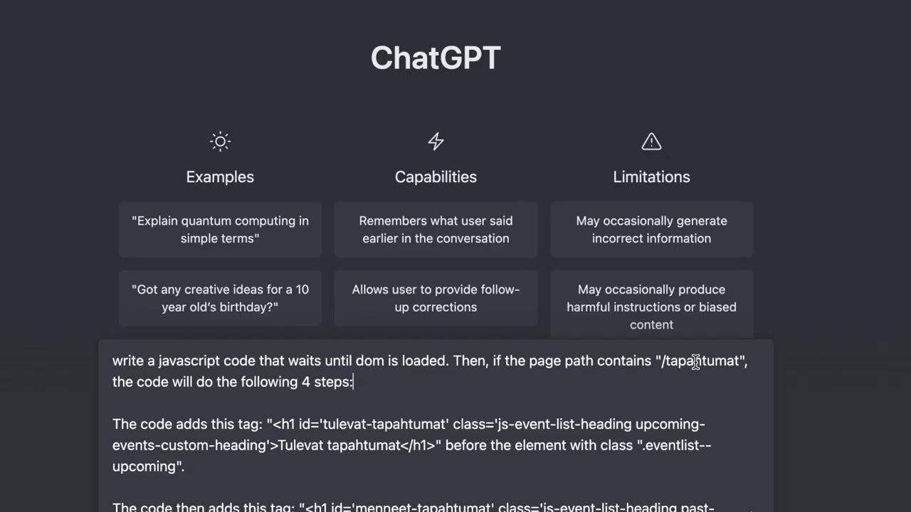]

<br>

[Ver demo completa &#8594;](https://www.youtube.com/watch?v=jXdb5r-_DQQ)

???

En noviembre de 2022, OpenAI liberó ChatGPT: una interfaz de chat para
GPT-3, una red neuronal entrenada sobre un corpus de texto enorme.

Por primera vez, el público tuvo acceso —a través de una interfaz web
simple— a un modelo capaz de generar texto indistinguible de texto escrito
por una persona. Le puedes preguntar casi cualquier cosa y responde,
sin importar qué tan compleja o extraña sea la pregunta.

Casi seguro varios de ustedes ya lo han usado en serio, así que no hace
falta presentarlo más. Pero vale la pena decirlo: es un hito real en la
historia de la IA.

---

class: middle

.grid[
.kol-1-2[

<br><br><br><br>

Una idea simple:

**Adivinar la siguiente palabra**

]
.kol-1-2[.center.width-70[]]
]

???

A pesar de su desempeño impresionante y su aparente complejidad, el
principio detrás de ChatGPT es en realidad muy simple: el modelo se
entrena para adivinar la siguiente palabra de una oración. Eso es todo.

Es el mismo principio que usa el autocompletado de tu teléfono, salvo
que el modelo es mucho más grande y se entrenó con muchísimo más texto.

Lo interesante del problema de "adivinar la siguiente palabra" es que es
simple de entender, pero difícil de resolver bien: hay muchas palabras
posibles, y a veces el contexto inmediato no alcanza — hace falta saber
algo del mundo para predecir bien.

---

class: middle
count: false

```
En la década de 1960, Armstrong ____
```

???

¡Ambiguo! ¿Louis Armstrong o Neil Armstrong?

Completions posibles: tocó, cantó, caminó, voló

---

class: middle
count: false

```
En la década de 1960, Armstrong hizo ___
```

???

Ahora se inclina hacia Louis Armstrong.

Completions posibles: jazz, música, solos de trompeta...

---

class: middle
count: false

```
En la década de 1960, Armstrong hizo un moonwalk ___
```

???

¡Giro inesperado!

Completions posibles: en el escenario, durante un concierto, en un club de jazz...

---

class: middle
count: false

```
En la década de 1960, Armstrong hizo un moonwalk en la ___
```

???

¡Cambio dramático de contexto!

Completion más probable: luna

---

class: middle
count: false

```
En la década de 1960, Armstrong hizo un moonwalk en la superficie
lunar y dijo ___
```

???

¡Contexto muy específico!

Completion posible: "Ese es un pequeño paso para el hombre,
un gran salto para la humanidad."

---

class: middle

Esto explica por qué los modelos de lenguaje...

- nunca producen la misma respuesta dos veces;
- no pueden contar, calcular ni razonar de forma confiable\*;
- inventan cosas y no pueden citar sus fuentes;
- difícilmente corrigen sus propios errores una vez cometidos.

.footnote[\*: al menos no con un transformer plano y una estrategia de decodificación greedy.]

---

class: middle

.center.circle.width-40[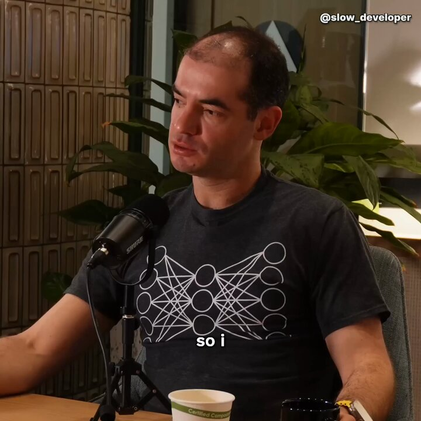]

.italic["¿Qué significa predecir bien el siguiente token? Es en realidad [...] una pregunta más profunda de lo que parece. Predecir bien el siguiente token significa entender la realidad subyacente que llevó a generar ese token."]

.pull-right[Ilya Sutskever, 2023 — traducido.]

---

class: middle, center, divider-slide

# ¿Qué es la Inteligencia Artificial?

---

class: middle, center

.width-70[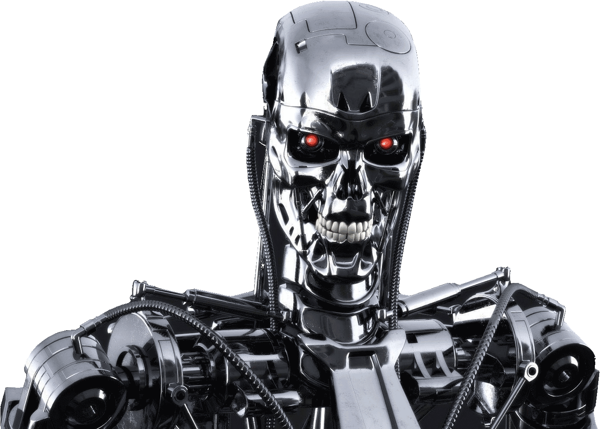]

"Con la inteligencia artificial estamos invocando al demonio" — Elon Musk, 2014 (traducido).

???

Dispara una imaginación alimentada por décadas de ciencia ficción.

---

class: middle, center

.width-60[]

"Estamos realmente más cerca de una lavadora inteligente que de Terminator" — Fei-Fei Li, directora del Stanford AI Lab, 2017 (traducido).

???

La realidad es bastante distinta...

---

class: middle, center, divider-slide

## Yann LeCun, 2018

.video-placeholder[
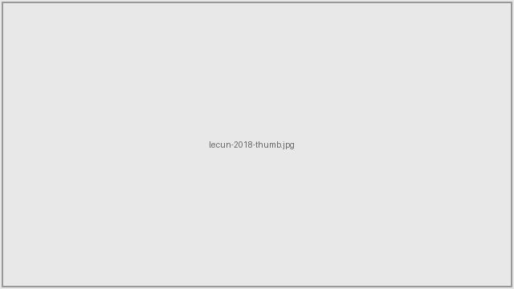
<div class="play-badge">&#9658;</div>
]

[Ver video &#8594;](https://www.dailymotion.com/video/x7kvtfn)

---

class: middle, center, divider-slide

## Geoffrey Hinton, 2023

.video-placeholder[

<div class="play-badge">&#9658;</div>
]

[Ver video &#8594;](https://www.youtube.com/watch?v=DsBGaHywRhs)

---

class: middle, center, divider-slide

## Yann LeCun, 2023

.video-placeholder[
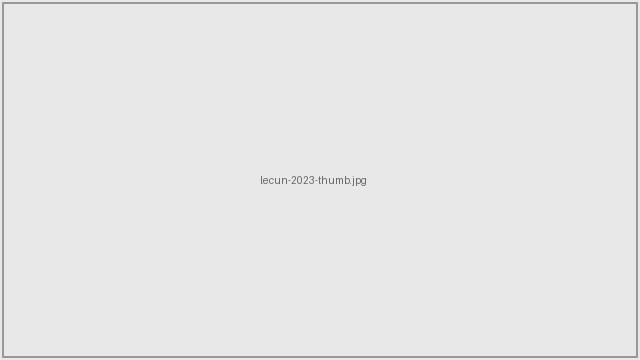
<div class="play-badge">&#9658;</div>
]

[Ver video &#8594;](https://www.youtube.com/watch?v=YdaRd_vitLw)

---

# ¿Una definición de IA?

<br>

.center.circle.width-40[]

.center["La inteligencia artificial es la ciencia de hacer que las máquinas hagan cosas que requerirían inteligencia si las hiciera un humano." — Marvin Minsky, 1968 (traducido).]

???

Pero, ¿qué es la inteligencia, de todos modos?

---

class: middle

## El test de Turing

Una computadora pasa el **test de Turing** (también llamado el "juego de
imitación") si un operador humano, tras hacer algunas preguntas por
escrito, no puede distinguir si las respuestas vienen de una persona o
de una computadora.

.grid[
.kol-2-3[
.width-80.center[<br>]
]
.kol-1-3.center[
.width-100.circle[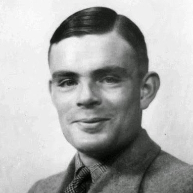]
.caption[¿Pueden pensar las máquinas?<br>(Alan Turing, 1950)]
]
]

???

El test de Turing es una definición *operacional* de inteligencia.

---

class: middle

Un agente no pasaría el test de Turing sin los siguientes **requisitos**:

- procesamiento de lenguaje natural
- representación de conocimiento
- razonamiento automatizado
- aprendizaje automático (machine learning)
- visión por computador (test de Turing total)
- robótica (test de Turing total)

A pesar de proponerse hace casi 75 años, el test de Turing sigue siendo
*relevante hoy*.

---

class: middle

El test de Turing tiende a enfocarse en *errores propios de humanos*,
*trucos lingüísticos*, etc.

Sin embargo, parece más importante estudiar los **principios** que
subyacen a la inteligencia que replicar un ejemplar particular.

---

class: middle, center, divider-slide

.width-80[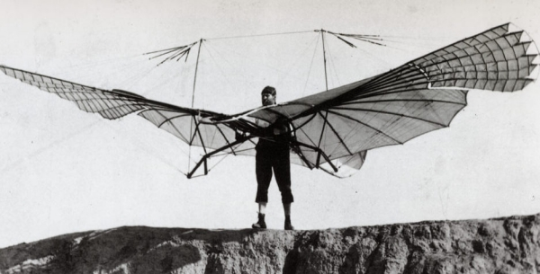]

La aeronáutica no se define como el campo de construir máquinas que
vuelan tan parecido a las palomas que engañan incluso a otras palomas.

---

class: middle

## Una definición moderna de IA

"Un 'sistema de IA' es un sistema basado en máquinas que está diseñado
para operar con niveles variables de autonomía y que puede exhibir
adaptabilidad tras el despliegue, y que, para objetivos explícitos o
implícitos, infiere, a partir de la entrada que recibe, cómo generar
salidas como predicciones, contenido, recomendaciones o decisiones que
pueden influir en entornos físicos o virtuales." — Ley de IA de la Unión
Europea, Artículo 3, 2024 (traducido).

.footnote[[Reglamento (UE) 2024/1689](https://eur-lex.europa.eu/legal-content/EN/TXT/HTML/?uri=OJ%3AL_202401689#d1e2090-1-1).]

???

¡Definición muy amplia! Sí cubre a los modelos de deep learning modernos,
pero también a muchos otros sistemas. ¿Es un termostato un sistema de IA?

---

class: middle, center, divider-slide

# Breve historia de la IA

---

class: middle

## 1940–1970: primeros años y expectativas

**1940–1950**
- 1943: McCulloch y Pitts — modelo de circuito booleano del cerebro.
- 1950: "Computing machinery and intelligence" de Turing.

**1950–1970**
- Años 50: primeros programas de IA — el programa de damas de Samuel,
  el Logic Theorist de Newell y Simon, el Geometry Engine de Gelernter.
- 1956: reunión de Dartmouth — se adopta el término "Inteligencia Artificial".
- 1958: Rosenblatt inventa el perceptrón.
- 1965: algoritmo completo de razonamiento lógico de Robinson.
- 1966–1974: la IA descubre la complejidad computacional.

---

class: middle

.width-60.center[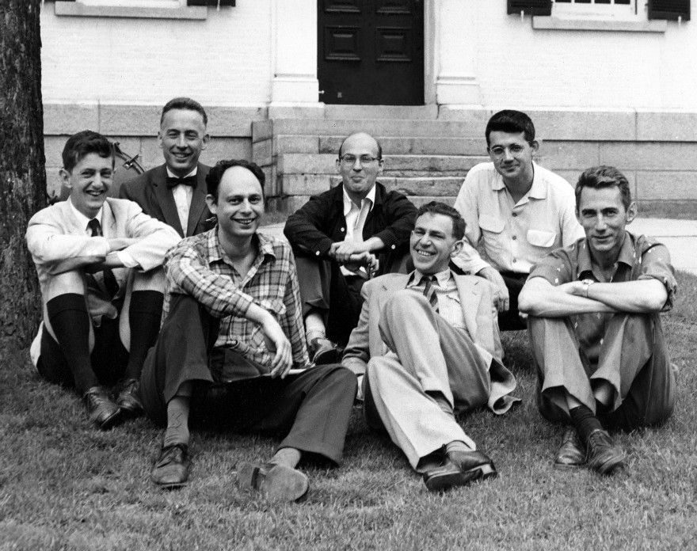]

## El taller de Dartmouth (1956)

.italic["El estudio se basa en la conjetura de que todo aspecto del aprendizaje o cualquier otra característica de la inteligencia puede, en principio, describirse con tanta precisión que una máquina pueda simularlo." (traducido)]

---

class: middle, center, divider-slide

.video-placeholder[
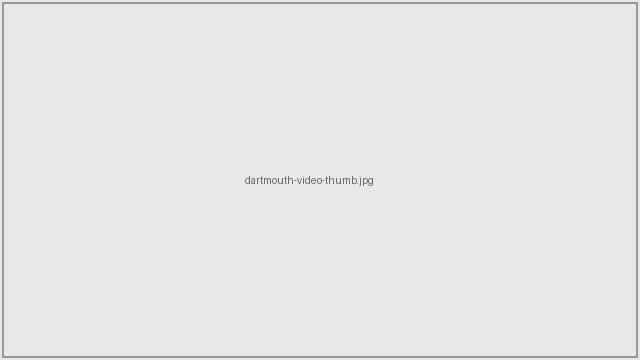
<div class="play-badge">&#9658;</div>
]

[Ver video &#8594;](https://www.youtube.com/watch?v=aygSMgK3BEM)

---

class: middle

## 1970–1990: enfoques basados en conocimiento

- 1969: la investigación en redes neuronales casi desaparece tras el
  libro de Minsky y Papert (primer "invierno de la IA").
- 1969–1979: desarrollo temprano de sistemas basados en conocimiento.
- 1980–1988: auge industrial de los sistemas expertos.
- 1988–1993: quiebre de la industria de sistemas expertos (segundo
  "invierno de la IA").

---

class: middle

## 1990–presente: enfoques estadísticos

- 1985–1995: el regreso de las redes neuronales.
- 1988–: resurgimiento de la probabilidad, foco en la incertidumbre.
- 1995–2010: nuevo desvanecimiento de las redes neuronales.
- 2000–: disponibilidad de datasets muy grandes.
- 2010–: hardware rápido y accesible (GPUs).
- 2012–: resurgimiento de las redes neuronales vía deep learning.
- 2017: "Attention is all you need" (transformers).
- 2022: ChatGPT se libera al público.

---

class: middle, center, divider-slide

# La revolución del deep learning

---

class: middle

.center.width-100[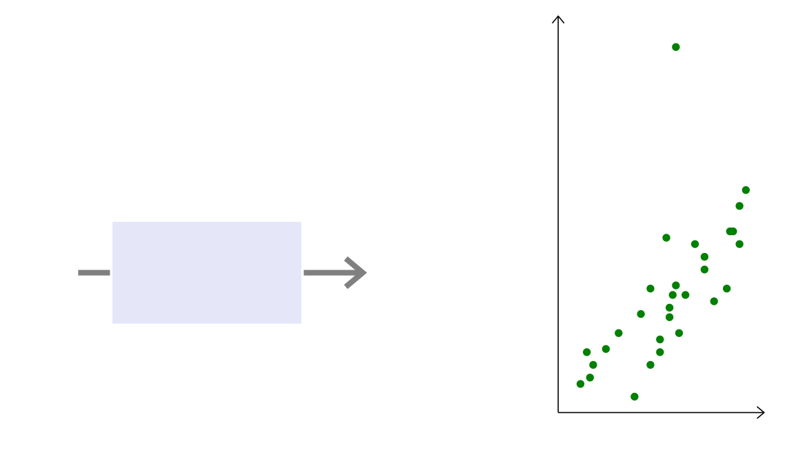]

.footnote[Créditos: François Fleuret, 2023 (adaptado).]

???

Cuando arrancas un proyecto de IA/ML, uno de los primeros pasos —y esto
se lo repito mucho a mis estudiantes— es mirar los datos. Tomar los
datos crudos y visualizarlos.

El dataset de ejemplo: 30 pacientes, edad vs. presión arterial. Pregunta
simple: ¿podemos predecir la presión arterial de un paciente a partir de
su edad?

---

class: middle
count: false

.width-100[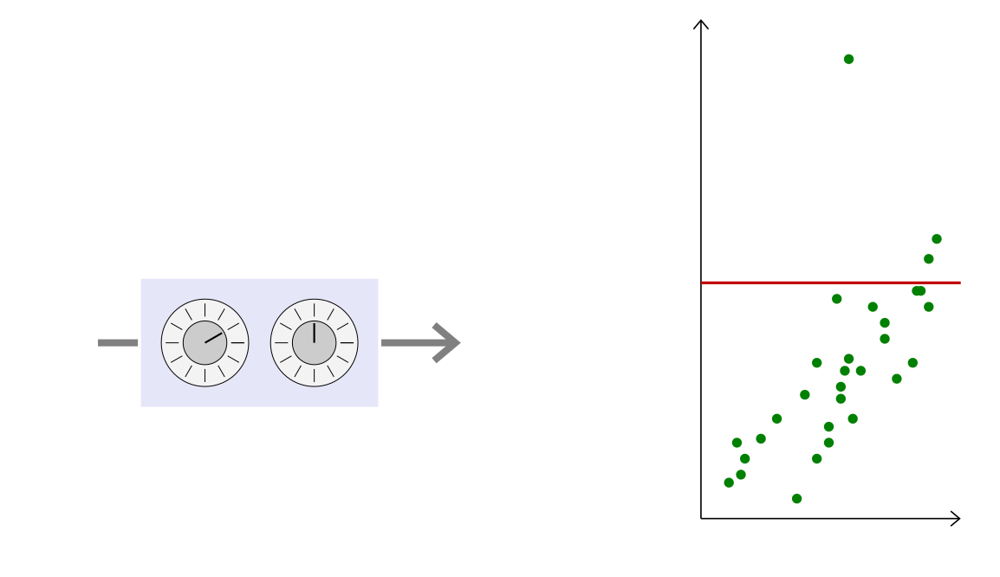]

.footnote[Créditos: François Fleuret, 2023 (adaptado).]

???

El enfoque de machine learning NO es programar a mano una fórmula que
tome la edad y devuelva una presión. En su lugar, escribimos un programa
que APRENDE a predecir mirando los datos.

Para eso definimos un modelo — una función matemática con parámetros.
El ejemplo más simple es el modelo lineal: `y = ax + b`, donde `a` y `b`
son los parámetros a ajustar, las "perillas" que movemos para cambiar
el comportamiento del modelo.

Entrenar el modelo es: mostrarle los datos, dejar que prediga, y ajustar
sus parámetros para reducir el error entre sus predicciones y los
valores reales.

---

class: middle

Deep learning **escala** los enfoques estadísticos y de machine learning:

- usando modelos más grandes (redes neuronales),
- entrenando con datasets más grandes,
- usando más recursos de cómputo.

.grid[
.kol-3-4.width-90.center[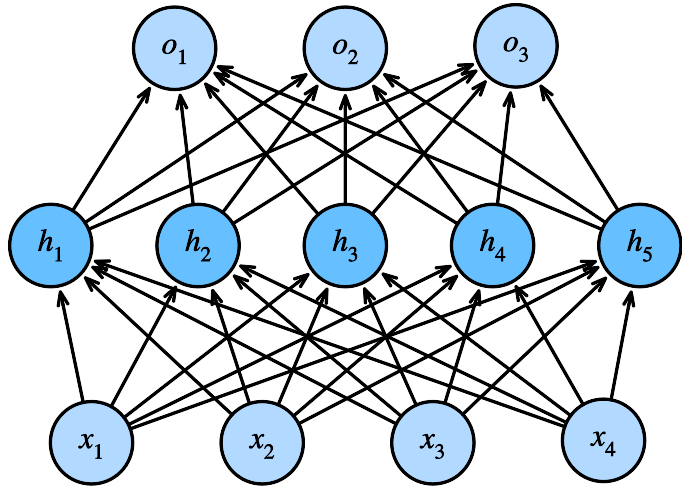]

.kol-1-4.width-60.center[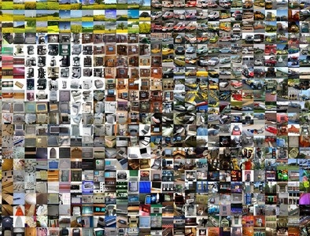 <br>]
]

???

Escalar por fuerza bruta en estas 3 dimensiones —modelo, datos, cómputo—
ha sido clave para el éxito del deep learning.

---

class: middle

Redes neuronales especializadas alcanzan hoy desempeño sobrehumano en
tareas que antes se creían fuera de alcance para una máquina.

.width-100[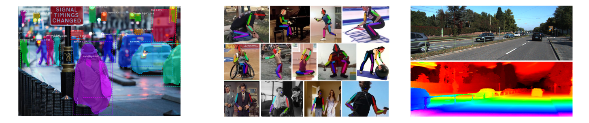]

.width-100[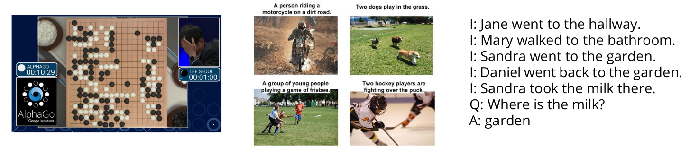]

.center[(Arriba) Comprensión de escenas, estimación de pose, razonamiento geométrico.<br>
(Abajo) Planeación, descripción de imágenes, respuesta a preguntas.]

.footnote[Créditos: François Fleuret, 2023 (adaptado).]

---

class: middle

Las redes neuronales forman **primitivas** transferibles a muchos dominios.

.grid[

.kol-1-3.center.width-80[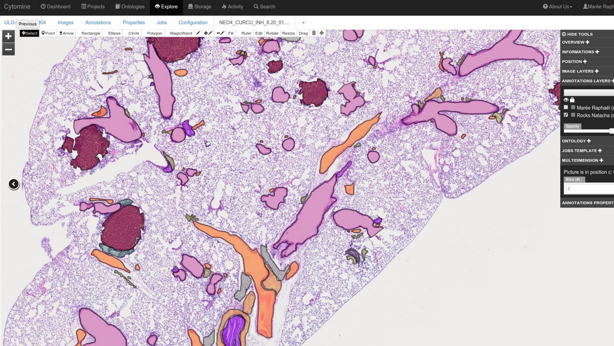]

.kol-1-3.center.width-100[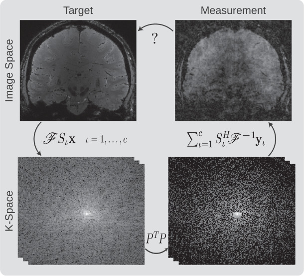]

.kol-1-3.center.width-100[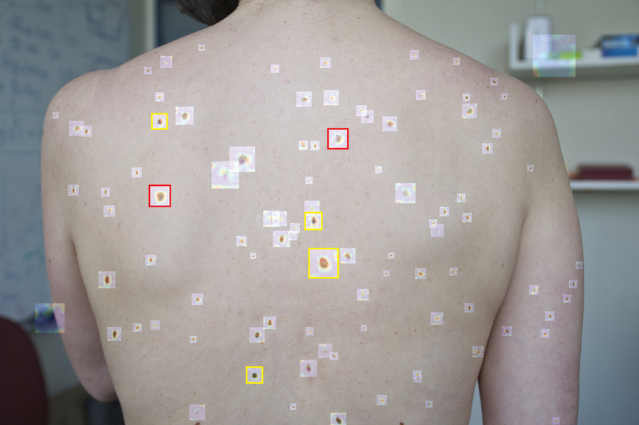]

]
.width-100[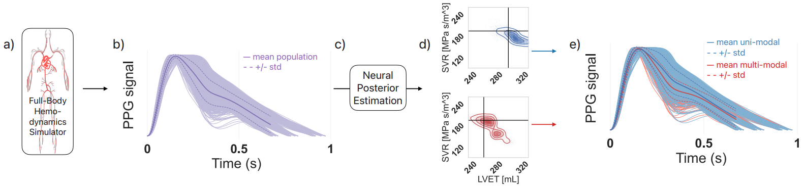]

.center[(Arriba) Análisis de laminillas histológicas, reducción de ruido en resonancias, detección de nevus.<br>
(Abajo) Reconstrucción hemodinámica de cuerpo completo a partir de señales PPG.]

???

Las mismas redes que anotan escenas se pueden usar para analizar
imágenes biomédicas. También para reducir ruido en resonancias, detectar
nevus, o reconstruir hemodinámica corporal completa a partir de señales
tipo Apple Watch.

---

class: middle, center, divider-slide

## Autos autónomos (Waymo, 2022)

.video-placeholder[

<div class="play-badge">&#9658;</div>
]

[Ver video &#8594;](https://www.youtube.com/watch?v=hA_-MkU0Nfw)

---

class: middle, center, divider-slide

## Impulsando el futuro de la energía limpia (NVIDIA, 2023)

.video-placeholder[
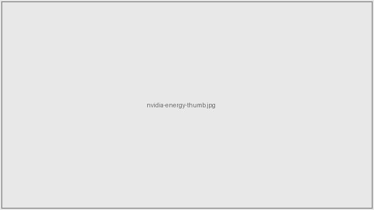
<div class="play-badge">&#9658;</div>
]

[Ver video &#8594;](https://www.youtube.com/watch?v=zrcxLZmOyNA)

---

class: middle, center, divider-slide

## Cómo la IA avanza la medicina (Google, 2018)

.video-placeholder[

<div class="play-badge">&#9658;</div>
]

[Ver video &#8594;](https://www.youtube.com/watch?v=AbdVsi1VjQY)

---

class: middle

Deep learning también puede **resolver problemas que nadie había podido
resolver antes** — hacer descubrimientos.

???

Más allá de automatizar tareas básicas, lo más emocionante de la IA —al
menos para el científico que hay en mí— es que el deep learning también
sirve para hacer descubrimientos. Voy a mencionar solo un par de ejemplos
de salud y medicina, aunque aplica igual en muchos otros dominios.

---

class: middle

## AlphaFold: de una secuencia de aminoácidos a una estructura 3D

.grid[
.kol-2-3.center.width-80[]

.kol-1-3.center[.width-80[]

.width-80[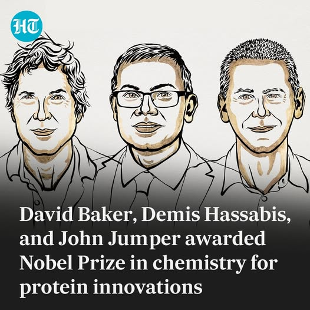]]
]

???

AlphaFold es una red neuronal basada en la arquitectura transformer que
predice la estructura 3D de una proteína a partir de su secuencia de
aminoácidos.

Este problema importa porque la estructura 3D determina la función de
la proteína. Determinarla experimentalmente puede tomar meses; AlphaFold
lo hace en minutos, con alta precisión, incluso para las secuencias más
largas.

---

class: middle, center, divider-slide

## AI for Science (DeepMind, AlphaFold, 2020)

.video-placeholder[

<div class="play-badge">&#9658;</div>
]

[Ver video &#8594;](https://www.youtube.com/watch?v=gg7WjuFs8F4)

---

class: middle

## Descubrimiento de fármacos con redes neuronales de grafos

.center.width-60[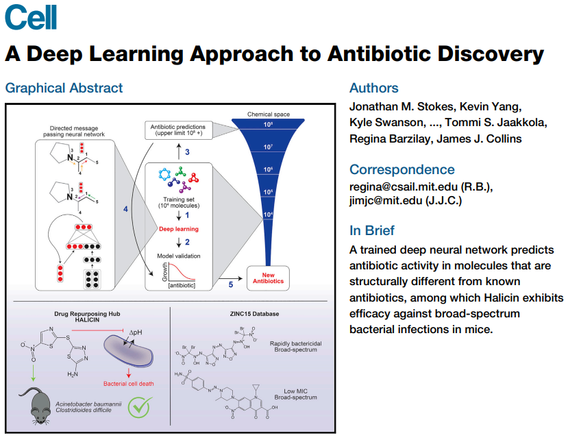]

???

Descubrir fármacos nuevos es un problema de búsqueda complejo y caro: se
buscan moléculas que se unan a una proteína objetivo. Es difícil por dos
razones: (1) el espacio de búsqueda es enorme — del orden de 10^60
moléculas farmacológicamente activas posibles; (2) modelar la unión
molécula-proteína requiere experimentos de laboratorio, caros y lentos.

Las redes de grafos han sido un avance real: funcionan como un
"laboratorio virtual" que pre-filtra millones de moléculas en horas,
reduciendo el trabajo de laboratorio a solo los candidatos más
prometedores.

---

class: middle

## GraphCast: pronósticos del clima rápidos y precisos

.center.width-60[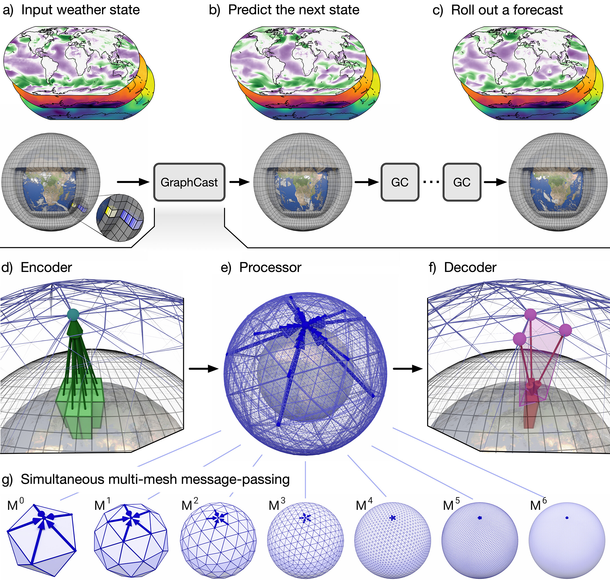]

---

class: middle

## El breakthrough

.grid[
.kol-1-2.center[.width-100[<br>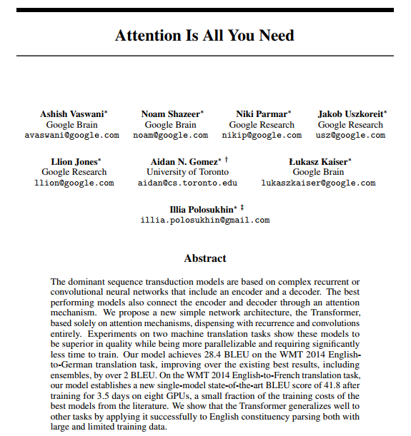

Vaswani et al., 2017.]]
.kol-1-2[.width-100[]]
]

---

class: middle

.width-100[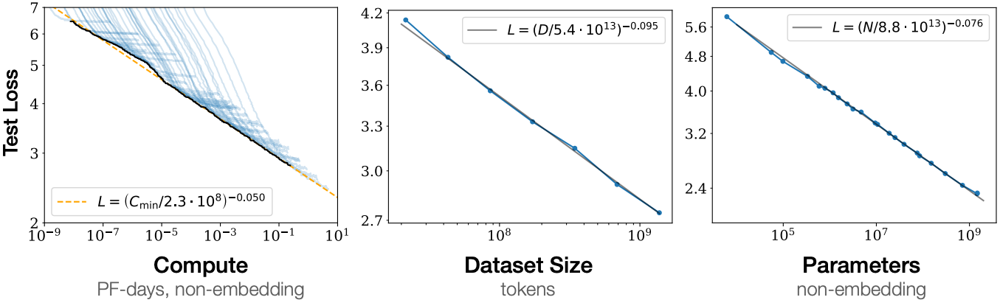]

Una simplicidad brutal:
- Más datos → mejor modelo.
- Más parámetros → mejor modelo.
- Más cómputo → mejor modelo.

Seguir escalando a modelos, datasets y cómputo aún más gigantes sigue
empujando los límites de lo posible, **sin señales de desaceleración**.

---

class: middle, center, divider-slide

## Asistentes conversacionales de IA (Anthropic, 2024)

.video-placeholder[

<div class="play-badge">&#9658;</div>
]

[Ver video &#8594;](https://www.youtube.com/watch?v=-dWfl7Dhb0o)

---

class: middle, center, divider-slide

## Asistentes de código (Cursor, 2024)

.video-placeholder[

<div class="play-badge">&#9658;</div>
]

[Ver video &#8594;](https://www.youtube.com/watch?v=o5uvDZ8srHA)

---

class: middle, center, divider-slide

## No solo texto: también imágenes y sonido (OpenAI, 2024)

.video-placeholder[

<div class="play-badge">&#9658;</div>
]

[Ver video &#8594;](https://www.youtube.com/watch?v=fWWCdqyYRPI)

---

class: middle, center, divider-slide

# ¿Y ahora qué?

---

class: middle

.center.width-10[]

## Lo bueno

- La IA es una herramienta capaz de automatizar tareas tediosas.
- La IA puede resolver problemas complejos que antes nadie podía resolver.
- La interfaz humano-máquina está cambiando radicalmente: los asistentes
  conversacionales hacen las herramientas digitales más accesibles.
- El progreso sigue a un ritmo vertiginoso.

---

class: middle

.center.width-10[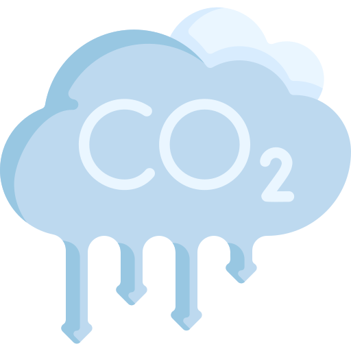]

## Lo malo

- Los modelos de deep learning son difíciles de inspeccionar, depurar y explicar.
- Los sistemas de IA pueden fallar de forma inesperada y catastrófica, a
  pesar de su aparente precisión.
- La IA genera mucho contenido de baja calidad ("AI slop") que contamina
  la información y devalúa el trabajo creativo humano.
- Los modelos de deep learning se han vuelto enormes y requieren recursos
  computacionales significativos, con consecuencias ambientales reales.

---

class: middle

.grid[
.kol-1-3[<br>.center.width-100[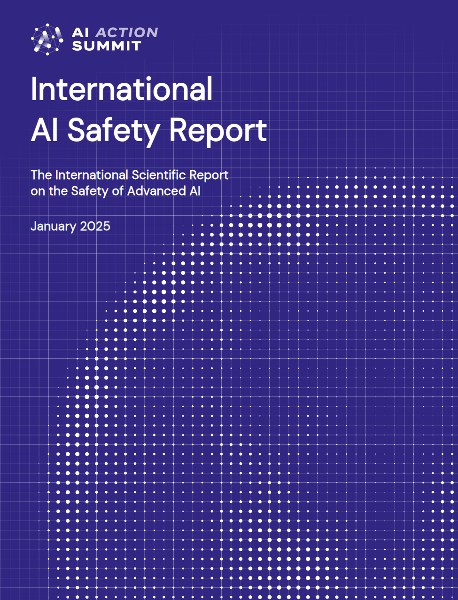]]

.kol-2-3[.center.width-100[]]
]

"La IA es un contribuyente moderado pero de rápido crecimiento a los
impactos ambientales globales, vía consumo energético y emisiones de
gases de efecto invernadero. Las estimaciones actuales indican que
**los centros de datos y la transmisión de datos representan cerca del
1% de las emisiones globales de GEI relacionadas con energía, y la IA
consume entre 10–28% de la capacidad energética de esos centros**. Se
espera que la demanda energética de la IA siga creciendo [...]"
(traducido)

.footnote[Créditos: [Bengio et al.](https://arxiv.org/abs/2501.17805), 2025 (arXiv:2501.17805).]

---

class: middle

.center.width-10[]

## Lo feo

- Los modelos de IA tienen sesgos y pueden perpetuar discriminación.
- Los usos maliciosos de la IA son cada vez más frecuentes (deepfakes,
  bots, manipulación, etc).
- En toda la sociedad se está asentando una dependencia de la IA, con
  riesgos de deshumanización, pérdida de control y pérdida de
  habilidades cognitivas.

---

class: middle

.center.width-100[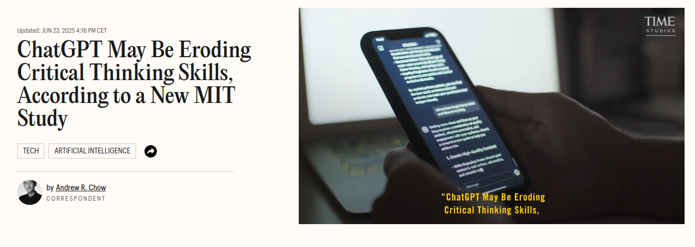]

"Los estudiantes que usaron ChatGPT mientras completaban ensayos tipo
SAT mostraron los niveles más bajos de actividad cerebral. Además, su
escritura se volvió cada vez más formulaica, olvidable y carente de
pensamiento original. Con el tiempo, se volvieron más pasivos y
desconectados. Muchos no podían recordar lo que habían escrito ni
revisar su trabajo sin ayuda de la IA — prueba de que **no estaban
aprendiendo de verdad**." (traducido)

---

class: middle, center, divider-slide

# Estructura del curso

---

class: middle

## Parte 1 — Fundamentos clásicos (Semanas 1–7)

1. Introducción: qué es la IA, agentes racionales (PEAS)
2. Búsqueda + CSP (compacto)
3. Juegos adversariales (minimax, poda alfa-beta)
4. Procesos de decisión de Markov (MDP)
5. Aprendizaje por refuerzo + Imitation Learning
6. Probabilidad, incertidumbre y redes bayesianas
7. HMMs, ML clásico y cierre de la Parte 1

**Semana 8 — Evaluación 1** (examen parcial, Parte 1)

---

class: middle

## Parte 2 — IA moderna (Semanas 9–14)

9. Redes neuronales: fundamentos (+ intro a CNN/RNN)
10. Transformers y atención
11. LLMs: entrenamiento y prompting
12. RAG y fine-tuning (RLHF → RLVR/GRPO)
13. Agentes modernos con LLMs
14. Seguridad, ética y sociedad de la IA

**Semana 15 — Evaluación 2** (examen final, Parte 2)
**Semana 16 — Presentaciones finales** del proyecto integrador

---

class: middle

## Cómo se evalúa

| Componente | Peso |
|---|---|
| Proyectos por tema (P1–P11) | 40% |
| Evaluación 1 (Semana 8) | 15% |
| Evaluación 2 (Semana 15) | 15% |
| Proyecto final integrador | 25% |
| Participación / quizzes cortos | 5% |

El **proyecto final** combina obligatoriamente al menos una técnica de
la Parte 1 (búsqueda/CSP/MDP/RL/imitation learning/Bayes) con al menos
una de la Parte 2 (deep learning/transformers/LLM/RAG/agentes).

---

class: middle

## Nuestra apuesta

Al terminar este curso vas a haber construido agentes autónomos que
toman decisiones eficientes en entornos totalmente informados,
parcialmente observables y adversariales. Tus agentes van a inferir en
entornos inciertos y desconocidos, y vas a optimizar acciones para
estructuras de recompensa arbitrarias.

Los modelos y algoritmos de este curso —tanto los clásicos como los
modernos— aplican a una variedad enorme de problemas de IA, y sirven
como base para seguir profundizando en cualquier área de aplicación que
elijas: ingeniería, ciencia, negocios, medicina.

???

Adaptado de la declaración de misión de Gilles Louppe (INFO8006, ULiège),
ajustado a la identidad "agente racional" del curso y a la Parte 2
(deep learning/LLMs/agentes) que él no cubre.

---

class: middle, center, end-slide
count: false

## Fin de la Clase 0

Próxima clase: Agentes racionales y PEAS

