class: middle, center, title-slide

# SI3003 - Inteligencia Artificial

<div class="kicker">Clase 1 — Agentes racionales</div>

<br><br>


???

Clase 1 es el núcleo técnico de la introducción del curso: qué es un
agente racional, PEAS, tipos de entorno, y la jerarquía de programas de
agente que motiva el resto del curso. La historia de la IA ya se cubrió
aparte. Todo lo que se defina hoy como abstracción (política,
racionalidad, PEAS) se vuelve concreto la próxima clase cuando
implementemos el primer agente de búsqueda.

---

class: middle

# Agentes racionales

---

# Agentes y entornos

<br><br><br>

.grid[
.kol-1-5.center[
<br><br><br>

]
.kol-3-5.center[
.width-95[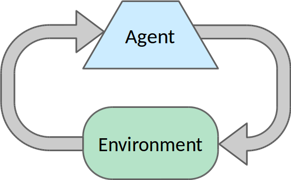]
]
.kol-1-5[
<br><br><br>

]
]

---

class: middle

## Agentes

- Un agente es una entidad que .bold[percibe] su entorno a través de
  sensores y toma .bold[acciones] a través de actuadores.

- El comportamiento del agente se describe con su política, una función
  $$\pi : \mathcal{P}^* \to \mathcal{A}$$ que mapea secuencias de
  percepts $e_1, ..., e_t$ a acciones $a$.

---

class: middle

## Mundo simplificado de Pac-Man

.width-20.center[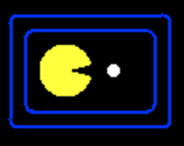]

Consideremos un mundo de 2 casillas con un agente Pac-Man.
- Percepts $e$: ubicación y contenido, ej. $(\text{casilla izquierda}, \text{sin comida})$
- Acciones $a$: $\text{ir a la izquierda}$, $\text{ir a la derecha}$, $\text{comer}$, $\text{no hacer nada}$

???

Tómate el tiempo de aclarar que este juego es distinto del Pac-Man real.

---

class: middle

La .bold[política] de un agente Pac-Man es una función que mapea
secuencias de percepts a acciones. Se puede implementar como una tabla.

| Secuencia de percepts | Acción |
| ---------------- | ------ |
| $(\text{izq}, \text{sin comida})$     | $\text{ir a la derecha}$ |
| $(\text{izq}, \text{comida})$     | $\text{comer}$ |
| $(\text{der}, \text{sin comida})$     | $\text{ir a la izquierda}$ |
| $(\text{der}, \text{comida})$     | $\text{comer}$ |
| $(\text{izq}, \text{sin comida}), (\text{izq}, \text{sin comida})$     | $\text{ir a la derecha}$ |
| $(\text{izq}, \text{sin comida}), (\text{izq}, \text{comida})$     | $\text{comer}$ |
| $\ldots$ | $\ldots$ |

???

El tamaño de la tabla crece exponencialmente con la longitud (máxima) de
la secuencia de percepts. Con $|\mathcal{P}|$ percepts posibles por paso
de tiempo y horizonte $T$, la tabla tiene $\sum_{t=1}^{T} |\mathcal{P}|^t$
entradas. Este es el pseudocódigo ingenuo — el punto de partida que todo
lo que sigue en el módulo existe para evitar:

```python
def table_driven_agent(percept, table, percept_history=[]):
    """Agente ingenuo: política = diccionario de secuencias -> acción.
    No escala -- existe solo para mostrar por qué hace falta algo mejor.
    """
    percept_history.append(percept)
    action = table.get(tuple(percept_history))
    return action
```

---

class: middle, center

.width-100.center[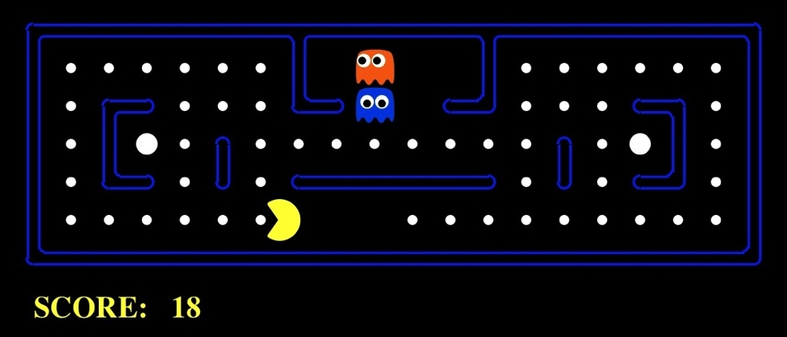]

¿Y el Pac-Man real? ¿Cómo diseñarías su programa de agente para jugar de
forma óptima?

???

Corre el ejemplo si tienes el notebook a mano.

---

# Agentes racionales

Una secuencia de estados del entorno se evalúa con una .bold[medida de
desempeño] (*performance measure*).

Un agente es .bold[racional] si elige las acciones que maximizan el
valor esperado de la medida de desempeño, dada la secuencia de percepts
hasta el momento.

.alert[La racionalidad solo concierne a .bold[qué] decisiones se toman —
no al proceso de pensamiento detrás de ellas, sea parecido al humano o
no.]

.footnote[Créditos: [CS188](https://inst.eecs.berkeley.edu/~cs188/), UC Berkeley.]

---

class: middle

.center[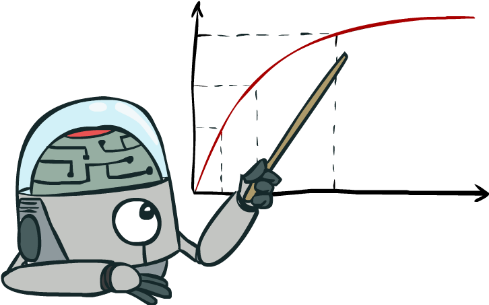

En este curso, Inteligencia Artificial = **maximizar el desempeño
esperado**
]

.footnote[Créditos: [CS188](https://inst.eecs.berkeley.edu/~cs188/), UC Berkeley.]

???

Subraya la importancia de *esperado*.

---

class: middle

## La definición formal

Un agente es .bold[racional] si, para cada secuencia de percepts, elige
la acción que se espera .bold[maximice] el valor esperado de la medida
de desempeño, dada la evidencia de los percepts y el conocimiento previo
del agente:

$$a^* = \arg\max_{a \in \mathcal{A}} \; \mathbb{E}\big[\text{Desempeño}(\text{Resultado}(a)) \mid e_1, \ldots, e_t\big]$$

.footnote[Adaptado de Russell & Norvig, *AIMA* 4ta ed., Cap. 2 (paráfrasis).]

---

class: middle

- Racionalidad $\neq$ omnisciencia
    - los percepts pueden no dar toda la información relevante.
- Racionalidad $\neq$ clarividencia
    - el resultado de una acción puede no ser el esperado.
- Por lo tanto, racional $\neq$ exitoso.
- Sin embargo, la racionalidad lleva a *exploración*, *aprendizaje* y
  *autonomía*.

.alert[Un peatón que cruza con luz verde y buena visibilidad, y es
golpeado por una puerta de carga que cae de un avión, actuó de forma
racional aunque el resultado fue pésimo — la evidencia disponible no
incluía esa posibilidad.]

???

Esta distinción es la que evita que la clase confunda "buena decisión"
con "buen resultado". Es crítica para cuando lleguemos a MDPs y RL en las
Semanas 4–5: la política óptima no garantiza que cada episodio individual
salga bien, solo que el valor esperado sobre muchos episodios es máximo.

---

# Desempeño, entorno, actuadores, sensores

Las características de la medida de desempeño, el entorno, el espacio de
acciones y los percepts dictan los enfoques para elegir acciones
racionales. Se resumen como el .bold[entorno de tarea] (*task
environment*), memorizado con el acrónimo .bold[PEAS].

## Ejemplo 1: un agente que juega ajedrez
- medida de desempeño: ganar, empatar, perder, ...
- entorno: tablero, oponente, ...
- acciones: mover piezas, ...
- sensores: estado del tablero, movimientos del oponente, ...

---

class: middle

## Ejemplo 2: un auto autónomo
- medida de desempeño: seguridad, destino, legalidad, comodidad, ...
- entorno: calles, autopistas, tráfico, peatones, clima, ...
- acciones: dirección, acelerador, freno, bocina, pantalla, ...
- sensores: video, acelerómetros, medidores, sensores del motor, GPS, ...

## Ejemplo 3: un sistema de diagnóstico médico
- medida de desempeño: salud del paciente, costo, tiempo, ...
- entorno: paciente, hospital, historial médico, ...
- acciones: diagnóstico, tratamiento, referencia, ...
- sensores: historial médico, resultados de laboratorio, ...

---

# Tipos de entorno

*Totalmente observable* vs. **parcialmente observable**
> Si los sensores del agente dan acceso al estado completo del entorno,
> en cada instante.

*Determinístico* vs. **estocástico**
> Si el siguiente estado del entorno queda completamente determinado por
> el estado actual y la acción ejecutada por el agente.

*Episódico* vs. **secuencial**
> Si la experiencia del agente se divide en episodios atómicos e
> independientes.

*Estático* vs. **dinámico**
> Si el entorno puede cambiar, o la medida de desempeño puede cambiar,
> mientras el agente delibera.

---

class: middle

*Discreto* vs. **continuo**
> Si el estado del entorno, el tiempo, los percepts o las acciones son
> continuos.

*Un solo agente* vs. **multiagente**
> Si el entorno incluye varios agentes que pueden interactuar entre sí.

*Conocido* vs. **desconocido**
> Refleja el estado de conocimiento del agente sobre las "leyes de la
> física" del entorno.

---

class: middle

¿Los siguientes entornos de tarea son totalmente observables?
¿determinísticos? ¿episódicos? ¿estáticos? ¿discretos? ¿de un solo
agente? ¿conocidos?

- Crucigrama
- Ajedrez, con reloj
- Póker
- Backgammon
- Conducción de un taxi
- Diagnóstico médico
- Robot de selección de piezas (*part-picking*)
- ChatGPT
- El mundo real

.footnote[Selección de entornos adaptada de AIMA 4ta ed., Fig. 2.6 — clasificación en vivo, sin mirar el libro todavía.]

---

class: middle, center

.width-100.center[]

¿Y Pac-Man?

---

# Programas de agente

El objetivo es diseñar un .bold[programa de agente] que implemente la
política del agente $\pi$.

Los programas de agente se pueden diseñar e implementar de muchas formas:
- con tablas
- con reglas
- con algoritmos de búsqueda
- con algoritmos de aprendizaje

El mejor diseño depende del entorno de tarea.

---

# Agentes de reflejo

Los agentes de reflejo ...
- eligen una acción basándose en el percept actual (y quizás memoria);
- pueden tener memoria o un modelo del estado actual del mundo;
- no consideran las consecuencias futuras de sus acciones.

<br>
.center.width-50[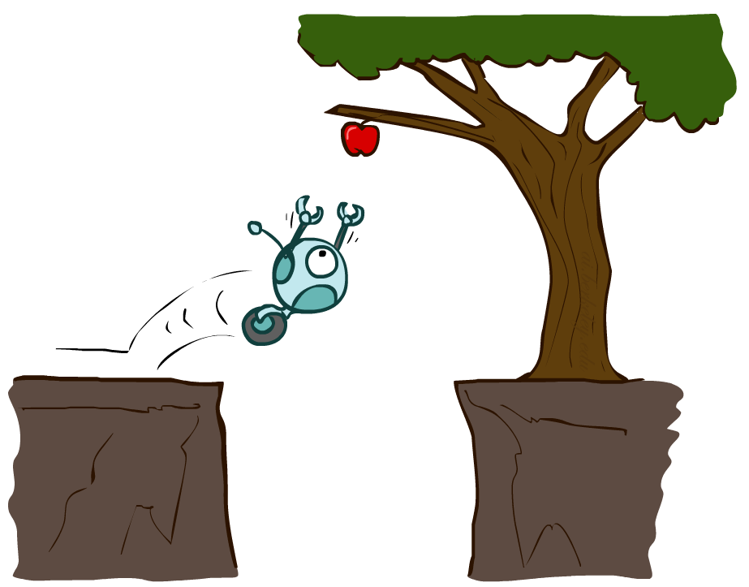]

.footnote[Créditos: [CS188](https://inst.eecs.berkeley.edu/~cs188/), UC Berkeley.]

---

class: middle

## Agentes de reflejo simple

.center.width-60[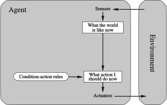]

```python
def simple_reflex_agent(percept, rules, interpret_input):
    state = interpret_input(percept)
    rule = rule_match(state, rules)
    return rule.action
```

???

Solución a las tablas gigantes: ¡olvidarse del pasado! Comprimirlas
usando reglas condición-acción.

---

class: middle

Los .bold[agentes de reflejo simple] eligen acciones basándose solo en
el percept actual, ignorando el resto del historial de percepts.

Se implementan con reglas condición-acción que hacen match entre el
percept actual y una acción. Las reglas son una forma de *comprimir* la
tabla de la función.

Solo funcionan si la decisión correcta se puede tomar con base
únicamente en el percept actual — algo raro en la práctica, salvo que el
entorno sea markoviano y totalmente observable.

.question[Ejemplos: detectores de humo, puertas automáticas, semáforos, etc.]

---

class: middle

## Agentes de reflejo basados en modelo

.center.width-60[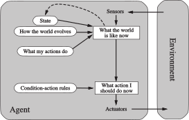]

```python
def model_based_reflex_agent(percept, state, model, rules, action):
    state = update_state(state, action, percept, model)
    rule = rule_match(state, rules)
    action = rule.action
    return action, state
```

???

Solución: no olvidarse del pasado. Recordar lo que se ha visto hasta
ahora manteniendo una representación interna del mundo, un estado de
creencia. Luego mapear ese estado a una acción.

---

class: middle

Los .bold[agentes de reflejo basados en modelo] manejan la observabilidad
parcial del entorno rastreando la parte del mundo que no pueden ver en
este momento.

Mantienen un estado interno que se actualiza con base en un .bold[modelo]
que determina:
- cómo evoluciona el entorno independientemente del agente;
- cómo las acciones del agente afectan al mundo.

.question[Ejemplo: robot aspiradora, termostatos inteligentes, etc.]

---

# Agentes de planificación

Los agentes de planificación ...
- se preguntan "¿qué pasaría si?";
- toman decisiones basadas en las consecuencias (hipotéticas) de sus acciones;
- deben tener un modelo de cómo evoluciona el mundo en respuesta a acciones;
- deben formular un objetivo.

<br>
.center.width-50[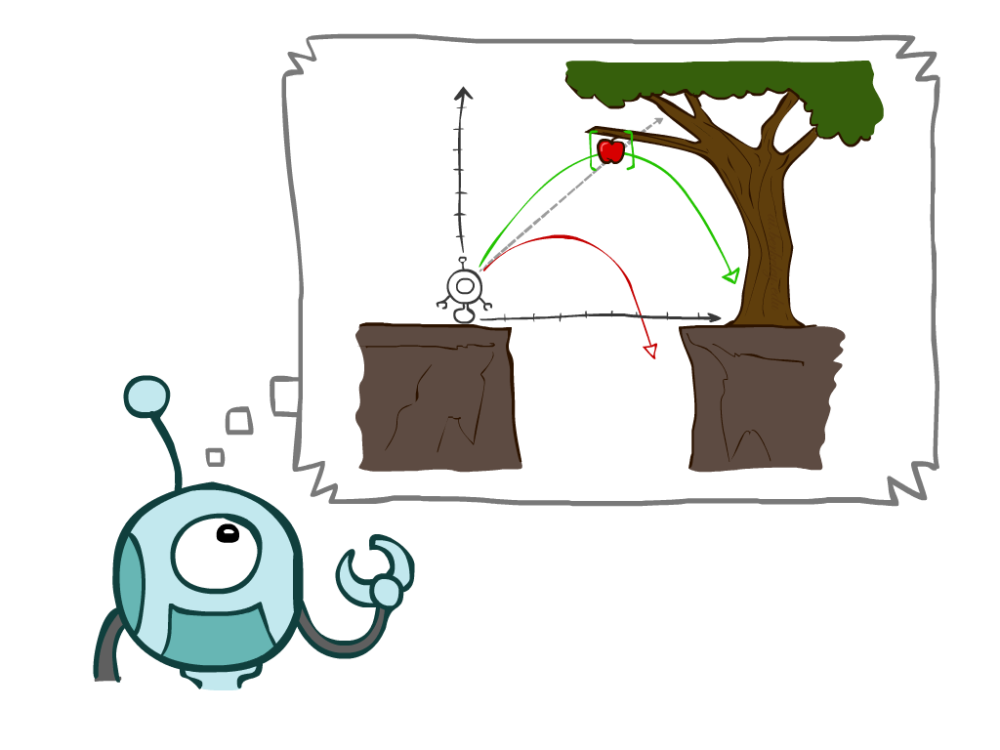]

.footnote[Créditos: [CS188](https://inst.eecs.berkeley.edu/~cs188/), UC Berkeley.]

---

class: middle

## Agentes basados en objetivos

.center.width-80[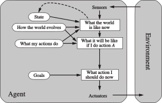]

???

No es fácil mapear un estado a una acción porque los objetivos no son
explícitos en reglas condición-acción.

---

class: middle

El proceso de decisión de un .bold[agente basado en objetivos] se puede
resumir así:
1. generar posibles secuencias de acciones;
2. predecir los estados resultantes;
3. evaluar el .bold[objetivo] en cada uno;
4. elegir la primera acción de la secuencia donde se alcanza el objetivo.

.alert[Estos 4 pasos .bold[son] la definición informal de un problema de
búsqueda en espacio de estados. La Clase 2 no introduce un tema nuevo:
formaliza cómo ejecutar estos 4 pasos sin enumerar cada secuencia posible
— es decir, sin repetir la tabla imposible que ya vimos.]

Encontrar secuencias de acciones que logran objetivos es difícil.
*Búsqueda* y *planificación* son dos estrategias — tema de la Clase 2.

.question[Ejemplos: sistema de navegación GPS, agentes que juegan videojuegos.]

---

class: middle

## Agentes basados en utilidad

.center.width-80[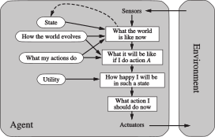]

???

A menudo hay varias secuencias de acciones que logran un objetivo.
Deberíamos elegir la mejor.

---

class: middle

Los objetivos por sí solos suelen no bastar para generar comportamiento
de alta calidad — solo dan una evaluación binaria del desempeño.

En cambio, una .bold[función de utilidad] $U : \mathcal{S} \to \mathbb{R}$
puntúa cualquier secuencia de estados del entorno: entre más alto el
puntaje, mejor la secuencia.

Un agente racional basado en utilidad elige la acción que .bold[maximiza
la utilidad esperada de sus resultados]:

$$a^* = \arg\max_{a \in \mathcal{A}} \; \mathbb{E}\big[U(\text{Resultado}(a))\big]$$

.question[Ejemplos: autos autónomos, sistemas de recomendación.]

???

La función de utilidad es distinta de la medida de desempeño, que solo
se usa para evaluar el comportamiento del agente desde afuera. La
función de utilidad es una internalización de la medida de desempeño,
la que el agente usa para decidir.

---

# Agentes de aprendizaje

<br>
.center.width-80[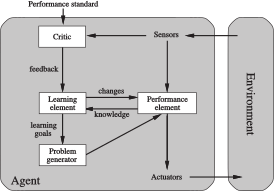]

---

class: middle

Los .bold[agentes de aprendizaje] mejoran su desempeño y se adaptan a
circunstancias nuevas aprendiendo de su experiencia. Son capaces de
auto-mejorarse.

Pueden hacer cambios a cualquiera de sus componentes de conocimiento:
- aprendiendo cómo evoluciona el *mundo*;
- aprendiendo cuáles son las *consecuencias* de las acciones;
- aprendiendo la utilidad de las acciones a través de *recompensas*.

.question[Ejemplos: robots.]

---

class: middle

## La jerarquía completa

| Tipo | Agrega | Por qué falla el anterior |
|---|---|---|
| Reflejo simple | reglas condición-acción sobre el percept actual | — (punto de partida) |
| Reflejo + modelo | estado interno que rastrea lo no observable ahora | parcial observabilidad → loops |
| Basado en objetivos | objetivo explícito + consecuencias futuras | objetivos son binarios |
| Basado en utilidad | función $U$ que ordena soluciones por calidad | $U$ no sale de la nada |
| De aprendizaje | ajusta cualquier componente anterior con experiencia | cierre — motiva RL |

---

class: middle, center, divider-slide

## Aprender a caminar en el mundo real en una hora (Wu et al., 2022)

.video-placeholder[

<div class="play-badge">&#9658;</div>
]

[Ver video &#8594;](https://danijar.com/project/daydreamer/)

---

class: middle, center, end-slide
count: false

## Fin de la Clase 1

Próxima clase: Búsqueda — el primer agente basado en objetivos
