class: middle, center, title-slide

# SI3003 - Inteligencia Artificial

Clase 10 — Retrieval Augmented Generation (RAG)

  

???

Las clases anteriores construyeron el Transformer y mostraron cómo un
LLM genera texto. Hoy atacamos su limitación más inmediata y más
práctica: el modelo solo sabe lo que vio en el entrenamiento. No conoce
los documentos internos de una empresa, no conoce lo que pasó ayer, y
cuando no sabe, inventa.

RAG es la respuesta pragmática a eso, y es sorprendentemente simple:
convertir la pregunta en un vector, buscar los vectores más parecidos en
una base de datos, y pegar ese texto al prompt. Toda la clase es
desarmar esa frase pieza por pieza — chunking, embeddings, búsqueda
vectorial y ANN — para que al final el pipeline completo se lea de un
vistazo.

---

### Hoy

.grid[
.kol-1-2[
1. **Modelos de Lenguaje**
    - Qué es un LLM: predicción del siguiente token
    - Entrenamiento e inferencia autoregresiva
    - El problema del contexto
    - RAG vs. Fine-Tuning vs. Prompt Engineering
2. **RAG**
    - La idea desde primeros principios
    - ¿Por qué chunking?
    - Tipos de búsqueda: vectorial, keyword e híbrida
3. **Embeddings**
    - Hipótesis distribucional y similitud del coseno
    - BERT y embeddings de oraciones
    - Sentence-BERT
    - Bases de datos vectoriales
    - ANN: NSW y HNSW
]
.kol-1-2[
.center.width-90[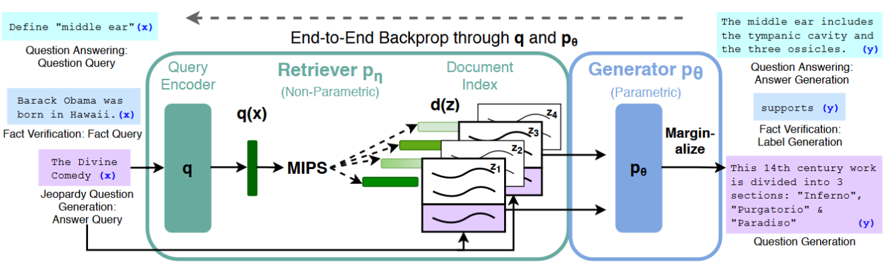]

.caption[Lewis et al., *Retrieval-Augmented Generation for Knowledge-Intensive NLP Tasks* (2020).]
]
]

???

Vale la pena anunciar el hilo desde el principio: la primera parte es
repaso rápido de LLM para motivar el problema, la segunda es la
arquitectura RAG a nivel de bloques, y la tercera abre cada bloque
—especialmente el retriever, que es donde está toda la ingeniería real.

La figura de la derecha es del paper original de RAG (Lewis et al.,
2020). No hace falta explicarla ahora; al final de la clase todos sus
bloques van a tener nombre.

---

class: middle, center, divider-slide

## Parte 1 — Modelos de Lenguaje

---

class: smaller

# LLMs

.grid[
.kol-1-2[
Un modelo de lenguaje es un .bold[modelo probabilístico] que asigna
probabilidades a secuencias de palabras.

.bold[En la práctica:] dado un texto de entrada (*prompt*), el modelo
predice cuál es el siguiente token más probable — y repite este proceso
para generar la respuesta completa.

## Entrenamiento

Se entrena en enormes corpus de texto (Wikipedia, libros, web). El
modelo aprende .bold[patrones estadísticos] del lenguaje.

## Inferencia

Dado un prompt, genera tokens uno a uno hasta completar la respuesta. Es
.bold[autoregresivo] — cada token depende de los anteriores.
]
.kol-1-2[
.center.width-80[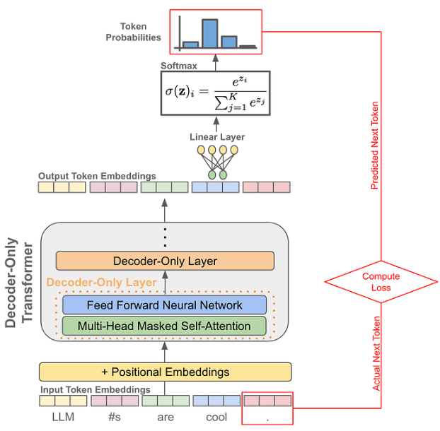]
]
]

???

Lo importante de esta lámina es el mecanismo, no la arquitectura: el
modelo produce una distribución de probabilidad sobre todo el
vocabulario, se muestrea un token, se vuelve a meter a la entrada, y se
repite. No hay ninguna "base de datos de hechos" adentro — solo pesos
que codifican estadística del lenguaje.

De ahí sale directamente el problema de la siguiente lámina: si el
conocimiento vive en los pesos, para cambiar lo que el modelo sabe hay
que reentrenarlo... o darle el dato en el prompt.

---

class: smaller

# Problema - Contexto

.grid[
.kol-1-2[
.bold[El LLM solo sabe lo que vio en el entrenamiento:]

- No conoce tus .bold[documentos internos]
- No conoce .bold[eventos recientes] (tiene fecha de corte)
- No puede acceder a .bold[datos en tiempo real]
- Puede .bold["alucinar"] — inventar información plausible pero falsa
]
.kol-1-2[
.center.width-90[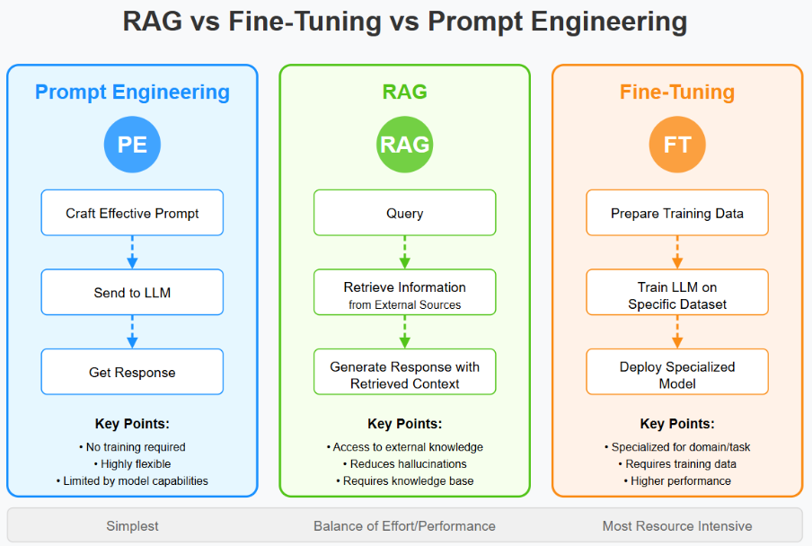]
]
]

???

Las tres columnas de la figura son las tres respuestas posibles al mismo
problema, ordenadas por costo:

- *Prompt Engineering*: no requiere entrenamiento, es muy flexible, pero
  está limitado por lo que el modelo ya sabe.
- *RAG*: da acceso a conocimiento externo y reduce alucinaciones, a
  cambio de mantener una base de conocimiento.
- *Fine-Tuning*: el más costoso — especializa el modelo para un dominio
  o tarea, pero exige datos de entrenamiento y cómputo.

El punto que conviene dejar claro: RAG y fine-tuning no compiten.
Fine-tuning cambia *cómo* responde el modelo; RAG cambia *con qué
información* responde.

---

class: middle, center, divider-slide

## Parte 2 — RAG

---

class: smaller

# Retrieval Augmented Generation - RAG

.center.width-80[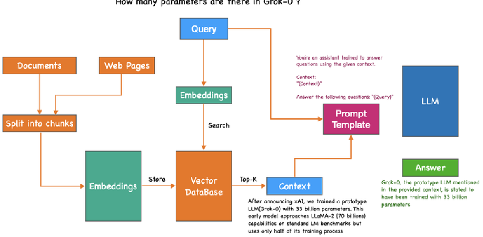]

.bold[Desde primeros principios:] RAG es una función donde, dada una
pregunta del usuario, la convertimos en vectores, buscamos los vectores
más similares en nuestra base de datos, y concatenamos los chunks
recuperados al prompt. Así de simple.

???

Insistir en la última frase: RAG no es un modelo ni una arquitectura
nueva de red neuronal. Es *fontanería*. El LLM ni siquiera se entera de
que hay un sistema de recuperación detrás — solo recibe un prompt más
largo.

Hay dos momentos distintos en la figura y conviene separarlos en el
tablero:

1. *Indexación* (offline): documentos → chunks → embeddings → vector DB.
2. *Consulta* (online): query → embedding → búsqueda top-K → prompt
   template → LLM → respuesta.

Todo lo que sigue en la clase son detalles de alguno de esos dos
momentos.

---

class: smaller

# ¿Por qué Chunking?

No podemos meter documentos completos en cada query — hay dos razones
principales.

.grid[
.kol-1-2[
## Ventana de contexto

Los LLMs tienen un límite de tokens por request. Un documento de 100
páginas no cabe. Los chunks resuelven esto.

## Calidad del retrieval

Un chunk que habla de un solo tema genera un vector más representativo.
Documentos largos mezclan temas y degradan la búsqueda.
]
.kol-1-2[
.center.width-90[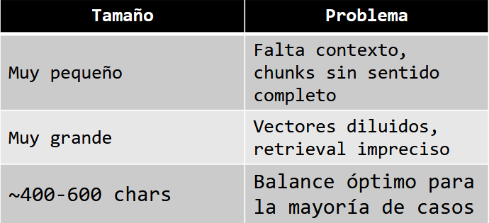]

 

.bold[Chunking semántico] respeta párrafos y oraciones — produce chunks
con significado cohesivo.
]
]

???

La segunda razón es la que suele sorprender: aunque el documento cupiera
en la ventana de contexto, seguiría conviniendo partirlo. Un embedding
es *un solo vector* — si el texto mezcla cinco temas, el vector queda en
el promedio de los cinco y no se parece a ninguno.

El rango de 400–600 caracteres es una heurística de arranque, no una
ley. Lo que sí es regla: hay que medirlo sobre tus propios datos.

---

class: smaller

# Tipos de Búsqueda

.grid[
.kol-1-2[
## Vectorial

Busca por .bold[similitud semántica]. Entiende sinónimos y contexto.

⚠ Puede devolver resultados relacionados pero no exactos
]
.kol-1-2[
## Keyword (BM25)

Coincidencias .bold[exactas] de términos. Ideal para nombres propios y
siglas.

⚠ No entiende relaciones semánticas
]
]

 

.grid[
.kol-1-6[&nbsp;]
.kol-2-3[
## Híbrida ← producción

Combina vectorial + keyword. Reordena por scores combinados.

✅ Mejor recall y precision en conjunto
]
.kol-1-6[&nbsp;]
]

.footnote[.bold[Ejemplo:] buscar *"política de vacaciones"* con búsqueda vectorial puede devolver *"días de descanso"* (semánticamente similar pero sin la palabra exacta). BM25 lo perdería. Híbrida encuentra ambos.]

???

El ejemplo del pie de lámina resume la clase entera en una línea. Otro
ejemplo útil para el caso contrario: buscar un código de producto como
"SKU-4471" o una sigla como "SI3003". La búsqueda vectorial es mala
justo ahí — esos tokens casi no tienen semántica — y BM25 los encuentra
al instante.

Por eso en producción casi nunca se usa una sola: se corren ambas y se
fusionan los rankings.

---

class: middle, center, divider-slide

## Parte 3 — Embeddings

---

class: smaller

# Embeddings

.grid[
.kol-1-2[
Un .bold[embedding] es una función que convierte texto en un vector de
números reales. Textos semánticamente similares quedan .bold[cerca en el
espacio vectorial].

.bold[Hipótesis distribucional:] palabras que aparecen en el mismo
contexto tienden a tener significados similares. *"teacher"* y
*"professor"* suelen aparecer junto a *"school"*, *"exam"*, *"course"*.

.bold[Self-Attention] en Transformers captura exactamente esto —
relaciona cada token con todos los demás de la oración.
]
.kol-1-2[
.center.width-90[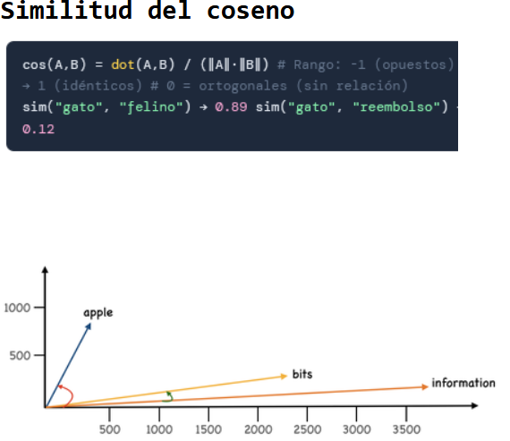]
]
]

$$\cos(A,B) = \frac{A \cdot B}{\lVert A \rVert \, \lVert B \rVert} \quad \in [-1, 1]$$

.footnote[Rango: $-1$ (opuestos) → $1$ (idénticos); $0$ = ortogonales (sin relación).]

???

La hipótesis distribucional es de Firth (1957): *"you shall know a word
by the company it keeps"*. Es la idea que sostiene todo, desde word2vec
hasta los embeddings de hoy.

Sobre el coseno: nos interesa la *dirección*, no la magnitud. Dos textos
sobre el mismo tema, uno corto y uno largo, deberían dar el mismo
ángulo. Por eso coseno y no distancia euclidiana cuando los vectores no
están normalizados.

---

class: middle, center, smaller

# BERT

.width-90[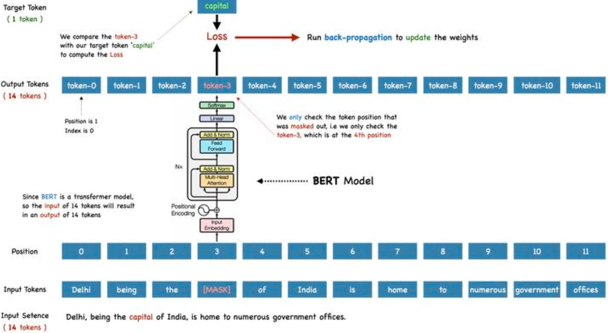]

Self-Attention captura el "significado" de una oración completa.

???

BERT se entrena con *masked language modeling*: se tapa un token y el
modelo tiene que reconstruirlo usando el contexto de ambos lados. Ese es
el contraste con el decoder-only de la primera parte, que solo puede
mirar hacia atrás.

El detalle que importa para RAG: BERT devuelve un vector .bold[por
token], no uno por oración. La siguiente lámina resuelve eso.

---

class: smaller

# Embeddings de Oraciones

.grid[
.kol-1-2[
.center.width-90[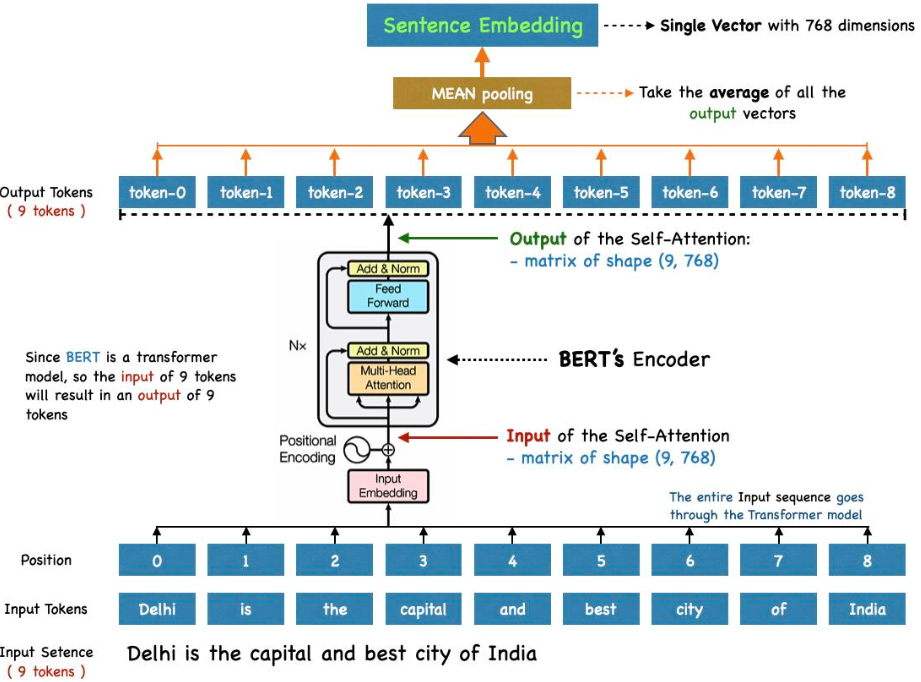]
]
.kol-1-2[
.center.width-90[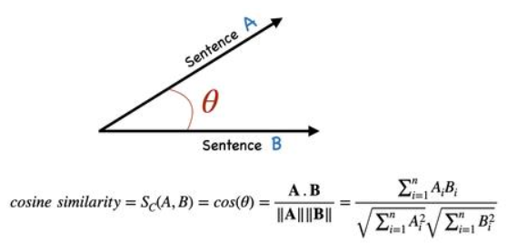]

 

La entrada de 9 tokens produce 9 vectores de salida de 768 dimensiones.
El .bold[MEAN pooling] promedia todos esos vectores y entrega un
.bold[único vector de 768 dimensiones] que representa la oración
completa.
]
]

???

Mean pooling es la receta más común, pero no la única: también se usa
max-pooling o directamente el vector del token `[CLS]`.

Y aquí está la trampa que motiva la siguiente lámina: nada en el
entrenamiento de BERT garantiza que ese promedio sea comparable con
coseno. Funciona *a veces*, por accidente.

---

class: smaller

# Sentence-BERT

.bold[Problema:] nadie le dijo a BERT que los embeddings que produce
deberían ser comparables con la similitud del coseno, es decir, que dos
oraciones similares deberían estar representadas por vectores que
apunten en la misma dirección en el espacio.

.grid[
.kol-3-5[
.center.width-90[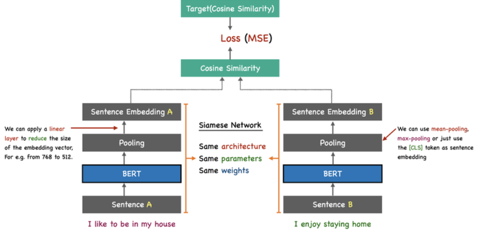]
]
.kol-2-5[
.center.width-90[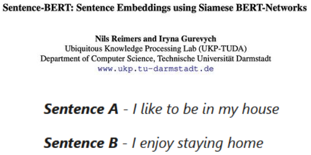]
]
]

.footnote[Reimers & Gurevych, *Sentence-BERT: Sentence Embeddings using Siamese BERT-Networks*, UKP-TUDA, TU Darmstadt.]

???

La solución es entrenar *para* el objetivo que nos importa. La red
siamesa pasa las dos oraciones por el .bold[mismo] BERT (misma
arquitectura, mismos parámetros, mismos pesos), calcula el coseno entre
los dos embeddings, y compara contra la similitud objetivo con MSE.

Es la misma receta de siempre —modelo, función de costo,
entrenamiento— aplicada a un objetivo nuevo: que el espacio vectorial
sea métricamente útil.

Nota práctica: casi todos los modelos de embeddings que usarán en el
proyecto (`sentence-transformers`, `text-embedding-3`, etc.) son
descendientes directos de esta idea.

---

class: smaller

# Base de datos vectorial

.grid[
.kol-1-2[
.bold[Vector DB:] almacena embeddings (vectores de dimensión fija)

- .bold[Objetivo:] encontrar elementos similares
- .bold[Similitud:] coseno o distancia euclidiana
- .bold[Método:] KNN / búsqueda aproximada (ANN)
- .bold[Uso:] recomendación y búsqueda
- .bold[Valor:] recuperación semántica rápida a escala

 

.bold[Con 1M de chunks de 768 dims:]
768 millones de operaciones por query. Demasiado lento para producción.
]
.kol-1-2[
.center.width-90[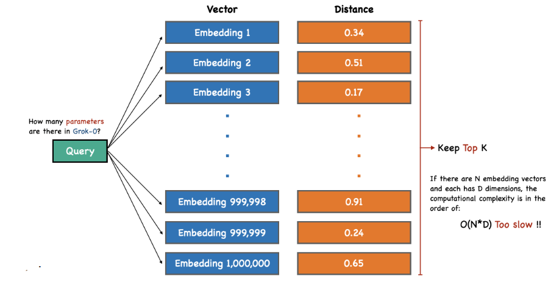]
]
]

???

Este es el momento en que el problema se vuelve de ingeniería de
sistemas y no de machine learning. La búsqueda exacta (KNN por fuerza
bruta) es $O(N \cdot D)$: compara la query contra *todos* los vectores.

Con N = 1.000.000 y D = 768 eso son ~768 millones de multiplicaciones
por cada pregunta del usuario. Funciona perfecto en el notebook con
1.000 chunks, y se cae en producción.

---

class: smaller

# ANN: Cambiar precisión por velocidad

La idea: reducir el número de comparaciones pero obtener resultados
precisos con .bold[alta probabilidad].

.grid[
.kol-1-2[
.bold[Métricas que importan:]

| Métrica | Qué mide |
|---|---|
| Recall | ¿Qué % de los K vecinos reales encontramos? |
| Latencia | Tiempo de respuesta por query |
| Throughput | Queries por segundo |
]
.kol-1-2[
.center.width-90[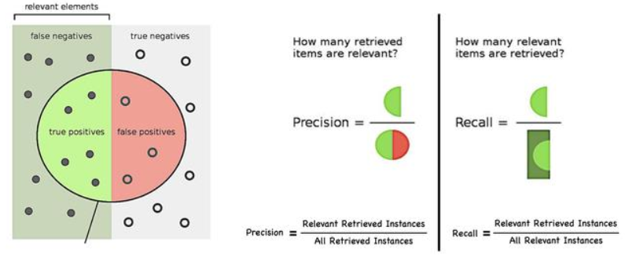]
]
]

.footnote[En RAG nos importa principalmente el .bold[recall] — si perdemos un chunk relevante, la respuesta puede ser incorrecta.]

???

*Approximate* Nearest Neighbors: renunciamos a la garantía de encontrar
exactamente los K vecinos más cercanos, a cambio de varios órdenes de
magnitud en velocidad.

La pregunta natural del estudiante es "¿y cuánto perdemos?". La
respuesta típica en la práctica: recall de 95–99% con latencias de
milisegundos. El trade-off es configurable.

Por qué recall y no precision en RAG: un chunk irrelevante de más solo
gasta tokens, y el LLM normalmente lo ignora. Un chunk relevante de
menos hace que la respuesta sea sencillamente incorrecta.

---

class: middle, center, smaller

# NSW: Navigable Small World

.width-90[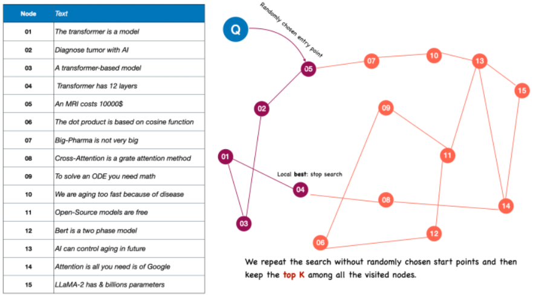]

???

La idea: construir un grafo donde cada nodo (un embedding) está
conectado a sus vecinos cercanos, más algunas aristas "largas" que
saltan a zonas lejanas del espacio — el efecto *small world*, los seis
grados de separación.

La búsqueda es greedy: se entra por un nodo aleatorio, se salta siempre
al vecino más cercano a la query, y se para cuando ningún vecino mejora.
Eso da un óptimo *local*, no global — por eso se repite la búsqueda
desde varios puntos de entrada aleatorios y se conserva el top-K entre
todos los nodos visitados.

---

class: smaller

# HNSW: Hierarchical Navigable Small World

.grid[
.kol-1-2[
.center.width-90[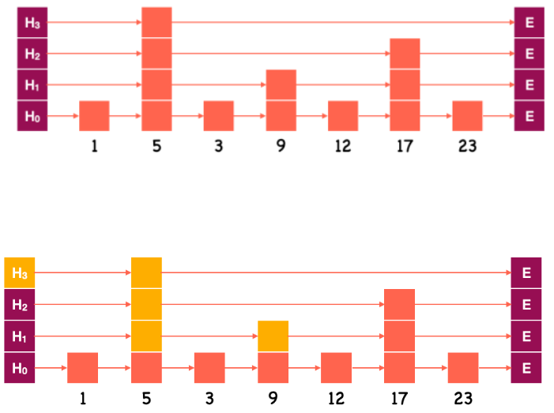]
]
.kol-1-2[
  

.center.width-90[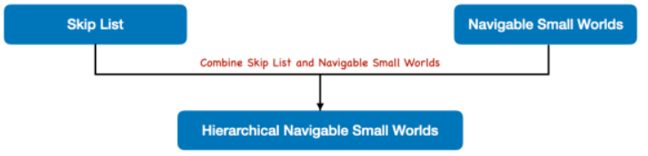]

 

HNSW combina la .bold[jerarquía por capas] de las *skip lists* con la
.bold[navegabilidad] de los grafos *small world*.
]
]

???

La *skip list* es la estructura clásica de listas enlazadas con capas:
la capa de abajo tiene todos los elementos, y cada capa superior tiene
un subconjunto con saltos más largos. Se busca de arriba hacia abajo:
avances grandes primero, refinamiento después. De $O(N)$ a
$O(\log N)$.

HNSW aplica esa misma intuición a un grafo de vecinos en vez de a una
lista ordenada. Es literalmente la suma de las dos ideas de la lámina
anterior y de esta.

---

class: smaller

# HNSW: Hierarchical Navigable Small World

.grid[
.kol-1-2[
.center.width-90[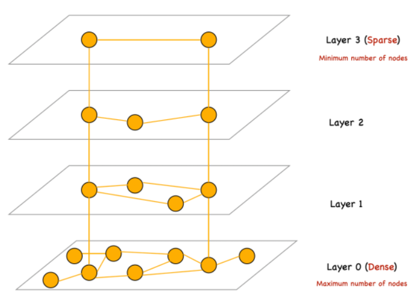]
]
.kol-1-2[
.center.width-90[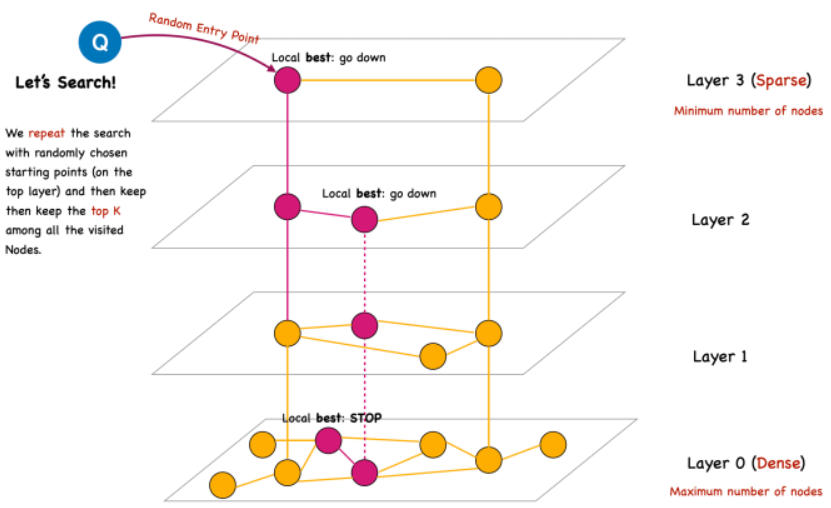]
]
]

.footnote[Se repite la búsqueda con puntos de partida aleatorios en la capa superior y se conserva el .bold[top-K] entre todos los nodos visitados.]

???

Recorrer la búsqueda con el dedo sobre la figura de la derecha:

1. Se entra por un nodo aleatorio de la .bold[capa 3] (la más dispersa,
   mínimo número de nodos): saltos enormes, se cubre todo el espacio en
   pocos pasos.
2. Al llegar al óptimo local de esa capa, se .bold[baja] al mismo nodo
   en la capa siguiente.
3. Se repite capa por capa, con saltos cada vez más cortos.
4. En la .bold[capa 0] (la más densa, todos los nodos) se hace el
   refinamiento final y se para.

Es el mismo descenso greedy de NSW, pero empezando por una vista gruesa
del espacio en vez de por un punto cualquiera. Esto es lo que corre por
dentro de FAISS, Qdrant, Weaviate, pgvector y compañía.

---

class: middle, center, smaller

# RAG Pipeline

.width-90[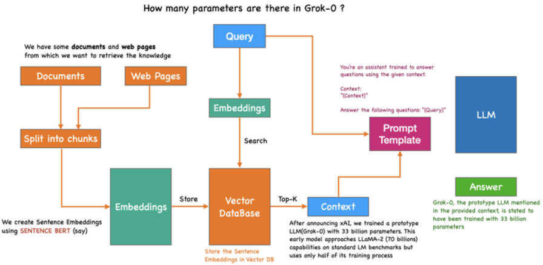]

???

La misma figura del inicio, ahora con todos los bloques nombrados.
Vale la pena cerrar recorriéndola completa y pidiéndole a alguien que
explique cada caja:

- *Split into chunks* → ¿por qué? Ventana de contexto y calidad del
  vector.
- *Embeddings* → Sentence-BERT, entrenado para que el coseno signifique
  algo.
- *Vector DataBase* → HNSW por debajo, ANN en vez de fuerza bruta.
- *Top-K → Context → Prompt Template* → el LLM nunca supo que hubo una
  búsqueda.

---

class: smaller

# Resumen

- Un .bold[LLM] es un modelo probabilístico autoregresivo: predice el siguiente token y repite. Todo su conocimiento vive en los pesos — no conoce tus documentos, ni eventos posteriores a su fecha de corte, y cuando no sabe puede .italic[alucinar].
- .bold[RAG] no es una arquitectura nueva: es convertir la pregunta en un vector, buscar los chunks más similares y concatenarlos al prompt. Da acceso a conocimiento externo sin reentrenar nada.
- El .bold[chunking] existe por dos razones distintas: la ventana de contexto (restricción dura) y la calidad del retrieval (un vector por chunk, así que un chunk = un tema). ~400–600 caracteres es un punto de partida razonable.
- La .bold[búsqueda híbrida] es el estándar de producción: la vectorial aporta semántica, BM25 aporta coincidencias exactas de siglas y nombres propios.
- Un .bold[embedding] convierte texto en un vector donde la .bold[similitud del coseno] mide parecido semántico. La hipótesis distribucional es el supuesto de fondo.
- .bold[BERT] da un vector por token; el .bold[mean pooling] los promedia en uno solo. Pero .bold[Sentence-BERT] es el que entrena explícitamente para que ese vector sea comparable con coseno — red siamesa, mismos pesos, costo MSE.
- La búsqueda exacta en una .bold[base de datos vectorial] es $O(N \cdot D)$ e inviable a escala. Por eso se usa .bold[ANN]: se cambia exactitud por velocidad, midiendo .bold[recall], latencia y throughput.
- .bold[HNSW] = skip list + navigable small world: capas dispersas arriba para cubrir el espacio con saltos grandes, capa densa abajo para refinar. Es el índice que usan las vector DB modernas.

---

class: middle, center, end-slide
count: false

## Fin de la Clase 10

Próxima clase: Agentes modernos con LLMs
