class: middle, center, title-slide

# SI3003 - Inteligencia Artificial

<div class="kicker">Clase 2 — Resolución de problemas mediante búsqueda</div>

<br><br>

???

Clase 2 es donde la abstracción de la Clase 1 se vuelve concreta: un
agente basado en objetivos necesita un mecanismo real para generar y
elegir secuencias de acciones. Hoy formalizamos ese mecanismo como
búsqueda en espacio de estados, cubrimos las estrategias no informadas
(DFS, BFS, UCS, iterative deepening) y las informadas (greedy, A*), y
cerramos con heurísticas admisibles/consistentes y búsqueda en grafo.
Todo lo que sigue en el curso — CSP, juegos adversariales, MDPs — es una
variación de este mismo esqueleto: estados, acciones, transición, costo,
objetivo.

---

# Hoy

.grid[
.kol-1-2[
- Agentes de planificación
- Problemas de búsqueda
- Métodos de búsqueda no informada
    - Búsqueda en profundidad (DFS)
    - Búsqueda en amplitud (BFS)
    - Búsqueda de costo uniforme (UCS)
- Métodos de búsqueda informada
    - A*
    - Heurísticas
]
.kol-1-2[
.center.width-100[]

]
]

.footnote[Créditos: [CS188](https://inst.eecs.berkeley.edu/~cs188/), UC Berkeley.]

---

class: middle

# Agentes de planificación

.alert[Recordemos la Clase 1: un agente .bold[basado en objetivos]
genera secuencias de acciones, predice sus estados resultantes, evalúa
el objetivo en cada uno y elige la primera acción de la secuencia
ganadora. Esos 4 pasos son, informalmente, un problema de búsqueda.
Hoy formalizamos cómo ejecutarlos sin enumerar cada secuencia posible.]

???

Arrancar con un agente humano jugando Pac-Man y discutir en vivo cómo
decidiría sus movimientos, si el layout lo permite.

---

# Agentes de reflejo

Los agentes de reflejo
- eligen acciones con base en el percept actual;
- pueden tener un modelo del estado actual del mundo;
- no consideran las consecuencias futuras de sus acciones;
- consideran solo .bold[cómo es el mundo ahora].

Los reflejos alcanzan para tomar acciones racionales en entornos
.italic[totalmente observables], .italic[determinísticos] y
.italic[conocidos].

Sin embargo, son .bold[difíciles de implementar] para tareas complejas,
ya que determinar la acción inmediata que produce el mejor resultado a
largo plazo se expresa más naturalmente en términos de planificación.

???

¿Puede un agente de reflejo ser racional?

Sí, siempre que la decisión correcta se pueda tomar solo con el percept
actual — es decir, si el entorno es totalmente observable,
determinístico y conocido.

---

# Agentes de resolución de problemas

Supuestos:
- Entorno de .italic[un solo agente], .italic[observable],
  .italic[determinístico] y .italic[conocido].

Los agentes de resolución de problemas
- toman decisiones con base en las consecuencias (hipotéticas) de sus
  acciones, considerando **cómo podría ser el mundo**;
- deben tener un modelo de cómo evoluciona el mundo en respuesta a las
  acciones;
- formulan un objetivo, de forma explícita.

---

class: middle

.width-100[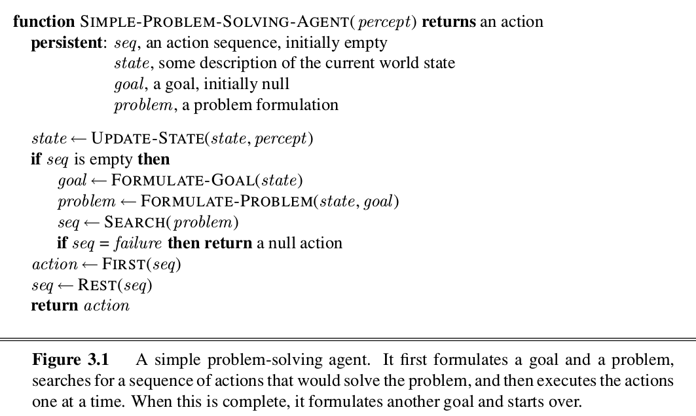]

???

Señalar que esto es *offline*. La ejecución se hace "con los ojos
cerrados".

---

class: middle

## Resolución offline vs. online

- Los agentes de resolución de problemas son .bold[offline]. La
  solución se ejecuta "con los ojos cerrados", ignorando los percepts.
- La resolución .bold[online] implica actuar sin conocimiento completo.
  En este caso, la secuencia de acciones puede recalcularse en cada
  paso.

---

class: middle

# Problemas de búsqueda

---

# Problemas de búsqueda

Un .bold[problema de búsqueda] consiste de los siguientes componentes:
- Una representación de los .italic[estados] del agente y su entorno.
- El .italic[estado inicial] del agente.
- Una descripción de las .italic[acciones] disponibles para el agente
  dado un estado $s$, denotada $\text{acciones}(s)$.
- Un .italic[modelo de transición] que devuelve el estado
  $s' = \text{resultado}(s, a)$ que resulta de ejecutar la acción $a$ en
  el estado $s$.
    - Decimos que $s'$ es un .italic[sucesor] de $s$ si existe una
      acción aceptable de $s$ a $s'$.

.center[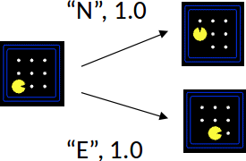]

.footnote[Créditos: [CS188](https://inst.eecs.berkeley.edu/~cs188/), UC Berkeley.]

???

Listar en el tablero.

---

class: middle

.center[]

- Juntos, el estado inicial, las acciones y el modelo de transición
  definen el .bold[espacio de estados] del problema, es decir, el
  conjunto de todos los estados alcanzables desde el estado inicial por
  cualquier secuencia de acciones.
    - El espacio de estados forma un grafo dirigido:
        - nodos = estados
        - enlaces = acciones
    - Un camino es una secuencia de estados conectados por acciones.
- Una .italic[prueba de objetivo] que determina si la solución del
  problema se alcanza en el estado $s$.
- Un .italic[costo del camino] que asigna un valor numérico a cada
  camino.
  - En este curso, además asumiremos que el costo del camino
    corresponde a la suma de .italic[costos de paso] positivos
    $c(s,a,s')$ asociados a la acción $a$ en $s$ que lleva a $s'$.

.footnote[Créditos: [CS188](https://inst.eecs.berkeley.edu/~cs188/), UC Berkeley.]

---

class: middle

Una .italic[solución] a un problema es una secuencia de acciones que
lleva del estado inicial a un estado objetivo.
- La calidad de una solución se mide con la función de costo del
  camino.
- Una .bold[solución óptima] tiene el menor costo del camino entre
  todas las soluciones.

.exercise[¿Qué pasa si el entorno es parcialmente observable? ¿Si es no
determinístico?]

???

Con observabilidad parcial, el agente necesita llevar la cuenta de en
qué estados podría estar.
- Los percepts acotan el conjunto de estados posibles.

Si es estocástico, el agente necesita considerar qué hacer para cada
contingencia que sus percepts puedan revelar.
- Los percepts revelan cuál de los resultados posibles ocurrió
  realmente.

---

class: middle

## Ejemplo: viajando por Rumania

.center.width-100[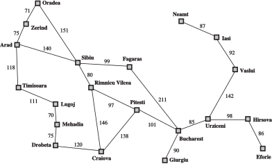]

.caption[¿Cómo ir de Arad a Bucarest?]

.footnote[Ejemplo clásico de Russell & Norvig, *AIMA* 4ta ed., Cap. 3.]

---

class: middle

- Representación de estados: la ciudad en la que estamos.
    - $s \in \\{ \text{en}(\text{Arad}), \text{en}(\text{Bucarest}), \ldots \\}$
- Estado inicial = la ciudad donde empezamos.
    - $s_0 = \text{en}(\text{Arad})$
- Acciones = ir de la ciudad actual a las ciudades directamente
  conectadas con ella.
    - $\text{acciones}(s_0) = \\{ \text{ir a}(\text{Sibiu}), \text{ir a}(\text{Timisoara}), \text{ir a}(\text{Zerind}) \\}$
- Modelo de transición = la ciudad a la que llegamos tras viajar a
  ella.
    - $\text{resultado}(\text{en}(\text{Arad}), \text{ir a}(\text{Zerind})) = \text{en}(\text{Zerind})$
- Prueba de objetivo: si estamos en Bucarest.
    - $s \in \\{ \text{en}(\text{Bucarest}) \\}$
- Costo de paso: distancias entre ciudades.

---

# Eligiendo un espacio de estados

El mundo real es absurdamente .bold[complejo].
- El .italic[estado del mundo] incluye cada detalle del entorno.
- Un .italic[estado de búsqueda] conserva solo los detalles necesarios
  para planificar.

.width-75.center[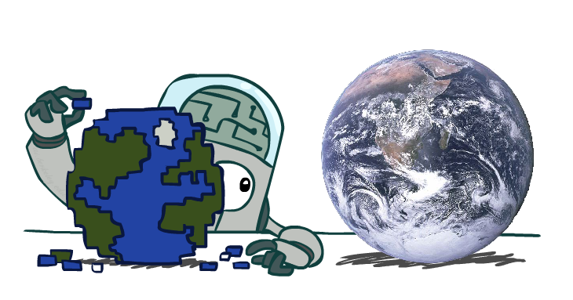]
.center[Los problemas de búsqueda son .bold[modelos].]

.footnote[Créditos: [CS188](https://inst.eecs.berkeley.edu/~cs188/), UC Berkeley.]

???

Los problemas de búsqueda son modelos, es decir, abstracciones
matemáticas. Estos modelos omiten detalles que no son relevantes para
resolver el problema.

El proceso de quitar detalles a una representación se llama
abstracción.

---

class: middle

## Ejemplo: comerse todos los puntos

- Estados: $\\{ (x, y), \text{booleanos de puntos}\\}$
- Acciones: NSEO
- Transición: actualizar la ubicación y, posiblemente, un booleano de
  punto
- Prueba de objetivo: todos los puntos en falso

.width-100.center[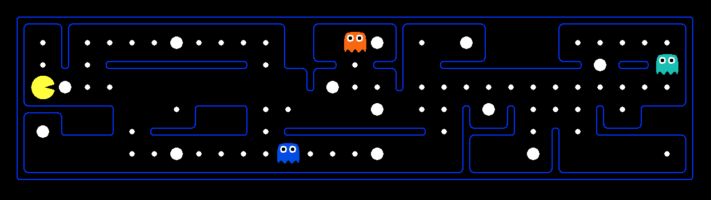]

.footnote[Créditos: [CS188](https://inst.eecs.berkeley.edu/~cs188/), UC Berkeley.]

---

class: middle

## Tamaño del espacio de estados

.grid[
.kol-1-2[
- .italic[Estado del mundo]:
    - Posiciones del agente: 120
    - Cantidad de puntos: 30
    - Posiciones de fantasmas: 12
    - Orientación del agente: NSEO
- .italic[¿Cuántos hay?]
    - ¿Estados del mundo?
        - $120 \times 2^{30} \times 12^2 \times 4$
    - ¿Estados para comerse-todos-los-puntos?
        - $120 \times 2^{30}$
]
.kol-1-2[
.width-100[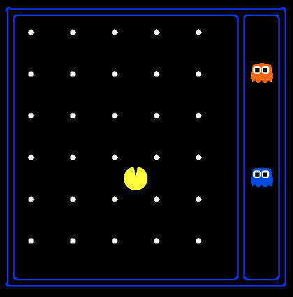]
]
]

.footnote[Créditos: [CS188](https://inst.eecs.berkeley.edu/~cs188/), UC Berkeley.]

---

# Árboles de búsqueda

El conjunto de secuencias aceptables que parten del estado inicial
forma un .bold[árbol de búsqueda].
- Los nodos corresponden a estados en el espacio de estados; el estado
  inicial es la raíz.
- Las ramas corresponden a acciones aplicables, y los nodos hijos
  corresponden a los sucesores.

Para la mayoría de los problemas, nunca podemos construir el árbol
completo. ¡Aun así queremos encontrar alguna rama óptima!

.center[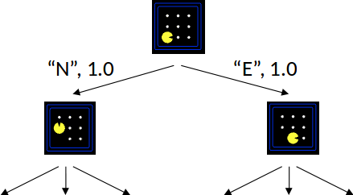]

.footnote[Créditos: [CS188](https://inst.eecs.berkeley.edu/~cs188/), UC Berkeley.]

---

# Algoritmos de búsqueda en árbol

.width-100[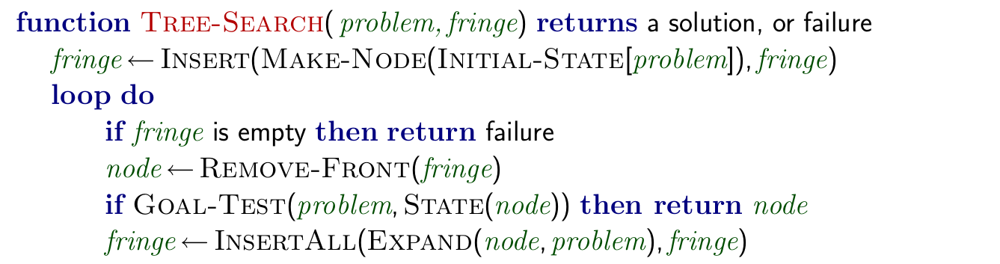]

## Ideas importantes
- Frontera (o *fringe*) de planes parciales bajo consideración
- Expansión
- Exploración

---

class: middle

.exercise[¿Qué nodos de la frontera explorar? ¿Cómo expandir la menor
cantidad de nodos posible, sin dejar de alcanzar el objetivo?]

---

class: middle

.center.width-90[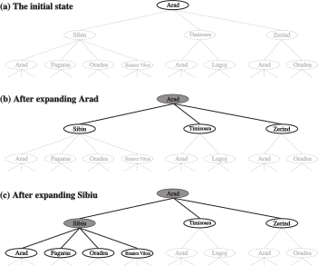]

---

# Estrategias de búsqueda no informada

Las estrategias de búsqueda .bold[no informada] usan solo la
información disponible en la definición del problema. No saben si un
estado se ve más prometedor que otro.

## Estrategias
- Búsqueda en profundidad (DFS)
- Búsqueda en amplitud (BFS)
- Búsqueda de costo uniforme (UCS)
- Profundización iterativa

---

# Propiedades de las estrategias de búsqueda

- Una estrategia se define eligiendo el .bold[orden de expansión].
- Las estrategias se evalúan según las siguientes dimensiones:
    - .italic[Completitud]: ¿siempre encuentra una solución si existe
      alguna?
    - .italic[Optimalidad]: ¿siempre encuentra la solución de menor
      costo?
    - .italic[Complejidad temporal]: ¿cuánto tarda en encontrar una
      solución?
    - .italic[Complejidad espacial]: ¿cuánta memoria necesita para
      hacer la búsqueda?
- El tiempo y la complejidad se miden en función de
    - $b$: factor de ramificación máximo del árbol de búsqueda
    - $d$: profundidad de la solución de menor costo
        * la profundidad de $s$ se define como el número de acciones
          desde el estado inicial hasta $s$.
    - $m$: longitud máxima de cualquier camino en el espacio de
      estados (puede ser $\infty$)

---

class: middle

.center.width-80[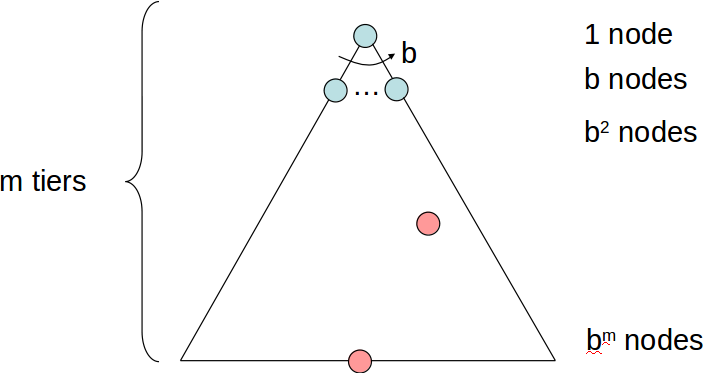]

???

Número de nodos en un árbol = $\frac{b^{m+1}-1}{b-1}$

---

# Búsqueda en profundidad (DFS)

<br><br>
.width-100[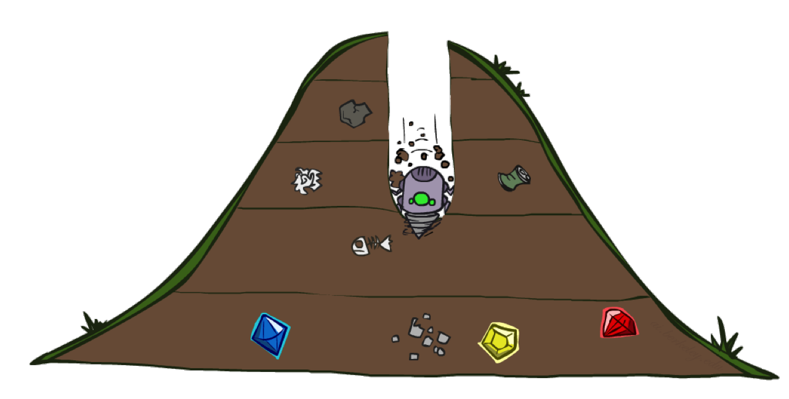]

.footnote[Créditos: [CS188](https://inst.eecs.berkeley.edu/~cs188/), UC Berkeley.]

---

class: middle

- .italic[Estrategia]: expandir el nodo más profundo de la frontera.
- .italic[Implementación]: la frontera es una .bold[pila LIFO].

.width-80.center[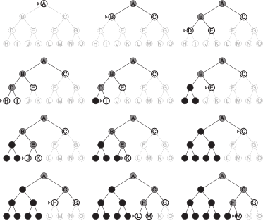]

---

class: middle

.center.width-80[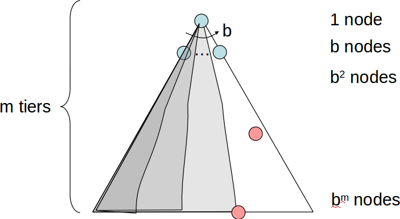]

---

class: middle

## Propiedades de DFS

- .italic[Completitud]:
    - $m$ podría ser infinito, así que solo se cumple si evitamos
      ciclos (más sobre esto adelante).
- .italic[Optimalidad]:
    - No, DFS encuentra la solución más a la izquierda, sin importar
      su profundidad o costo.
- .italic[Complejidad temporal]:
    - Puede generar el árbol completo (o buena parte de él,
      independientemente de $d$). Por lo tanto $O(b^m)$, que puede ser
      mucho mayor que el tamaño del espacio de estados.
- .italic[Complejidad espacial]:
    - Solo almacena a los hermanos del camino hacia la raíz, por lo
      tanto $O(bm)$.
    - Cuando todos los descendientes de un nodo ya se visitaron, el
      nodo se puede eliminar de memoria.

---

# Búsqueda en amplitud (BFS)

<br><br>
.width-100[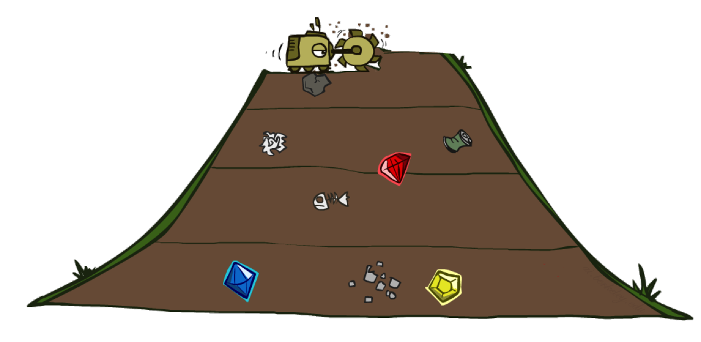]

.footnote[Créditos: [CS188](https://inst.eecs.berkeley.edu/~cs188/), UC Berkeley.]

---

class: middle

- .italic[Estrategia]: expandir el nodo más superficial de la
  frontera.
- .italic[Implementación]: la frontera es una .bold[cola FIFO].

.width-80.center[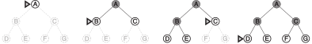]

---

class: middle

.center.width-80[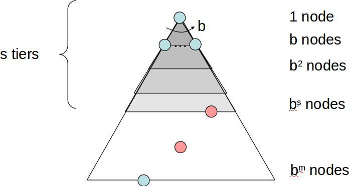]

---

class: middle

## Propiedades de BFS

- .italic[Completitud]:
    - Si el nodo objetivo más superficial está a una profundidad
      finita $d$, BFS eventualmente lo encontrará tras generar todos
      los nodos menos profundos (siempre que $b$ sea finito).
- .italic[Optimalidad]:
    - El objetivo más superficial no es necesariamente el óptimo.
    - BFS es óptima solo si el costo del camino es una función no
      decreciente de la profundidad del nodo.
- .italic[Complejidad temporal]:
    - Si la solución está a profundidad $d$, el número total de nodos
      generados antes de encontrarla es
      $b+b^2+b^3+...+b^d = O(b^d)$
- .italic[Complejidad espacial]:
    - El número de nodos a mantener en memoria es el tamaño de la
      frontera, que será máximo en el último nivel. Es decir,
      $O(b^d)$

---

class: middle, center

(demo)

???

```
python run.py --agentfile dfs.py --show 1 --layout small
python run.py --agentfile bfs.py --show 1 --layout small

python run.py --agentfile dfs.py --show 1 --layout medium
python run.py --agentfile bfs.py --show 1 --layout medium

python run.py --agentfile dfs.py --show 1 --layout large
python run.py --agentfile bfs.py --show 1 --layout large
```

---

# Profundización iterativa

Idea: obtener las ventajas de espacio de DFS con las ventajas de
tiempo/solución superficial de BFS.
- Correr DFS con límite de profundidad 1.
- Si no hay solución, correr DFS con límite de profundidad 2.
- Si no hay solución, correr DFS con límite de profundidad 3.
    - ...

.grid[
.kol-1-2[
.exercise[
- ¿Cuáles son las propiedades de la profundización iterativa?
- ¿No es este proceso innecesariamente redundante?
]
]
.kol-1-2[
.center.width-80[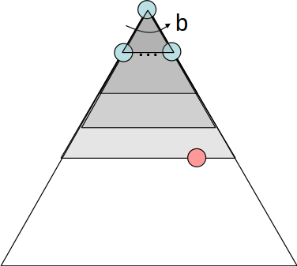]
]
]

---

# Búsqueda de costo uniforme (UCS)

<br><br>
.width-100[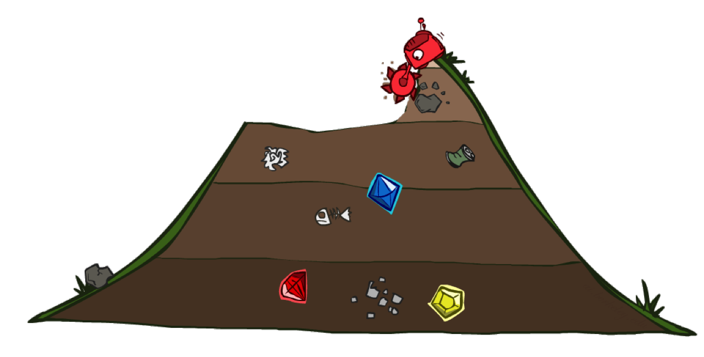]

.footnote[Créditos: [CS188](https://inst.eecs.berkeley.edu/~cs188/), UC Berkeley.]

---

class: middle

- .italic[Estrategia]: expandir el nodo más barato de la frontera.
- .italic[Implementación]: la frontera es una .bold[cola de
  prioridad], usando el costo acumulado $g(n)$ desde el estado inicial
  hasta el nodo $n$ como prioridad.

---

class: middle

.center.width-70[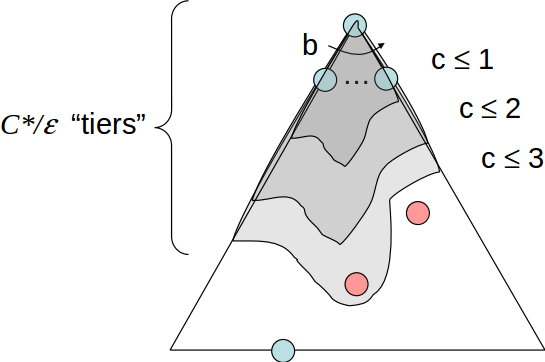]

---

class: middle

## Propiedades de UCS

- .italic[Completitud]:
    - Sí, si todos los costos de paso cumplen
      $c(s,a,s') \geq \epsilon > 0$. (¿Por qué?)
- .italic[Optimalidad]:
    - Sí, ya que UCS expande los nodos en orden de su costo de camino
      óptimo.
- .italic[Complejidad temporal]:
     - Asumamos que $C^\*$ es el costo de la solución óptima y que
       todos los costos de paso son $\geq \epsilon$.
     - La "profundidad efectiva" es entonces, aproximadamente,
       $C^\*/\epsilon$.
     - La complejidad temporal en el peor caso es
       $O(b^{C^\*/\epsilon})$.
- .italic[Complejidad espacial]:
     - El número de nodos a mantener es el tamaño de la frontera, es
       decir, tantos como en el último nivel: $O(b^{C^\*/\epsilon})$.

---

class: middle, center

(demo)

???

```
python run.py --agentfile bfs.py --show 1 --layout medium
python run.py --agentfile ucs.py --show 1 --layout medium
```

---

# Estrategias de búsqueda informada

.center.width-70[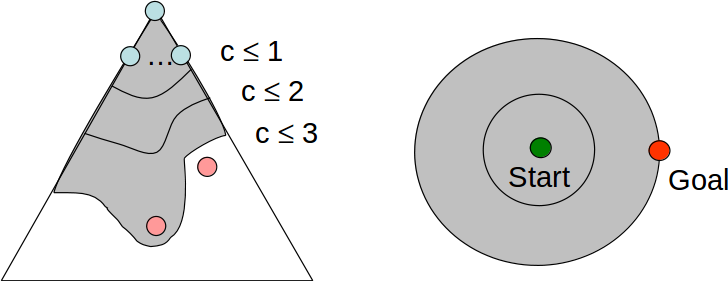]

Uno de los .bold[problemas de UCS] es que explora el espacio de
estados en .italic[todas las direcciones], sin aprovechar información
sobre la ubicación (plausible) del nodo objetivo.

Las estrategias de búsqueda .bold[informada] buscan resolver este
problema expandiendo los nodos de la frontera en orden decreciente de
.italic[deseabilidad].
- Búsqueda voraz (*greedy*)
- A*

---

# Búsqueda voraz (greedy)

<br>
.width-100[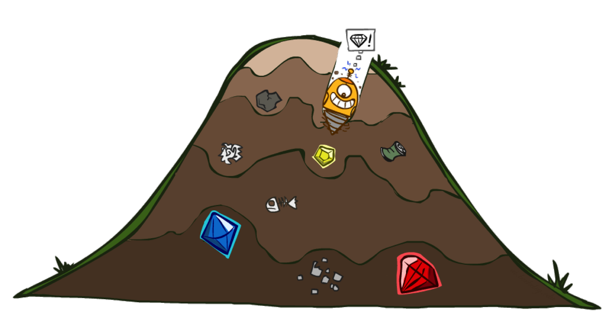]

.footnote[Créditos: [CS188](https://inst.eecs.berkeley.edu/~cs188/), UC Berkeley.]

---

class: middle

## Heurísticas

Una .bold[heurística] (o función de evaluación) $h(n)$ es:
- una función que .italic[estima] el costo del camino más barato desde
  el nodo $n$ hasta un estado objetivo;
    - $h(n) \geq 0$ para todo nodo $n$
    - $h(n) = 0$ para un estado objetivo.
- se diseña para un problema de búsqueda .italic[particular].

<br>
.center.width-70[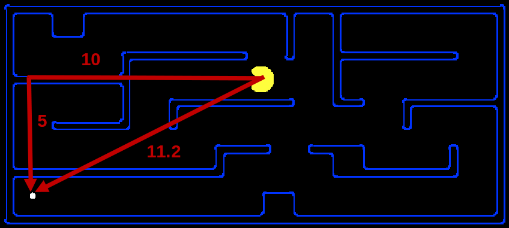]

.footnote[Créditos: [CS188](https://inst.eecs.berkeley.edu/~cs188/), UC Berkeley.]

---

class: middle

## Búsqueda voraz

- .italic[Estrategia]: expandir el nodo $n$ de la frontera para el
  cual $h(n)$ es menor.
- .italic[Implementación]: la frontera es una .bold[cola de
  prioridad], usando $h(n)$ como prioridad.

---

class: middle, center

.width-80[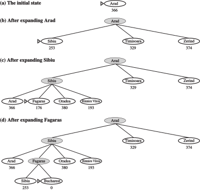]

$h(n)$ = distancia en línea recta hasta Bucarest.

---

class: middle

.center.width-90[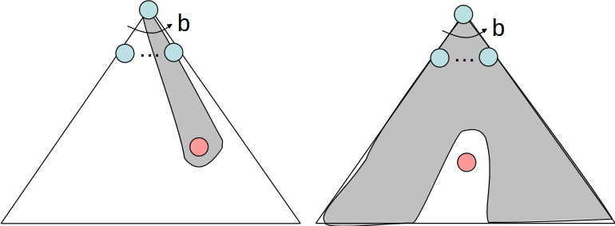]

.center[En el mejor caso, la búsqueda voraz te lleva directo al
objetivo.<br>
En el peor caso, es como un BFS mal guiado.]

---

class: middle

## Propiedades de la búsqueda voraz

- .italic[Completitud]:
    - No, a menos que evitemos ciclos (más sobre esto adelante).
- .italic[Optimalidad]:
    - No, ej. el camino vía Sibiu y Fagaras es 32km más largo que el
      camino por Rimnicu Vilcea y Pitesti.
- .italic[Complejidad temporal]:
    - $O(b^m)$, a menos que tengamos una buena función heurística.
- .italic[Complejidad espacial]:
    - $O(b^m)$, a menos que tengamos una buena función heurística.

---

# A*

<br><br>
.width-100[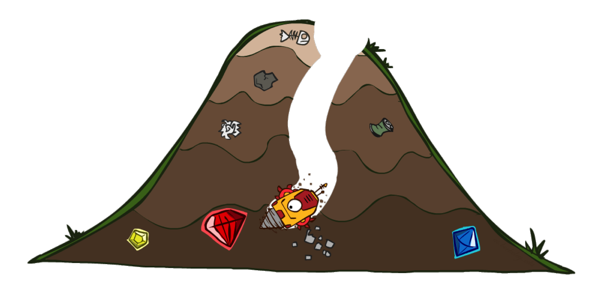]

.footnote[Créditos: [CS188](https://inst.eecs.berkeley.edu/~cs188/), UC Berkeley.]

---

class: middle

.grid[
.kol-1-2[<br><br><br><br>
## El robot Shakey

- A\* se propuso por primera vez en **1968** para mejorar la
  planificación de robots.
- El objetivo era navegar por una habitación con obstáculos.
]
.kol-1-2[
.center.width-80[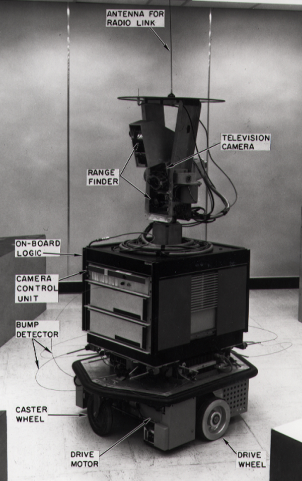]
]
]

.footnote[Foto: SRI International — proyecto Shakey (1966–1972).]

---

class: middle, center, divider-slide

## Shakey el robot (SRI International, 1969)

.video-placeholder[

<div class="play-badge">&#9658;</div>
]

[Ver video &#8594;](https://www.youtube.com/watch?v=7bsEN8mwUB8)

---

class: middle

## A*

- El costo uniforme ordena por costo del camino, o .italic[costo hacia
  atrás] $g(n)$
- La búsqueda voraz ordena por cercanía al objetivo, o .italic[costo
  hacia adelante] $h(n)$
- .bold[A*] combina los dos algoritmos y ordena por la suma
  $$f(n) = g(n) + h(n)$$
- $f(n)$ es el costo estimado de la solución más barata que pasa por
  $n$.

---

class: middle

.center.width-80[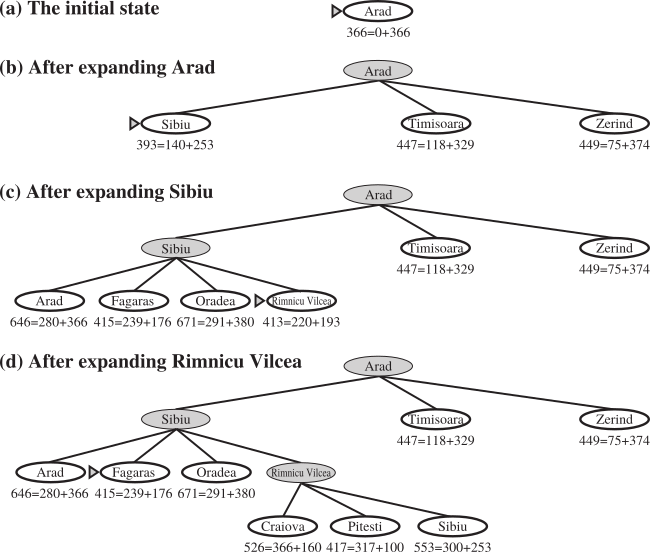]

---

class: middle

.center.width-80[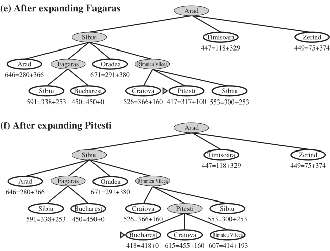]

.exercise[¿Por qué A* no se detiene en el paso (e), si Bucarest ya
está en la frontera?]

---

class: middle

## Heurísticas admisibles

Una heurística $h$ es .bold[admisible] si
$$0 \leq h(n) \leq h^\*(n)$$
donde $h^\*(n)$ es el costo real hasta el objetivo más cercano.

.center.width-80[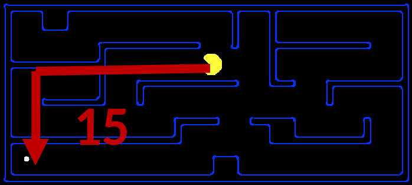]
.caption[La distancia Manhattan es admisible]

???

$h$ es admisible si subestima el costo real hacia el objetivo.

---

class: middle

## Optimalidad de A*

.grid[
.kol-2-3[
Supuestos:
- $A$ es un nodo objetivo óptimo
- $B$ es un nodo objetivo subóptimo
- $h$ es admisible

Afirmación:
$A$ saldrá de la frontera antes que $B$.
]
.kol-1-3[
.width-100[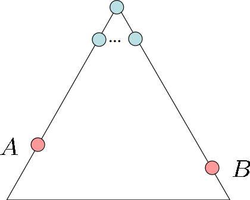]
]
]

---

class: middle

.grid[
.kol-2-3[
## Prueba

Supongamos que $B$ está en la frontera.
Algún ancestro $n$ de $A$ también está en la frontera.

- $f(n) \leq f(A)$
    - $f(n) = g(n) + h(n)$ (por definición)
    - $f(n) \leq g(A)$ (admisibilidad de $h$)
    - $f(A) = g(A) + h(A) = g(A)$ ($h=0$ en un objetivo)
- $f(A) < f(B)$
    - $g(A) < g(B)$ ($B$ es subóptimo)
    - $f(A) < f(B)$ ($h=0$ en un objetivo)
- Por lo tanto, $n$ se expande antes que $B$.
    - ya que $f(n) \leq f(A) < f(B)$
]
.kol-1-3[
.width-100[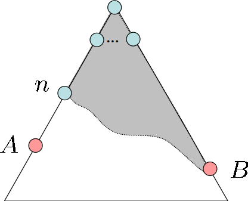]
]
]
De forma similar, todos los ancestros de $A$ se expanden antes que
$B$, incluido $A$. Por lo tanto, .bold[A* es óptimo].

---

class: middle

## Contornos de A*

- Supongamos que los costos $f$ son no decrecientes a lo largo de
  cualquier camino.
- Podemos definir .bold[niveles de contorno] $t$ en el espacio de
  estados, que incluyen todos los nodos $n$ para los cuales
  $f(n) \leq t$.

.center[
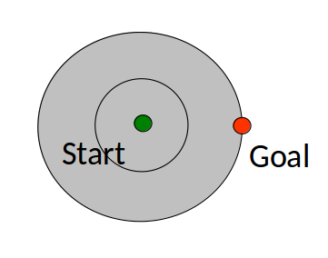
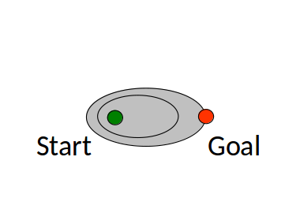]
.grid[
.kol-1-2[Para UCS ($h(n)=0$ para todo $n$), las bandas son circulares
alrededor del inicio.]
.kol-1-2[Para A* con heurísticas precisas, las bandas se estiran hacia
el objetivo.]
]

---

class: middle

.grid[
.kol-1-3[
.width-100[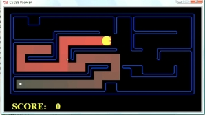]
]
.kol-1-3[
.width-100[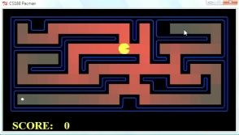]
]
.kol-1-3[
.width-100[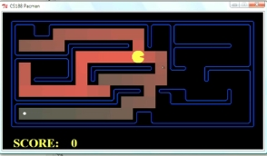]
]
]
.center.grid[
.kol-1-3[
Búsqueda voraz
]
.kol-1-3[
UCS
]
.kol-1-3[
A*
]
]

.footnote[Créditos: [CS188](https://inst.eecs.berkeley.edu/~cs188/), UC Berkeley.]

???

A\* encuentra el camino más corto.

---

class: middle, center

(demo)

???

```
python run.py --agentfile astar0.py --layout large --show 1
python run.py --agentfile astar1.py --layout large --show 1
python run.py --agentfile astar2.py --layout large --show 1
```

---

# Creando heurísticas admisibles

Gran parte del trabajo para resolver problemas de búsqueda difíciles de
forma óptima está en encontrar heurísticas admisibles.

Las heurísticas admisibles se pueden derivar de las soluciones exactas
de .italic[problemas relajados], donde hay nuevas acciones disponibles.

<br><br>
.center.width-80[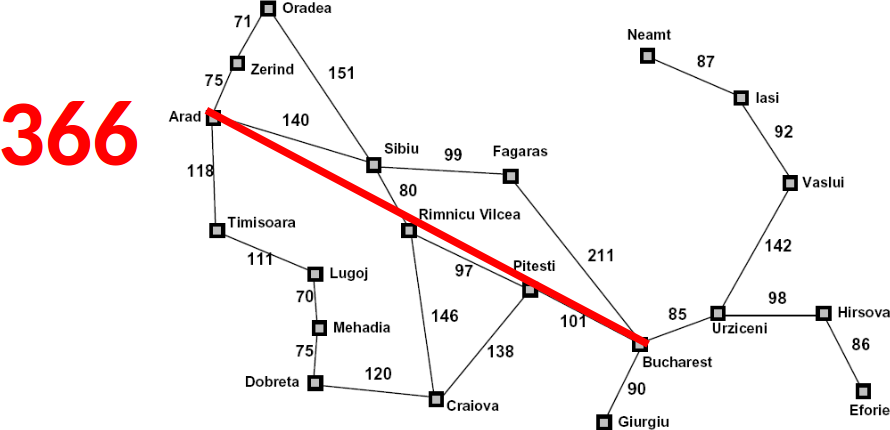]

---

class: middle

## Dominancia

- Si $h_1$ y $h_2$ son ambas admisibles y $h_2(n) \geq h_1(n)$ para
  todo $n$, entonces $h_2$ .bold[domina] a $h_1$ y es .italic[mejor]
  para la búsqueda.
- Dadas heurísticas admisibles cualesquiera $h_a$ y $h_b$,
  $$h(n) = \max(h_a(n), h_b(n))$$
  también es admisible y domina a $h_a$ y $h_b$.

---

class: middle

## Aprendiendo heurísticas a partir de la experiencia

- Asumiendo un entorno .italic[episódico], un agente puede
  .bold[aprender] buenas heurísticas jugando el juego muchas veces.
- Cada solución óptima $s^\*$ provee .italic[ejemplos de
  entrenamiento] a partir de los cuales se puede aprender $h(n)$.
- Cada ejemplo consiste de un estado $n$ del camino solución y el
  costo real $g(s^\*)$ de la solución desde ese punto.
- El mapeo $n \to g(s^\*)$ se puede aprender con algoritmos de
  .bold[aprendizaje supervisado].
    - Modelos lineales, redes neuronales, etc.

---

# Búsqueda en grafo

<br>
.center.width-90[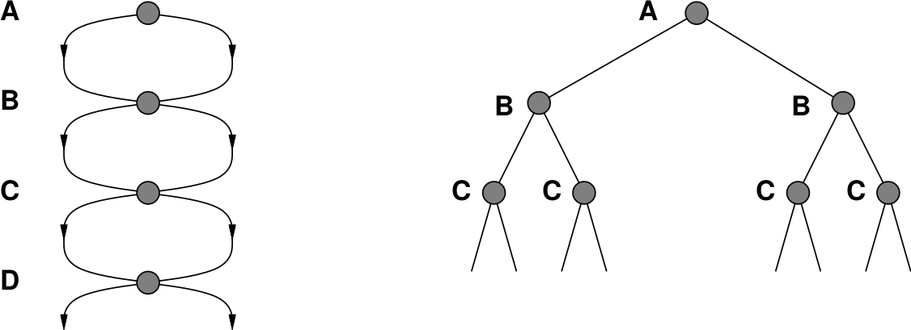]
<br>

La falla al no detectar .bold[estados repetidos] puede convertir un
problema lineal en uno exponencial. También puede provocar búsquedas
que no terminan.

Los caminos redundantes y los ciclos se pueden evitar .bold[llevando
un registro] de los estados que ya se .italic[exploraron]. Esto
equivale a construir un árbol directamente sobre el grafo del espacio
de estados.

???

Insistir en la importancia de definir representaciones de estado que
no colapsen estados (del mundo) distintos sobre una misma
representación.

---

class: middle

.width-100[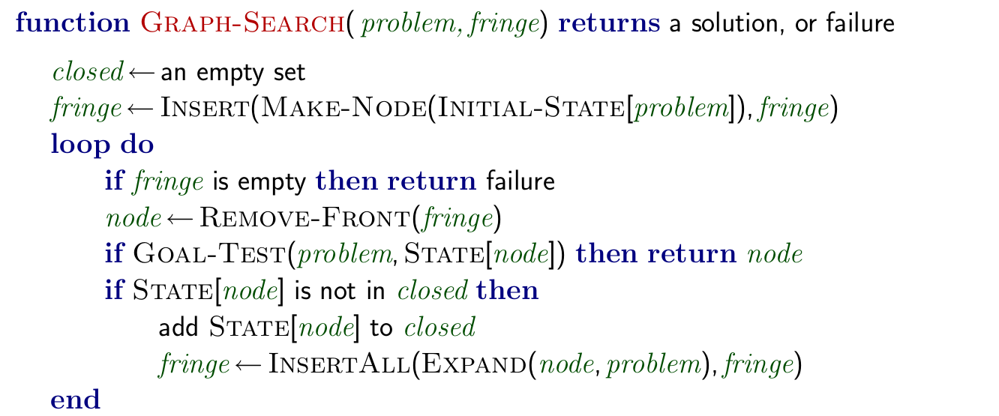]

???

- La completitud está bien.
- La optimalidad es delicada. ¡Podríamos encontrar la equivocada!

---

class: middle

.grid[
.kol-1-2[<br><br>
## ¿A* en grafo sale mal?

.grid[
.kol-1-2[
- Empezamos en $S$ y $G$ es un estado objetivo.
- ¿Qué camino encuentra la búsqueda en grafo?
]
.kol-1-2.center.width-55[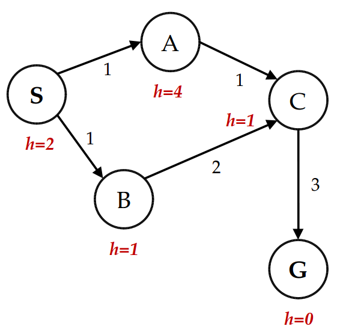]
]

???

Primero, ¿$h$ es admisible?

Simular la ejecución de búsqueda en grafo usando esta $h$.

¡El nodo $C$ se expande demasiado pronto!

---

class: middle

## Heurísticas consistentes

.grid[
.kol-2-3[
Una heurística $h$ es consistente si para todo $n$ y todo sucesor $n'$
generado por cualquier acción $a$,
$$h(n) \leq c(n,a,n') + h(n').$$
]
.kol-1-3.center.width-70[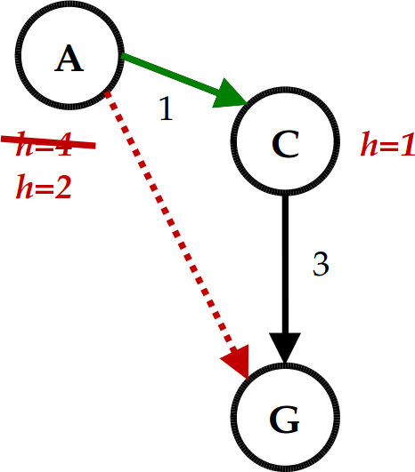]
]

Consecuencias de las heurísticas consistentes:
- $f(n)$ es no decreciente a lo largo de cualquier camino.
- $h(n)$ es admisible.
- Con una heurística consistente, A* con búsqueda en grafo es óptimo.

???

Algoritmo alternativo de búsqueda en grafo: ver la diapositiva 22 de
https://www.ics.uci.edu/~kkask/Fall-2016%20CS271/slides/03-InformedHeuristicSearch.pdf
=> sin reapertura de nodos hace falta consistencia
=> si se permite reabrir nodos, con admisibilidad alcanza

---


# Ejemplo de repaso: Super Mario

.center.width-50[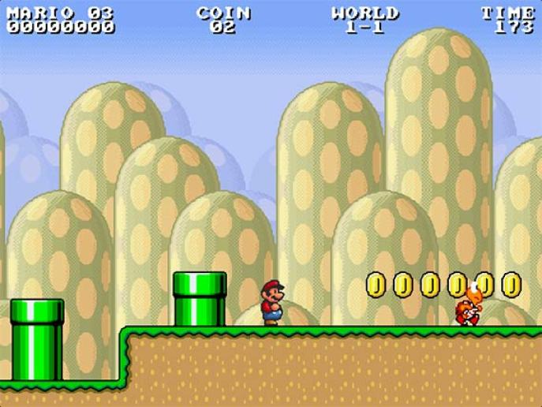]

- ¿.italic[Entorno de tarea]?
    - ¿medida de desempeño, entorno, actuadores, sensores?
- ¿.italic[Tipo] de entorno?
- ¿.italic[Problema de búsqueda]?
    - ¿estado inicial, acciones, modelo de transición, prueba de
      objetivo, costo del camino?
- ¿.italic[Buena heurística]?

.footnote[Captura de *Super Mario Bros.*, © Nintendo — uso educativo en
clase.]

???

- medida de desempeño = puntaje, entre más a la derecha mejor; monedas;
  enemigos eliminados, ...
- entorno: el mundo de Mario
- actuadores: izquierda, derecha, arriba, abajo, saltar, velocidad
- sensores: la pantalla

- tipo de entorno: parcialmente observable, determinístico, episódico,
  dinámico, discreto/continuo, multiagente, conocido

- problema de búsqueda:
    * estado = posición de Mario (x, y), mapa, puntaje, tiempo
    * estado inicial = inicio del juego
    * modelo de transición = lo da el motor del juego (¡asumamos que
      lo conocemos!)
    * prueba de objetivo = ¿llegamos a la bandera?
    * costo del camino = mientras más corto el camino, mejor; penaliza
      si muere, bonifica si recoge monedas y elimina enemigos

---

class: middle, center, divider-slide

## A* en acción (recorrido de Mario)

.video-placeholder[

<div class="play-badge">&#9658;</div>
]

[Ver video &#8594;](https://www.youtube.com/watch?v=DlkMs4ZHHr8)

???

Comentar las acciones tomadas en cada cuadro (derecha, saltar,
velocidad) mostradas en rojo en el video.

---

# Resumen

- La formulación de un problema normalmente requiere abstraer detalles
  del mundo real para definir un espacio de estados que se pueda
  explorar de forma factible.
- Variedad de estrategias de búsqueda no informada (*DFS*, *BFS*,
  *UCS*, *profundización iterativa*).
- Las funciones heurísticas estiman costos de los caminos más cortos.
  Una buena heurística puede reducir drásticamente el costo de la
  búsqueda.
- La búsqueda voraz expande el $h$ más bajo, lo cual resulta ser
  incompleta y no siempre óptima.
- La búsqueda .bold[A*] expande el $f=g+h$ más bajo. Esta estrategia
  es completa y óptima.
- La búsqueda en grafo puede ser exponencialmente más eficiente que la
  búsqueda en árbol.

---

class: middle, center, end-slide
count: false

## Fin de la Clase 2

Próxima clase: Juegos adversariales — minimax y poda alfa-beta
