class: middle, center, title-slide

# SI3003 - Inteligencia Artificial

Clase 3 — Satisfacción de restricciones (CSP)

  

???

Clase 3 formaliza algo que ya usamos en la Clase 2 sin nombrarlo:
backtracking es DFS aplicado a un problema con estructura interna
(variables/dominios/restricciones) en vez de estados atómicos. Explotar
esa estructura es la idea central de CSP.

---

class: divider-slide, center, middle

.width-60[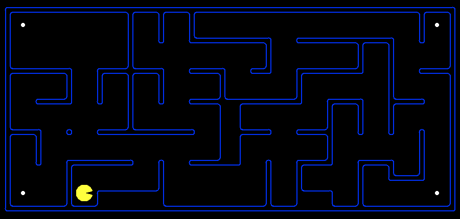]

Mmm, déjame pensar...

---

count: false
class: divider-slide, center, middle

.width-60[]

(...)

---

count: false
class: divider-slide, center, middle

.width-60[]

(un rato después)

---

count: false
class: divider-slide, center, middle

.width-60[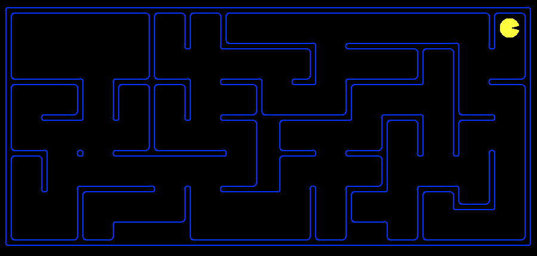]

¡Solución encontrada! ¿Podemos hacerlo mejor?

---

# Hoy

.grid[
.kol-1-2[
- .italic[Problemas de satisfacción de restricciones (CSP)]:
    - Explotar la representación de un estado para acelerar la búsqueda.
    - Backtracking.
    - Heurísticas genéricas: ordenamiento, filtrado, estructura.
]
.kol-1-2[
.center.width-90[]
]
]

.footnote[Créditos: [CS188](https://inst.eecs.berkeley.edu/~cs188/), UC Berkeley.]

---

class: middle

# Problemas de satisfacción de restricciones

---

# Motivación

En los problemas de búsqueda estándar:
- Los estados se evalúan con heurísticas específicas del dominio.
- Los estados se prueban con una función específica del dominio para
  determinar si se alcanzó el objetivo.
- Sin embargo, desde el punto de vista de los algoritmos de búsqueda,
  **los estados son atómicos**.

En cambio, si los estados tienen una .italic[representación factored],
entonces se puede explotar la estructura de los estados para mejorar la
.bold[eficiencia de la búsqueda].

.center.width-40[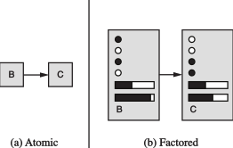]

.footnote[Créditos: [CS188](https://inst.eecs.berkeley.edu/~cs188/), UC Berkeley.]

---

# Problemas de satisfacción de restricciones

- Los solucionadores de .bold[problemas de satisfacción de
  restricciones] (CSP) aprovechan las representaciones factored de
  estados y usan heurísticas de .italic[propósito general] para resolver
  problemas complejos.
- Los CSP son una familia especializada de subproblemas de búsqueda.
- Idea principal: eliminar porciones grandes del espacio de búsqueda de
  una sola vez, identificando combinaciones de variable/valor que violan
  restricciones.

---

class: middle

Formalmente, un .bold[problema de satisfacción de restricciones] (CSP)
consiste de tres componentes $X$, $D$ y $C$:

- $X$ es un conjunto de .italic[variables], $\\{X_1, ..., X_n\\}$,
- $D$ es un conjunto de .italic[dominios], $\\{D_1, ..., D_n\\}$, uno
  para cada variable,
- $C$ es un conjunto de .italic[restricciones] que especifican las
  combinaciones de valores permitidas.

---

class: middle

## Ejemplo: coloreo de mapas

.center.width-70[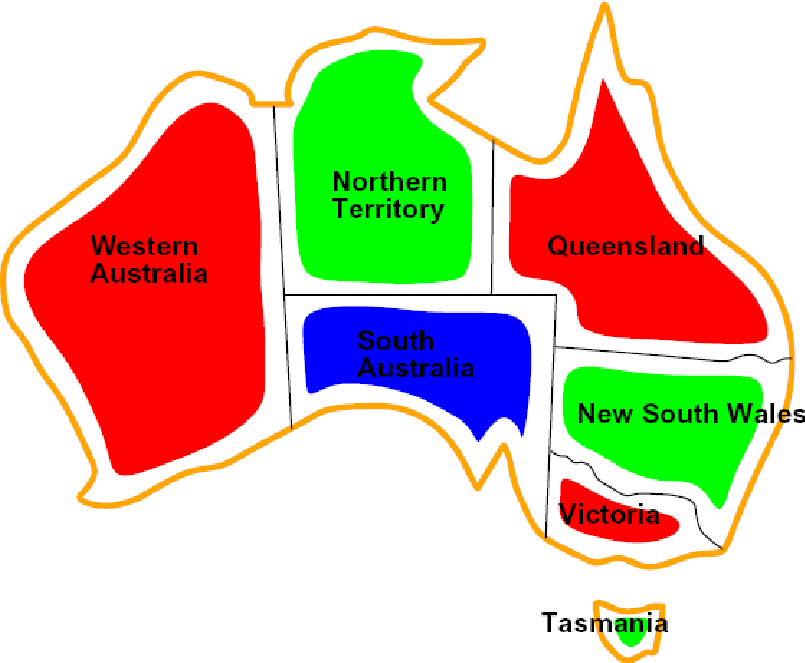]

---

class: middle

.center.width-30[]

- Variables: $X = \\{ \text{WA}, \text{NT}, \text{Q}, \text{NSW}, \text{V}, \text{SA}, \text{T} \\}$
- Dominios: $D_i = \\{ \text{rojo}, \text{verde}, \text{azul} \\}$ para
  cada variable.
- Restricciones: $C = \\{ \text{SA} \neq \text{WA}, \text{SA} \neq \text{NT}, \text{SA} \neq \text{Q}, ... \\}$
    - Implícita: $\text{WA} \neq \text{NT}$
    - Explícita: $(\text{WA}, \text{NT}) \in \\{ \\{\text{rojo}, \text{verde}\\}, \\{\text{rojo}, \text{azul}\\}, ... \\}$
- Las soluciones son .bold[asignaciones] de valores a las variables tales
  que se satisfacen todas las restricciones.
    - ej., $\\{ \text{WA}=\text{rojo}, \text{NT}=\text{verde}, \text{Q}=\text{rojo}, \text{SA}=\text{azul},$ $\quad\quad \text{NSW}=\text{verde}, \text{V}=\text{rojo}, \text{T}=\text{verde} \\}$

---

# (Hiper)grafo de restricciones

.center.width-50[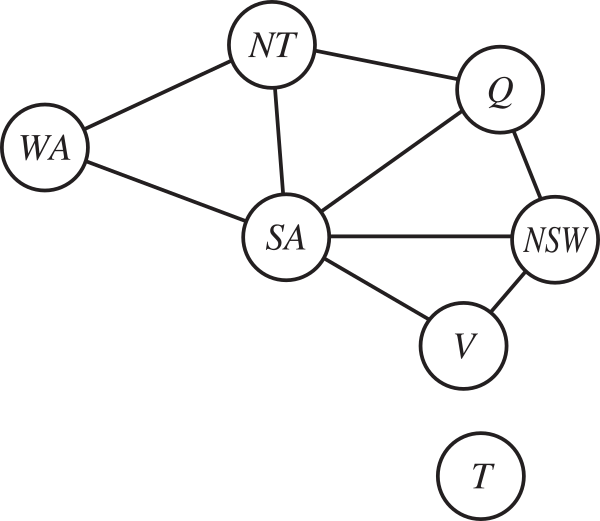]

- .italic[Nodos] = variables del problema
- .italic[Aristas] = restricciones del problema que involucran a las
  variables asociadas a los nodos extremos.
- Los algoritmos de CSP de propósito general .bold[usan la estructura
  del grafo] para acelerar la búsqueda.
    - ej., Tasmania es un subproblema independiente.

---

class: middle

## Ejemplo: criptoaritmética

.center.width-60[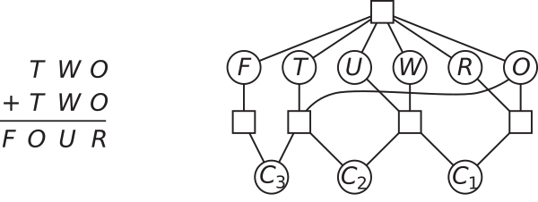]

- Variables: $\\{ T, W, O, F, U, R, C_1, C_2, C_3\\}$
- Dominios: $D_i = \\{ 0, 1, 2, 3, 4, 5, 6, 7, 8, 9 \\}$
- Restricciones:
    - $\text{alldiff}(T, W, O, F, U, R)$
    - $O+O=R+10\times C_1$
    - $C_1 + W + W = U + 10\times C_2$
    - ...

---

class: middle

## Ejemplo: Sudoku

.center.width-30[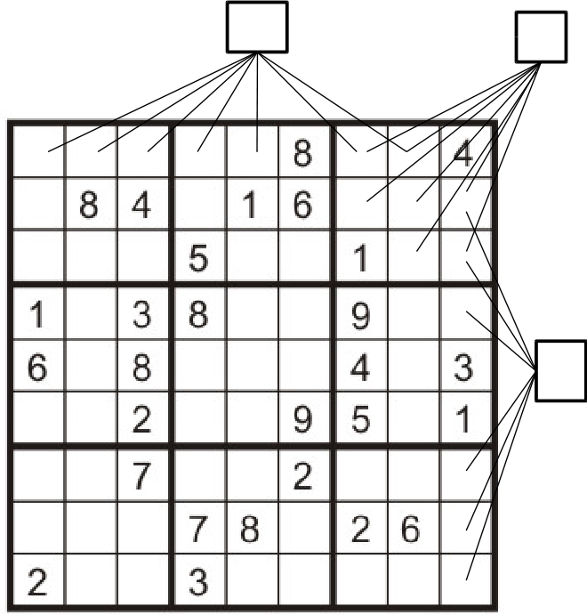]

- Variables: cada casilla (abierta)
- Dominios: $D_i = \\{ 1, 2, 3, 4, 5, 6, 7, 8, 9 \\}$
- Restricciones:
    - $\text{alldiff}$ de 9 vías para cada columna
    - $\text{alldiff}$ de 9 vías para cada fila
    - $\text{alldiff}$ de 9 vías para cada región

---

class: middle

.center.width-50[]

## Ejemplo: el algoritmo de Waltz

Procedimiento para interpretar dibujos 2D de líneas de poliedros sólidos
como objetos 3D. Ejemplo temprano de un cómputo de IA planteado como un
CSP.

.pull-right.width-70[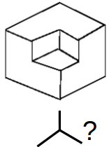]
Formulación como CSP:
- Cada intersección es una variable.
- Las intersecciones adyacentes se imponen restricciones entre sí.
- Las soluciones son objetos 3D físicamente realizables.

.footnote[Créditos: [CS188](https://inst.eecs.berkeley.edu/~cs188/), UC Berkeley.]

---

# Variaciones sobre el formalismo CSP

- .italic[Variables discretas]
    - Dominios finitos
        - Tamaño $d$ implica $O(d^n)$ asignaciones completas.
        - ej., CSP booleanos, incluyendo el problema de satisfacibilidad
          booleana SAT (NP-completo).
    - Dominios infinitos
        - ej., programación de tareas, las variables son días de
          inicio/fin de cada tarea.
        - hace falta un lenguaje de restricciones, ej.
          $inicio_1 + 5 \leq inicio_2$.
        - Resoluble para restricciones lineales, indecidible en otro
          caso.
- .italic[Variables continuas]
    - ej., tiempos precisos de inicio/fin de experimentos.
    - Las restricciones lineales son resolubles en tiempo polinomial con
      métodos de programación lineal.

---

class: middle

- .italic[Variedades de restricciones]
    - Las restricciones unarias involucran una sola variable.
        - Equivalente a reducir el dominio, ej. $\text{SA} \neq \text{verde}$.
    - Las restricciones binarias involucran pares de variables, ej.
      $\text{SA} \neq \text{WA}$.
    - Las restricciones de orden superior involucran 3 o más variables.
- .italic[Preferencias] (restricciones suaves)
    - ej., rojo es mejor que verde.
    - Frecuentemente representables como un costo por cada asignación de
      variable.
    - Da lugar a problemas de optimización con restricciones.
    - (Las ignoramos en este curso.)

---

# Ejemplos del mundo real

.grid[
.kol-1-2[
- Problemas de asignación
    - ej., quién enseña qué clase
- Problemas de programación de horarios
    - ej., ¿qué clase se ofrece cuándo y dónde?
- Configuración de hardware
- Hojas de cálculo
- Programación de transporte
- Programación de fábricas
- Diseño de circuitos
- ... y muchos más
]
.kol-1-2[
.width-100[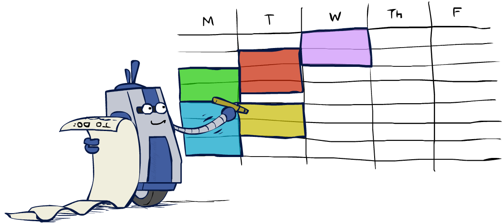]
]
]

Nota que muchos problemas del mundo real involucran variables de valor
real.

.footnote[Créditos: [CS188](https://inst.eecs.berkeley.edu/~cs188/), UC Berkeley.]

---

# Programación con restricciones

.grid[
.kol-2-3[
 
.caption[La programación con restricciones representa uno de los
acercamientos más cercanos que la ciencia de la computación ha logrado
al Santo Grial de la programación: el usuario plantea el problema, la
computadora lo resuelve.
 (Eugene Freuder)]
]
.kol-1-3[.center.circle.width-100[]]
]

La programación con restricciones es un paradigma de programación en el
que el usuario especifica el programa como un CSP. La resolución del
problema queda a cargo de la computadora.

Ejemplos:
- Prolog
- ECLiPSe

---

class: middle

# Resolviendo CSP

---

# Formulación como búsqueda estándar

- Los CSP se pueden plantear como problemas de búsqueda estándar.
    - Para los que ya tenemos solucionadores, incluyendo DFS, BFS o A*.
- Los estados son .italic[asignaciones parciales]:
    - El estado inicial es la asignación vacía $\\{ \\}$.
    - Acciones: asignar un valor a una variable sin asignar.
    - Prueba de objetivo: la asignación actual está completa y satisface
      todas las restricciones.
- ¡Este algoritmo es .bold[el mismo] para todos los CSP!

---

class: middle

.center.width-50[]

¿Qué haría BFS o DFS? ¿Qué problemas tiene la búsqueda ingenua?

Para $n$ variables de dominio de tamaño $d$:
- $b=(n-l)d$ en la profundidad $l$;
- ¡generamos un árbol con $n!d^n$ hojas aunque solo haya $d^n$
  asignaciones posibles!

???

Simular la ejecución en el tablero. Resaltar dos problemas:
- conmutatividad
- las restricciones solo se revisan al final, con la función de objetivo

---

# Búsqueda con backtracking

- La búsqueda con backtracking es el algoritmo canónico no informado
  para resolver CSP.
- Idea 1: .bold[una variable a la vez]:
    - La aplicación ingenua de algoritmos de búsqueda ignora una
      propiedad crucial: las asignaciones de variables son
      .italic[conmutativas]. Por lo tanto, fijamos el orden.
        - $\text{WA}=\text{rojo}$ y luego $\text{NT}=\text{verde}$ es lo
          mismo que $\text{NT}=\text{verde}$ y luego $\text{WA}=\text{rojo}$.
    - Solo hace falta considerar asignaciones a una única variable en
      cada paso.
        - $b=d$ y hay $d^n$ hojas.
- Idea 2: .bold[revisar restricciones sobre la marcha]:
    - Considerar solo valores que no entren en conflicto con la
      asignación parcial actual.
    - Prueba de objetivo incremental.

---

class: middle

.center.width-80[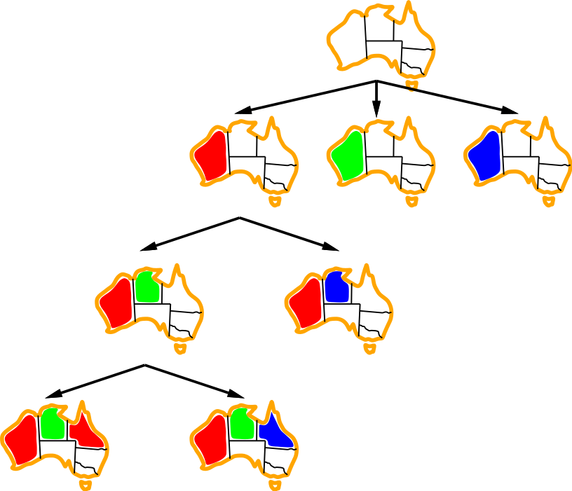]

---

class: middle

.center.width-100[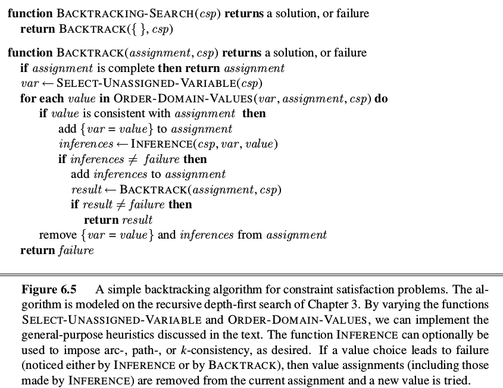]

???

- Backtracking = DFS + ordenamiento de variables + fallo ante violación
- ¿Cuáles son los puntos de decisión?

Puntos de decisión:
- Ordenamiento de las variables
- Ordenamiento de los valores
- Filtrado
- Estructura

---

class: middle

## Mejorando el backtracking

¿Podemos mejorar el backtracking usando ideas de .bold[propósito
general], sin conocimiento específico del dominio?

- .italic[Ordenamiento]:
    - ¿Qué variable se debería asignar a continuación?
    - ¿En qué orden se deberían probar sus valores?
- .italic[Filtrado]: ¿podemos detectar un fallo inevitable temprano?
- .italic[Estructura]: ¿podemos explotar la estructura del problema?

---

class: middle

## Ordenamiento de variables

- .bold[Valores restantes mínimos] (MRV): elegir la variable .italic[con
  menos valores legales restantes] en su dominio.
- También conocida como la heurística de .italic[fallar primero].
    - Detectar fallos rápidamente equivale a podar partes grandes del
      árbol de búsqueda.

.center.width-100[]

---

class: middle

## Ordenamiento de valores

- .bold[Valor menos restrictivo] (LCV): dada una elección de variable,
  elegir el .italic[valor menos restrictivo].
- Es decir, el valor que descarta la menor cantidad de valores en las
  variables restantes.

.center.width-100[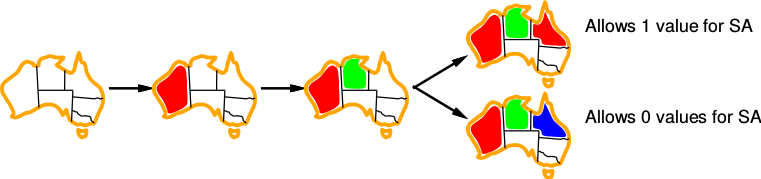]

.exercise[¿Por qué la selección de variable debería fallar primero, pero
la selección de valor debería fallar al final?]

???

Solo estamos buscando una solución. Por lo tanto:
- selección de variable que falla primero, para podar porciones grandes
  del árbol
- selección de valor que falla al final, para buscar el valor más
  probable

---

class: middle

## Filtrado: forward checking

- Llevar el .italic[registro de los valores legales restantes] para las
  variables sin asignar.
    - Cada vez que se asigna una variable $X$, y para cada variable sin
      asignar $Y$ conectada a $X$ por una restricción, eliminar del
      dominio de $Y$ cualquier valor inconsistente.
- .italic[Terminar la búsqueda] cuando alguna variable se quede sin
  valores legales.

.center.width-100[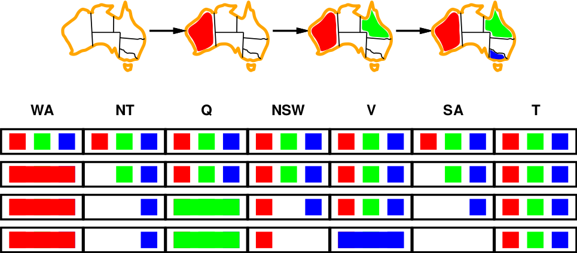]

---

class: middle

## Filtrado: propagación de restricciones

El forward checking propaga información hacia las variables sin asignar,
pero no detecta tempranamente todos los fallos:

.center.width-100[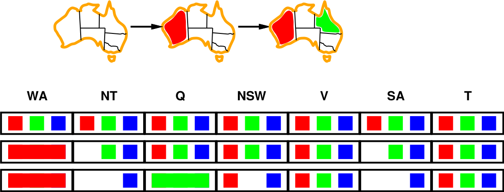]

- ¡$NT$ y $SA$ no pueden ser ambos azules!
- La .bold[propagación de restricciones] refuerza restricciones
  localmente de forma repetida.

---

class: middle

## Consistencia de arcos

- Un arco $X \to Y$ es .bold[consistente] si y solo si para todo valor
  $x$ en el dominio de $X$ existe algún valor $y$ en el dominio de $Y$
  que satisface la restricción binaria asociada.
- Forward checking $\Leftrightarrow$ forzar la consistencia de los arcos
  que apuntan a cada nueva asignación.
- Este principio se puede generalizar para forzar la consistencia de
  .bold[todos] los arcos.

.center.width-100[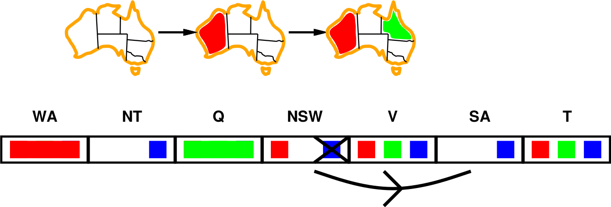]

---

class: middle

.center.width-100[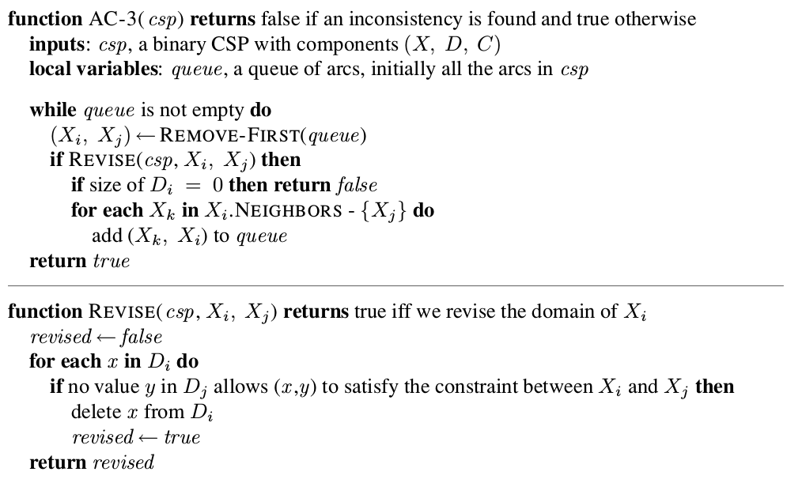]

.exercise[¿En qué momento del backtracking se debería llamar este
procedimiento?]

???

- Tras aplicar AC-3, o bien todo arco es arco-consistente, o alguna
  variable tiene un dominio vacío, indicando que el CSP no se puede
  resolver.
- Esta revisión se debería insertar después de una nueva asignación,
  antes de la llamada recursiva. Si se detecta una inconsistencia...

---

# Estructura

.center.width-50[]

- Tasmania y el continente son .bold[subproblemas independientes].
    - Cualquier solución para el continente combinada con cualquier
      solución para Tasmania produce una solución para el mapa completo.
- La independencia se puede determinar encontrando las .italic[componentes
  conexas] del grafo de restricciones.

---

class: middle

## Complejidad temporal

Supongamos que cada subproblema tiene $c$ variables de $n$ en total.
Entonces $O(\frac{n}{c} d^c)$.
- ej., $n=80$, $d=2$, $c=20$.
- $2^{80} =$ 4 mil millones de años a 10 millones de nodos/seg.
- $4 \times 2^{20} =$ 0.4 segundos a 10 millones de nodos/seg.

---

class: middle

## CSP con estructura de árbol

.center.width-90[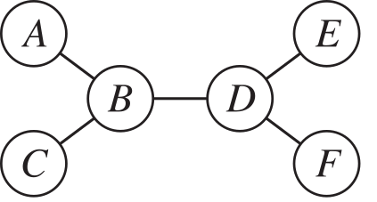]

.center.width-90[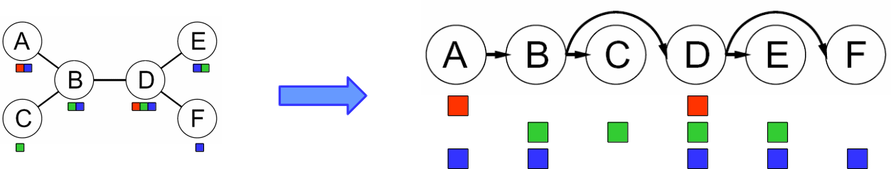]

- Algoritmo para CSP con estructura de árbol:
    - Ordenar: elegir una variable raíz, ordenar las variables de modo
      que los padres precedan a los hijos (orden topológico).
    - Eliminar hacia atrás:
        - para $i=n$ hasta $2$, forzar la consistencia de arcos de
          $padre(X_i) \to X_i$.
    - Asignar hacia adelante:
        - para $i=1$ hasta $n$, asignar $X_i$ de forma consistente con
          su $padre(X_i)$.
- Complejidad temporal: $O(n d^2)$
    - En comparación con los CSP generales, donde el peor caso es
      $O(d^n)$.

???

Correr el algoritmo en el tablero.

---

class: middle

## CSP casi con estructura de árbol

- .italic[Condicionamiento]: instanciar una variable, podar los dominios
  de sus vecinos.
- .italic[Condicionamiento por conjunto de corte] (*cutset*):
    - Asignar (de todas las formas posibles) un conjunto $S$ de
      variables tal que el grafo de restricciones restante sea un
      árbol.
    - Resolver los CSP residuales (con estructura de árbol).
    - Si el CSP residual tiene solución, devolverla junto con la
      asignación para $S$.

.center.width-70[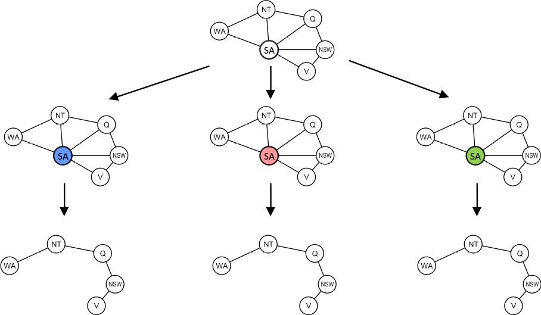]

---

# Resumen

- Los estados de un CSP se representan con un conjunto de pares
  variable/valor, no como estados atómicos.
- El backtracking, una forma de búsqueda en profundidad, se usa
  comúnmente para resolver CSP — es el mismo algoritmo para todos los
  CSP.
- El ordenamiento (MRV, LCV) y el filtrado (forward checking,
  consistencia de arcos) aceleran el backtracking sin conocimiento
  específico del dominio.
- La complejidad de resolver un CSP está fuertemente relacionada con la
  estructura de su grafo de restricciones — los CSP con estructura de
  árbol se resuelven en tiempo lineal.

---

class: middle, center, end-slide
count: false

## Fin de la Clase 3

Próxima clase: Juegos adversariales — minimax y poda alfa-beta
