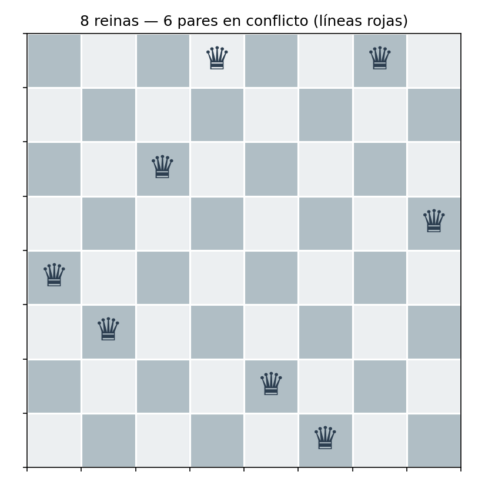
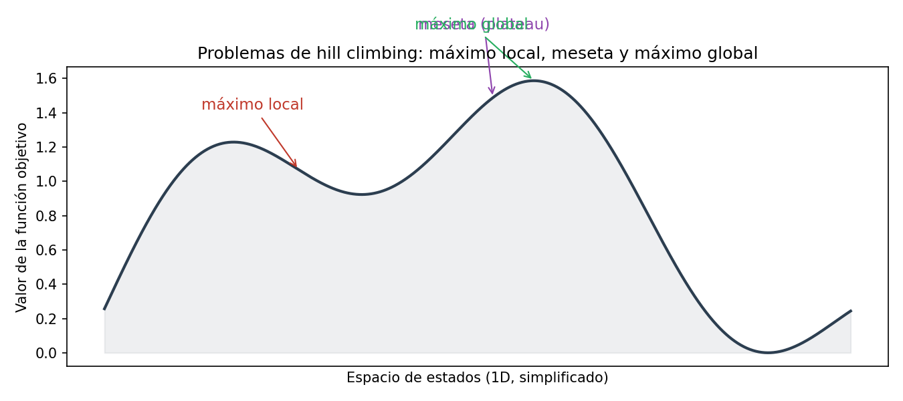

class: middle, center, title-slide

# SI3003 - Inteligencia Artificial

<div class="kicker">Clase 4 — Optimización: búsqueda local y programación lineal</div>

<br><br>

???

Clase 3 rompe con el esquema de las clases anteriores: hasta ahora nos
importaba el *camino* (secuencia de acciones) hasta el objetivo. Hoy
el camino deja de importar por completo — solo el estado final. Esto
nos permite atacar espacios de estados enormes o incluso continuos que
DFS/BFS/A*/backtracking no pueden manejar. Cubrimos búsqueda local
(hill climbing, simulated annealing), una mención breve de algoritmos
genéticos, y programación lineal. Cerramos comparando los tres
paradigmas de las clases que llevamos hasta ahora.

---

# Hoy

.grid[
.kol-1-2[
- Optimización: un paradigma distinto a la búsqueda clásica
- Búsqueda local
    - Hill climbing y sus variantes
    - Simulated annealing
    - (breve) Algoritmos genéticos
- Programación lineal
- Comparación: búsqueda vs. CSP vs. optimización
]
.kol-1-2[
.center.width-100[]
]
]

.footnote[Créditos: [CS188](https://inst.eecs.berkeley.edu/~cs188/), UC Berkeley; [CS50 AI](https://cs50.harvard.edu/ai/), Harvard.]

---

class: middle

# De "encontrar un camino" a "encontrar el mejor estado"

.alert[En las Clases 2 y 3 el objetivo era llegar a un estado meta
mediante una **secuencia de acciones válida** — el camino importaba
(costo, orden, factibilidad paso a paso). Hoy consideramos problemas
donde el camino .bold[no importa en absoluto]: solo nos interesa la
calidad del estado final.]

???

Ejemplos para abrir la discusión en vivo: acomodar N reinas sin
ataques, diseñar el horario de clases de un semestre, decidir cuántas
unidades producir de dos artículos para maximizar ganancia. En ninguno
de estos nos importa "cómo llegamos" a la solución — solo si la
solución es buena (o la mejor posible).

---

# Optimización

Un **problema de optimización** consiste de:

- Un conjunto de **estados** candidatos, cada uno una *configuración
  completa* (todas las variables asignadas).
- Una **función objetivo** $\text{valor}(s)$ que evalúa qué tan buena
  es una configuración (a maximizar o minimizar).
- Una noción de **vecindario**: qué otras configuraciones son
  alcanzables con un solo "movimiento" desde $s$.

A diferencia de un problema de búsqueda (Clase 2), aquí no hay estado
inicial fijo ni prueba de objetivo binaria — hay un espectro de
calidad, y buscamos el máximo (o mínimo).

---

class: middle, center, divider-slide

## Búsqueda local

.width-70[]

.footnote[Créditos: [CS188](https://inst.eecs.berkeley.edu/~cs188/), UC Berkeley.]

---

# Búsqueda local

- *Estrategia*: mantener **un solo estado actual** (o un conjunto
  pequeño) y moverse a un estado vecino que mejore la función
  objetivo — nunca se construye un árbol de búsqueda.
- *Ventaja*: memoria **constante**, funciona en espacios de estados
  enormes o infinitos donde BFS/A\* son inviables.
- *Costo*: se pierde la garantía de completitud/optimalidad que
  teníamos con búsqueda en árbol/grafo.

El espacio de estados se puede imaginar como un **paisaje**: el eje
horizontal recorre los estados posibles y el eje vertical es el valor
de la función objetivo (elevación = "qué tan bueno" es ese estado).

---

# Hill climbing

*Estrategia*: desde el estado actual, moverse al vecino con **mayor**
valor de la función objetivo. Repetir hasta que ningún vecino mejore.

```
function HILL-CLIMBING(problema) returns un estado que es un máximo local
    actual ← ESTADO-INICIAL(problema)
    loop do
        vecino ← el sucesor de actual con mayor valor
        if VALOR(vecino) ≤ VALOR(actual) then return actual
        actual ← vecino
```

Es literalmente "búsqueda voraz sin memoria de lo recorrido": en cada
paso toma la decisión localmente óptima, sin mirar atrás ni adelante.

---

# Ejemplo: 8-reinas con hill climbing

- **Estado**: una configuración con las 8 reinas puestas, una por
  columna (siempre 8 reinas, en cualquier fila).
- **Función de costo** (a *minimizar*): número de pares de reinas
  que se atacan entre sí.
- **Vecinos**: mover una reina a otra fila de su misma columna.
- **Objetivo**: costo = 0 (ninguna reina se ataca).

.center.width-60[]

---

# Problemas de hill climbing

Hill climbing es **incompleto**: puede quedar atrapado sin llegar
nunca al óptimo global.

.center.width-90[]

- **Máximo local**: mejor que todos sus vecinos, pero no el mejor global.
- **Meseta (plateau)**: una zona plana; puede ser un "máximo local
  plano" (sin salida) o un "hombro" (*shoulder*, con salida pero sin
  pistas de dirección).
- **Cresta (ridge)**: una secuencia de máximos locales difícil de
  navegar si los movimientos permitidos son limitados (ej. solo N/S/E/O).

---

# Variantes de hill climbing

- **Steepest-ascent**: evalúa *todos* los vecinos y toma el mejor (la versión de la slide anterior).
- **First-choice hill climbing**: genera vecinos al azar uno por uno
  y toma el primero que mejore — útil cuando hay demasiados vecinos
  para evaluarlos todos.
- **Sideways moves**: permite moverse a un vecino de **igual** valor
  (hasta un límite de pasos) para poder atravesar mesetas.
- **Random-restart hill climbing**: si queda atrapado, reinicia desde
  un estado aleatorio distinto. Trivialmente **completo** si se
  permiten reinicios ilimitados (eventualmente el punto de partida
  aleatorio coincide con el óptimo global).
- **Stochastic hill climbing**: elige al azar entre los vecinos que
  mejoran (no necesariamente el mejor), lo que en la práctica ayuda a
  escapar de ciertos máximos locales a costa de más iteraciones.

???

Gancho hacia Machine Learning: cuando el espacio de estados es
continuo (ej. los parámetros de un modelo), la versión de hill
climbing se llama **gradient ascent/descent**: en vez de enumerar
vecinos discretos, se usa el gradiente de la función objetivo para
decidir la dirección y el tamaño del paso.

---

class: middle, center, divider-slide

## Simulated annealing

.width-60[]

---

# Simulated annealing

*Idea*: combinar un **paseo aleatorio** (explora mucho, pero
ineficiente) con **hill climbing** (eficiente, pero se atasca) para
obtener un algoritmo completo y razonablemente eficiente.

- Analogía física: el *recocido* (annealing) enfría metales
  lentamente para que los átomos encuentren una configuración de
  energía mínima, en vez de quedar atrapados en un estado
  metaestable por un enfriamiento brusco.
- En cada paso se elige un vecino al azar:
    - Si mejora la función objetivo, se acepta siempre.
    - Si la empeora, se acepta con una probabilidad que depende de
      una "temperatura" $T$ que **decrece** con el tiempo.

---

# Simulated annealing — pseudocódigo

```
function SIMULATED-ANNEALING(problema, schedule) returns un estado
    actual ← ESTADO-INICIAL(problema)
    for t = 1 to ∞ do
        T ← schedule(t)
        if T = 0 then return actual
        siguiente ← un sucesor de actual, elegido al azar
        ΔE ← VALOR(siguiente) − VALOR(actual)
        if ΔE > 0 then actual ← siguiente
        else actual ← siguiente con probabilidad e^(ΔE / T)
```

- Con $T$ alta al inicio: se aceptan muchos movimientos "malos" (mucha exploración).
- Con $T \to 0$: el algoritmo se comporta como hill climbing puro (solo explotación).
- Bajo un `schedule` que decrezca **suficientemente lento**, se puede
  demostrar que simulated annealing converge al óptimo global con
  probabilidad que tiende a 1.

---

# Simulated annealing — propiedades

- *Completitud*: sí, bajo un schedule de enfriamiento adecuado
  (teóricamente; en la práctica se usan schedules finitos que dan
  buenas soluciones, no garantías).
- *Optimalidad*: no garantizada en tiempo finito, pero en la práctica
  suele encontrar soluciones muy cercanas al óptimo.
- El diseño del `schedule(t)` (qué tan rápido baja $T$) es la parte
  más delicada de aplicar el algoritmo a un problema real.

.footnote[Se usa en logística (ruteo), diseño de circuitos VLSI, y fue
uno de los primeros métodos exitosos para el problema del vendedor
viajero (TSP) a gran escala.]

---

class: middle, center, divider-slide

## (Breve) Local beam search y algoritmos genéticos

---

# Local beam search y algoritmos genéticos

- **Local beam search**: mantiene $k$ estados en paralelo (no uno
  solo); en cada paso genera todos los sucesores de los $k$ estados y
  se queda con los $k$ mejores del total — hay comunicación implícita
  entre las "ramas" (se abandonan las que van peor).
- **Algoritmos genéticos**: una variante de beam search con
  **reproducción**:
    - Una *población* de estados ("individuos"), representados como
      cadenas sobre un alfabeto finito.
    - Una función de *fitness* mide qué tan buena es cada individuo.
    - Se seleccionan padres (con probabilidad proporcional al
      fitness), se combinan (*crossover*) y se aplican mutaciones
      aleatorias para formar la siguiente generación.

.alert[Esta sección se cubre a nivel conceptual — no entra en el
notebook obligatorio de esta clase. Referencia para profundizar:
AIMA Cap. 4 y CS188 Note 4.]

---

class: middle, center, divider-slide

## Programación lineal

.width-70[]

---

# Programación lineal (LP)

Un **problema de programación lineal** consiste en:

- Un conjunto de **variables de decisión** $x_1, \dots, x_n \in \mathbb{R}$ (¡continuas!, a diferencia de CSP).
- Una **función objetivo lineal** a maximizar o minimizar:
  $c_1 x_1 + c_2 x_2 + \dots + c_n x_n$
- Un conjunto de **restricciones lineales** (igualdades o
  desigualdades) sobre esas variables.

*Diferencia clave con CSP (Clase 3)*: en CSP los dominios son
discretos y finitos y buscamos *cualquier* asignación que satisfaga
todas las restricciones (o falla). En LP los dominios son continuos y
buscamos la *mejor* asignación posible según la función objetivo.

---

# Ejemplo: problema de producción

Una fábrica produce **sillas** ($x_1$) y **mesas** ($x_2$). Cada
silla deja \$20 de ganancia y cada mesa \$30. Restricciones:

- Madera disponible: $2x_1 + 3x_2 \leq 120$
- Horas de mano de obra: $x_1 + x_2 \leq 50$
- No negatividad: $x_1, x_2 \geq 0$

**Maximizar**: $20x_1 + 30x_2$

La región factible es un polígono convexo; el óptimo de un problema
LP **siempre** se encuentra en un vértice de ese polígono (o en toda
una arista, si hay empates).

---

# Resolviendo LP

- Para 2 variables se puede resolver **gráficamente** (dibujar la
  región factible, evaluar la función objetivo en cada vértice).
- Para problemas reales (decenas/miles de variables) se usan
  algoritmos como **Simplex** (recorre vértices de la región
  factible) o métodos de **punto interior** — no los programamos a
  mano en este curso, usamos un *solver*.
- En Python: `scipy.optimize.linprog` o `PuLP` (más legible, estilo
  "álgebra") resuelven esto en unas pocas líneas — ver el notebook de
  esta clase.

---

# Programación lineal entera (ILP)

¿Qué pasa si las variables deben ser **enteras** (ej. "número de
sillas" no puede ser 3.7)?

- El problema se llama **programación lineal entera (ILP)**.
- Ya no basta con mirar los vértices de la región factible continua:
  hay que buscar puntos enteros dentro de ella.
- ILP es, en general, **NP-difícil** — la misma familia de dificultad
  que CSP (Clase 3). De hecho, muchos solvers de ILP usan
  **backtracking + poda** (branch and bound) internamente, la misma
  idea central de la Clase 3.

.alert[Este es el punto de cierre del círculo: búsqueda (Clase 2) →
estructura interna del estado (Clase 3, CSP) → función objetivo
continua (Clase 4, LP) → y de vuelta a backtracking cuando forzamos
variables enteras (ILP).]

---

# Comparación: los tres paradigmas de búsqueda del curso

| | Búsqueda (Clase 2) | CSP (Clase 3) | Optimización (Clase 4) |
|---|---|---|---|
| ¿Qué es el estado? | Configuración parcial en un camino | Asignación parcial de variables/dominios | Configuración completa (búsqueda local) o vector real (LP) |
| ¿Qué buscamos? | Un camino al objetivo (óptimo si aplica) | *Cualquier* asignación consistente | El estado / vector que **maximiza/minimiza** una función |
| Garantías típicas | Completo y óptimo (BFS/UCS/A\* bien diseñados) | Completo (con backtracking sistemático) | Ninguna garantía dura en búsqueda local; sí en LP (óptimo global garantizado) |
| Algoritmo típico | DFS, BFS, UCS, A\* | Backtracking + poda (arc consistency, MRV, LCV) | Hill climbing, simulated annealing / Simplex |
| Memoria | $O(bm)$ a $O(b^d)$ según algoritmo | Depende de la poda | $O(1)$ en búsqueda local |

---

# Aplicaciones reales

- **Ruteo de vehículos (VRP)** y logística de última milla: simulated annealing y variantes de búsqueda local.
- **Programación de horarios/turnos**: CSP + optimización combinadas (satisfacer restricciones *y* minimizar costo).
- **Optimización de portafolios financieros**: programación lineal/cuadrática.
- **Diseño de circuitos VLSI**: simulated annealing para colocación de componentes (uso histórico original).
- **Entrenamiento de redes neuronales**: *gradient descent* es, conceptualmente, hill climbing (o su versión de minimización) sobre un espacio de parámetros continuo — lo verán en detalle más adelante en el curso.

---

class: middle, center, divider-slide

## Demo (notebook): N-reinas con hill climbing y simulated annealing

???

Ejecutar en vivo `notebooks/lecture4/Local_Search_NQueens.ipynb`:
comparar cuántas corridas de steepest-ascent hill climbing quedan
atrapadas en un máximo local vs. cuántas resuelve simulated annealing,
y cuántas iteraciones toma cada una en promedio.

---

class: middle, center, divider-slide

## Demo (notebook): problema de producción con programación lineal

???

Ejecutar en vivo `notebooks/lecture4/Linear_Programming_Intro.ipynb`:
formular el problema de sillas/mesas, resolverlo con
`scipy.optimize.linprog`, y graficar la región factible con el óptimo
marcado.

---

# Resumen

- La optimización cambia el paradigma de "encontrar un camino" a
  "encontrar el mejor estado" — el camino deja de importar.
- **Búsqueda local** (hill climbing, simulated annealing) usa memoria
  constante y funciona en espacios de estados enormes o infinitos,
  a costa de perder garantías de completitud/optimalidad (excepto
  bajo condiciones especiales, como random-restart o un buen
  schedule en simulated annealing).
- **Programación lineal** resuelve, de forma exacta y eficiente,
  problemas con función objetivo y restricciones lineales sobre
  variables continuas; forzar variables enteras (ILP) reintroduce la
  dificultad de CSP.
- Los tres paradigmas del curso (búsqueda, CSP, optimización)
  comparten la misma pregunta de fondo — *¿cómo recorrer un espacio
  de posibilidades sin enumerarlo todo?* — con distintas garantías y
  costos.

---

class: middle, center, end-slide
count: false

## Fin de la Clase 4

Próxima clase: Búsqueda adversarial (juegos) — *a confirmar con el coordinador*
