class: middle, center, title-slide

# SI3003 - Inteligencia Artificial

<div class="kicker">Clase 3 — Optimización: búsqueda local y programación lineal</div>

<br><br>

???

Clase 3 rompe con el esquema de las clases 1 y 2: hasta ahora nos
importaba el *camino* (secuencia de acciones) hasta el objetivo. Hoy
el camino deja de importar por completo — solo el estado final. Esto
nos permite atacar espacios de estados enormes o incluso continuos que
DFS/BFS/A*/backtracking no pueden manejar. Cubrimos búsqueda local
(hill climbing, simulated annealing), una mención breve de algoritmos
genéticos, y programación lineal. Cerramos comparando los tres
paradigmas de las clases 1, 2 y 3.

---

# Hoy

.grid[
.kol-1-2[
- Optimización: un paradigma distinto a la búsqueda clásica
- Búsqueda local
    - Hill climbing y sus variantes
    - Simulated annealing
    - Algoritmos genéticos
- Programación lineal
- Comparación: búsqueda vs. CSP vs. optimización
]
.kol-1-2[
.center.width-60[]
]
]

.footnote[Créditos: [CS188](https://inst.eecs.berkeley.edu/~cs188/), UC Berkeley; [CS50 AI](https://cs50.harvard.edu/ai/), Harvard — notas de la Lecture 3: https://cs50.harvard.edu/ai/notes/3/]

---

class: middle

# De "encontrar un camino" a "encontrar el mejor estado"

.alert[En las Clases 2 y 3 el objetivo era llegar a un estado meta
mediante una **secuencia de acciones válida** — el camino importaba
(costo, orden, factibilidad paso a paso). Hoy consideramos problemas
donde el camino .bold[no importa en absoluto]: solo nos interesa la
calidad del estado final.]

???

Ejemplos para abrir la discusión en vivo: acomodar N reinas sin
ataques, diseñar el horario de clases de un semestre, decidir cuántas
unidades producir de dos artículos para maximizar ganancia. En ninguno
de estos nos importa "cómo llegamos" a la solución — solo si la
solución es buena (o la mejor posible).

---

# Optimización

Un **problema de optimización** consiste de:

- Un conjunto de **estados** candidatos, cada uno una *configuración
  completa* (todas las variables asignadas).
- Una **función objetivo** $\text{valor}(s)$ que evalúa qué tan buena
  es una configuración (a maximizar o minimizar).
- Una noción de **vecindario**: qué otras configuraciones son
  alcanzables con un solo "movimiento" desde $s$.

A diferencia de un problema de búsqueda (Clase 2), aquí no hay estado
inicial fijo ni prueba de objetivo binaria — hay un espectro de
calidad, y buscamos el máximo (o mínimo).

???

Terminología equivalente entre fuentes: CS188/AIMA hablan de "valor" y
"función objetivo" indistintamente; CS50 (Harvard) distingue
explícitamente entre **función objetivo** (se maximiza) y **función de
costo** (se minimiza) — misma idea, dos nombres según el signo. Vale la
pena mencionarlo en clase porque los estudiantes verán ambas
convenciones en la literatura.

---

class: middle, center, divider-slide

## Búsqueda local

.width-70[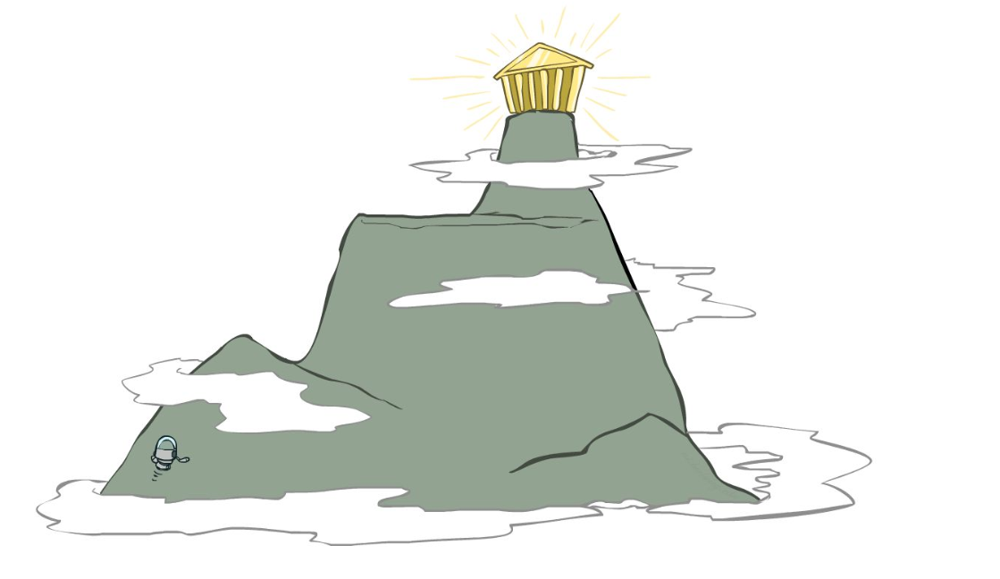]

.footnote[Créditos: [CS188](https://inst.eecs.berkeley.edu/~cs188/), UC Berkeley.]

---

# Búsqueda local

- *Estrategia*: mantener **un solo nodo/estado actual** (o un conjunto
  pequeño) y moverse a un estado **vecino** que mejore la función
  objetivo — a diferencia de la búsqueda clásica (Clase 2), nunca se
  construye ni se recorre un árbol de búsqueda completo.
- *Ventaja*: memoria **constante**, funciona en espacios de estados
  enormes o infinitos donde BFS/A\* son inviables.
- *Costo*: se pierde la garantía de completitud/optimalidad que
  teníamos con búsqueda en árbol/grafo — a menudo se conforma con una
  solución "suficientemente buena" en vez de la óptima.

El espacio de estados se puede imaginar como un **paisaje**
(*state-space landscape*): el eje horizontal recorre los estados
posibles y el eje vertical es el valor de la función objetivo/costo
(elevación = "qué tan bueno" es ese estado).

.center.width-50[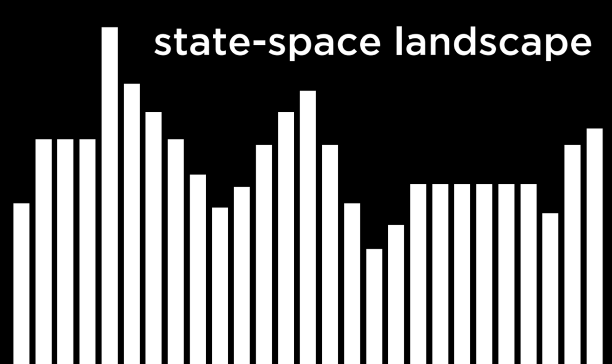]

---

# Ejemplo introductorio: casas y hospitales

Un ejemplo clásico (CS50, Harvard) para presentar búsqueda local antes
de formalizarla:

> Tenemos 4 casas en ubicaciones fijas de una cuadrícula. Queremos
> construir 2 hospitales de modo que se **minimice** la distancia total
> de cada casa a su hospital más cercano (distancia Manhattan).

- **Estado**: una configuración concreta de las posiciones de los 2 hospitales.
- **Función de costo**: suma, sobre todas las casas, de la distancia
  a su hospital más cercano.
- **Estado vecino**: mover un hospital una casilla en alguna dirección.

.center.width-40[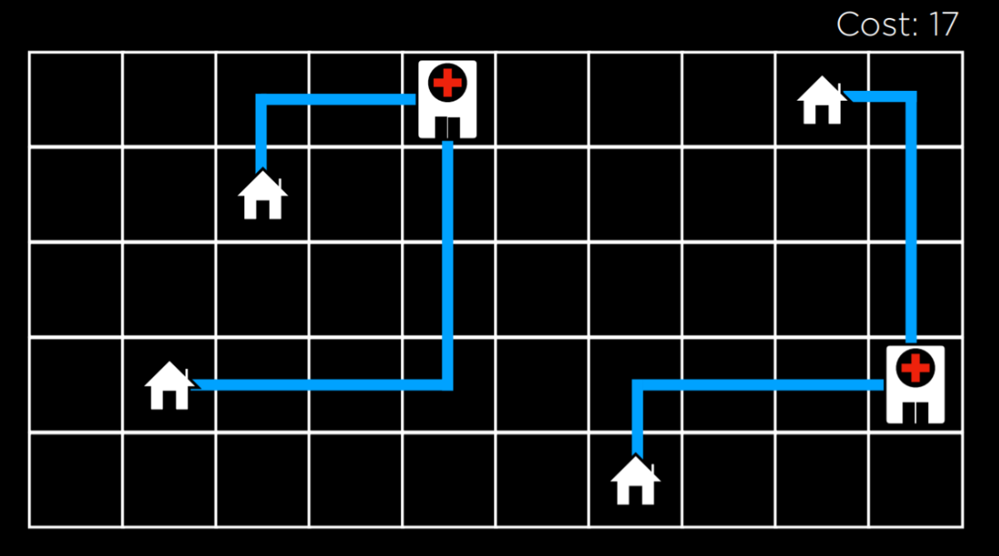]

En esta configuración inicial (aleatoria) el costo es **17**.

---

# Ejemplo: mejorando con hill climbing

Aplicando hill climbing —mover repetidamente un hospital si eso reduce
el costo total— llegamos, tras varias transiciones, a esta
configuración:

.center.width-50[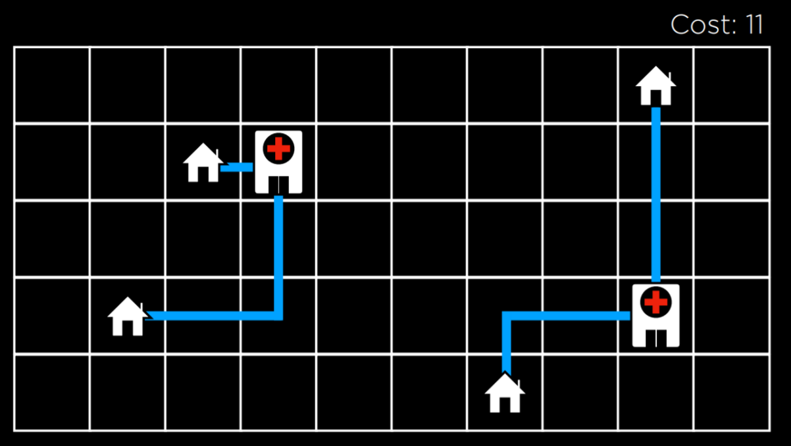]

El costo bajó de 17 a **11**: una mejora clara. Pero **no es el óptimo
global** — mover el hospital izquierdo justo debajo de la casa superior
izquierda daría costo 9. El algoritmo no llega ahí porque, desde el
estado con costo 11, **todos los vecinos inmediatos son iguales o
peores** — es decir, quedó atrapado en un mínimo local.

.alert[Esta es la limitación central de hill climbing: es *miope*
(short-sighted). En cada paso toma la mejor decisión local, sin mirar
más allá de sus vecinos inmediatos, así que puede conformarse con una
solución *buena* que no es la *mejor* posible.]

---

# Hill climbing

*Estrategia*: desde el estado actual, moverse al vecino con **mayor**
valor de la función objetivo. Repetir hasta que ningún vecino mejore.

```
function HILL-CLIMBING(problema) returns un estado que es un máximo local
    actual ← ESTADO-INICIAL(problema)
    loop do
        vecino ← el sucesor de actual con mayor valor
        if VALOR(vecino) ≤ VALOR(actual) then return actual
        actual ← vecino
```

Es literalmente "búsqueda voraz sin memoria de lo recorrido": en cada
paso toma la decisión localmente óptima, sin mirar atrás ni adelante.

---

## Ejemplo: 8-reinas con hill climbing

- **Estado**: una configuración con las 8 reinas puestas, una por
  columna (siempre 8 reinas, en cualquier fila).
- **Función de costo** (a *minimizar*): número de pares de reinas
  que se atacan entre sí.
- **Vecinos**: mover una reina a otra fila de su misma columna.
- **Objetivo**: costo = 0 (ninguna reina se ataca).

.center.width-40[]

---

## Máximos y mínimos: local vs. global

Antes de nombrar los problemas de hill climbing, formalicemos qué
significa quedar "atrapado":

- Un **máximo local** es un estado con mayor valor que *todos sus
  vecinos* — pero no necesariamente que todos los estados posibles.
- Un **máximo global** es el estado con el mayor valor de *todo* el
  espacio de estados.
- Simétricamente se definen **mínimo local** y **mínimo global** para
  funciones de costo.

.center.width-50[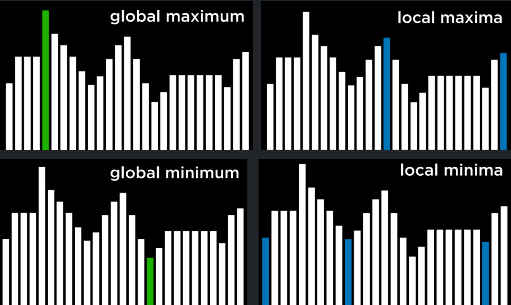]

Hill climbing solo puede garantizar que termina en un máximo/mínimo
**local** — puede o no coincidir con el global, y el algoritmo no
tiene forma de saberlo desde donde está parado.

---

## Problemas de hill climbing

Hill climbing es **incompleto**: puede quedar atrapado sin llegar
nunca al óptimo global. Además de los máximos/mínimos locales, hay dos
casos especiales de "zonas planas" donde el algoritmo se estanca:

.center.width-90[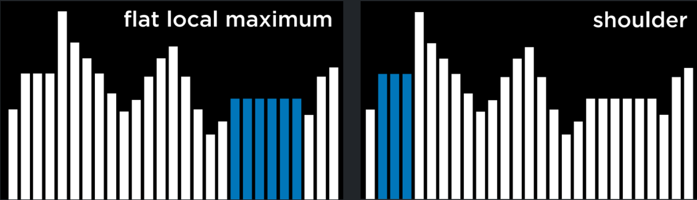]

- **Máximo/mínimo local plano** (*flat local maximum/minimum*): varios
  estados adyacentes con el mismo valor, formando una meseta cuyos
  vecinos son todos peores — no hay forma de salir mejorando.
- **Hombro (shoulder)**: varios estados adyacentes con el mismo valor,
  pero cuyos vecinos *sí* incluyen estados mejores — el problema es que,
  parado en medio de la meseta, el algoritmo no tiene ninguna pista de
  hacia dónde moverse para encontrarlos.
- **Cresta (ridge)**: una secuencia de máximos locales alineados en
  diagonal, difícil de navegar si los movimientos permitidos son
  limitados (ej. solo N/S/E/O) — cada paso individual parece empeorar
  aunque la cresta como conjunto suba.

---

## Cresta (ridge) — vista visual

.center.width-50[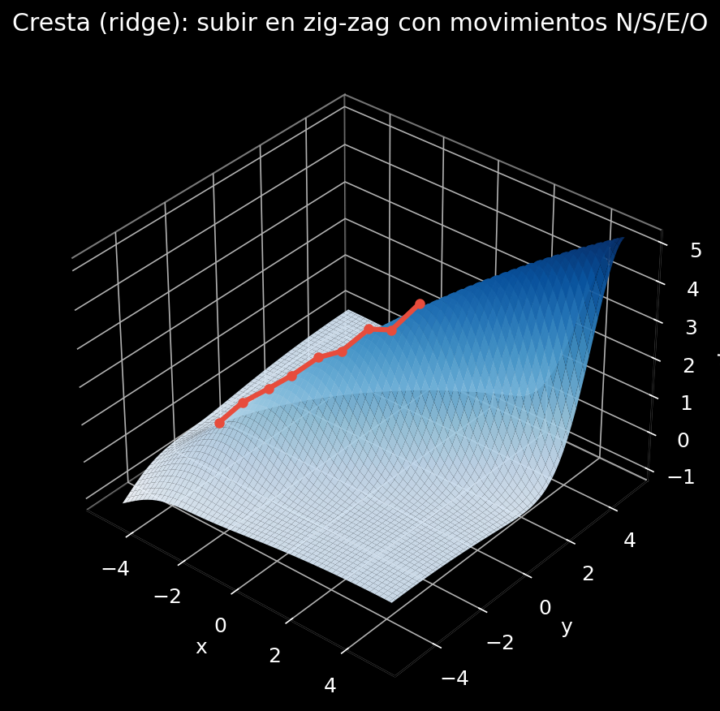]

Si el algoritmo solo puede moverse en 4 direcciones (N/S/E/O) pero la
cresta sube en diagonal, **cada movimiento individual disponible
empeora o mantiene igual el valor** — aunque exista un camino en
zig-zag que sí sube, hill climbing puro no lo detecta porque evalúa un
paso a la vez, no la tendencia general.

---

## Variantes de hill climbing

- **Steepest-ascent**: evalúa *todos* los vecinos y toma el mejor (la versión de la slide anterior).
- **First-choice hill climbing**: genera vecinos al azar uno por uno
  y toma el primero que mejore — útil cuando hay demasiados vecinos
  para evaluarlos todos.
- **Sideways moves**: permite moverse a un vecino de **igual** valor
  (hasta un límite de pasos) para poder atravesar mesetas.
- **Random-restart hill climbing**: si queda atrapado, reinicia desde
  un estado aleatorio distinto. Trivialmente **completo** si se
  permiten reinicios ilimitados (eventualmente el punto de partida
  aleatorio coincide con el óptimo global).
- **Stochastic hill climbing**: elige al azar entre los vecinos que
  mejoran (no necesariamente el mejor), lo que en la práctica ayuda a
  escapar de ciertos máximos locales a costa de más iteraciones.

???

Gancho hacia Machine Learning: cuando el espacio de estados es
continuo (ej. los parámetros de un modelo), la versión de hill
climbing se llama **gradient ascent/descent**: en vez de enumerar
vecinos discretos, se usa el gradiente de la función objetivo para
decidir la dirección y el tamaño del paso.

---

class: middle, center, divider-slide

## Simulated annealing

.width-60[]

---

# Simulated annealing

*Idea*: combinar un **paseo aleatorio** (explora mucho, pero
ineficiente) con **hill climbing** (eficiente, pero se atasca) para
obtener un algoritmo completo y razonablemente eficiente.

- Analogía física: el *recocido* (annealing) enfría metales
  lentamente para que los átomos encuentren una configuración de
  energía mínima, en vez de quedar atrapados en un estado
  metaestable por un enfriamiento brusco.
- En cada paso se elige un vecino al azar:
    - Si mejora la función objetivo, se acepta siempre.
    - Si la empeora, se acepta con una probabilidad que depende de
      una "temperatura" $T$ que **decrece** con el tiempo.

---

## Simulated annealing

.grid[
.kol-1-2[
.compact-code[
```
function SIMULATED-ANNEALING(problema, schedule)
        returns un estado
    actual ← ESTADO-INICIAL(problema)
    for t = 1 to ∞ do
        T ← schedule(t)
        if T = 0 then return actual
        siguiente ← un sucesor de
            actual, elegido al azar
        ΔE ← VALOR(siguiente) − VALOR(actual)
        if ΔE > 0 then actual ← siguiente
        else actual ← siguiente con
            probabilidad e^(ΔE / T)
```
]
]
.kol-1-2[
- Con $T$ alta al inicio: se aceptan muchos movimientos "malos" (mucha exploración).
- Con $T \to 0$: el algoritmo se comporta como hill climbing puro (solo explotación).
- Bajo un `schedule` que decrezca **suficientemente lento**, se puede
  demostrar que simulated annealing converge al óptimo global con
  probabilidad que tiende a 1.

.center.width-100[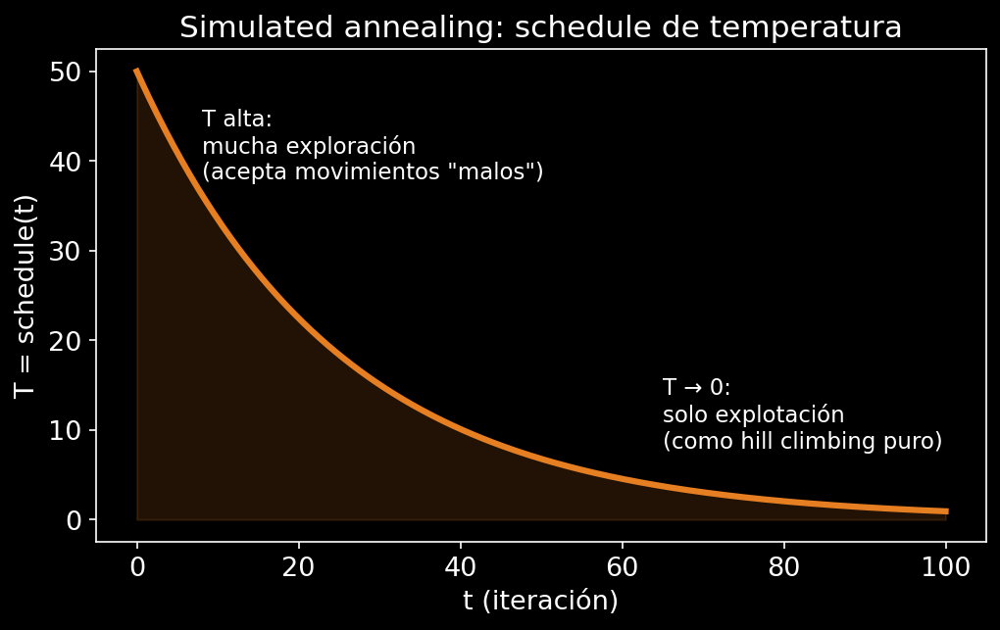]
]
]
---

### Simulated annealing — ejemplo: el vendedor viajero (TSP)

El **problema del vendedor viajero (TSP)** pide conectar un conjunto
de puntos (ciudades, clientes) con la **ruta más corta** que los visita
a todos y regresa al inicio — exactamente lo que necesita resolver una
empresa de reparto para ir de la bodega a cada cliente y volver.

- **Estado**: una ruta completa (un orden de visita de todos los puntos).
- **Vecino natural**: intercambiar el orden de dos paradas en la ruta.
- **Por qué no fuerza bruta**: el número de rutas posibles crece como
  $n!$ — con apenas 10 puntos ya hay $10! = 3\,628\,800$ rutas posibles
  a evaluar.

.alert[Simulated annealing no garantiza la ruta óptima, pero encuentra
soluciones muy buenas a una fracción del costo computacional de
enumerar todas las rutas — por eso es una de las heurísticas clásicas
para TSP a escala real.]

---

### Simulated annealing — propiedades

- *Completitud*: sí, bajo un schedule de enfriamiento adecuado
  (teóricamente; en la práctica se usan schedules finitos que dan
  buenas soluciones, no garantías).
- *Optimalidad*: no garantizada en tiempo finito, pero en la práctica
  suele encontrar soluciones muy cercanas al óptimo.
- El diseño del `schedule(t)` (qué tan rápido baja $T$) es la parte
  más delicada de aplicar el algoritmo a un problema real.

.footnote[Se usa en logística (ruteo), diseño de circuitos VLSI, y fue
uno de los primeros métodos exitosos para el problema del vendedor
viajero (TSP) a gran escala.]

---

---

class: middle, center, divider-slide

## Local beam search y algoritmos genéticos

---

# Local beam search

.grid[
.kol-1-2[
- Corre $k$ hill-climbings **en paralelo**, pero no de forma
  independiente: en cada paso se generan todos los sucesores de los
  $k$ estados, y se conservan los $k$ mejores del total combinado.
- Diferencia clave con $k$ *random restarts* independientes: aquí
  hay **comunicación implícita** entre las ramas — si una rama va
  muy bien, puede "absorber" los cupos de las que van mal
  ("ven, la hierba es más verde por acá").
- Riesgo: los $k$ estados pueden converger rápido a la misma región
  del espacio de estados y perder diversidad — parecido a lo que
  verán con la diversidad de la población en GA.
]
.kol-1-2[
.center.width-100[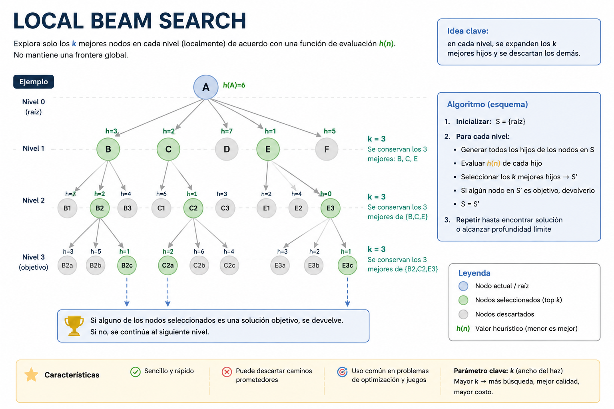]
]
]

---

## Local beam search — pseudocódigo

```
function LOCAL-BEAM-SEARCH(problema, k) returns un estado
    estados ← k estados generados al azar
    loop do
        sucesores ← { }
        for cada s en estados do
            sucesores ← sucesores ∪ SUCESORES(s)
        if algún s en sucesores es objetivo then return s
        estados ← los k mejores de sucesores según VALOR
```

- **Stochastic beam search**: en vez de tomar siempre los $k$
  mejores, elige los $k$ sucesores **con probabilidad proporcional a
  su valor** — mitiga la pérdida de diversidad, análogo a cómo
  simulated annealing mitiga el atasco de hill climbing.

.alert[Este mismo nombre — *beam search* — lo van a volver a ver en
la Parte 2 del curso, en la generación de texto de un LLM (elegir
entre las $k$ secuencias más probables en cada paso). Es la misma
idea, aplicada a un espacio de estados distinto.]

---

class: middle, center, divider-slide

## Algoritmos genéticos

---

# Algoritmos genéticos — motivación y representación

.grid[
.kol-1-2[
- Una variante de beam search con **reproducción**: en vez de que
  los $k$ mejores sobrevivan tal cual, se combinan entre sí para
  producir la siguiente generación.
- Retomamos el ejemplo de 8-reinas:
    - Un **individuo** es un cromosoma $x=(x_1,\dots,x_L)$ sobre un
      alfabeto finito.
    - Para 8-reinas: $L=8$ y cada $x_i\in\{1,\dots,8\}$ es la fila
      de la reina en la columna $i$.
    - Una **población** es un conjunto de $k$ individuos —
      exactamente como los $k$ estados de local beam search.
]
.kol-1-2[
.center.width-90[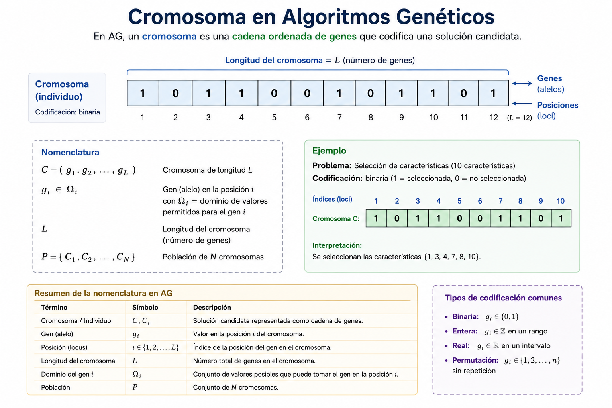]
]
]

---

# Algoritmos genéticos — fitness y selección

- La función de ***fitness*** mide qué tan bueno es cada individuo.
  Para 8-reinas, en vez de contar conflictos (que queremos
  minimizar, como en hill climbing), definimos algo que
  **maximizar**: el número de pares de reinas que no se atacan,
  sobre el máximo posible $\binom{8}{2}=28$:

$$
\text{fitness}(x) = 28 - n_{\text{conflictos}}
$$

- **Selección por torneo**: se muestrean $k\_{\text{torneo}}$ individuos al azar de la población y se queda el de mayor fitness. A mayor $k\_{\text{torneo}}$, mayor presión de selección (los mejores individuos dominan más rápido, pero se pierde diversidad más rápido también).
- Alternativa clásica (AIMA): selección **proporcional al fitness**
  — la probabilidad de ser padre es
  $P(x)=\text{fitness}(x)/\sum_i \text{fitness}(x_i)$. Es la que
  implementarán en la Actividad 1 del notebook.

---

# Algoritmos genéticos — crossover y mutación

.grid[
.kol-1-2[
- **Crossover** de un punto (con probabilidad $p\_c$): dado un punto
  de corte $j$, dos padres $x,y$ producen
$$
x'=(x\_1,\dots,x\_j,y\_{j+1},\dots,y\_L)
$$
  y su complemento (intercambiando los roles de $x$ y $y$). Para
  8-reinas, esto combina el arreglo de columnas de un padre con el
  de otro.
- **Mutación** (con probabilidad $p_m$ por gen): cada $x_i$ cambia a
  un valor aleatorio del alfabeto con probabilidad $p_m$ — le da a
  GA la capacidad de recuperar diversidad genética que el crossover
  por sí solo no puede introducir.
]
.kol-1-2[
.center.width-100[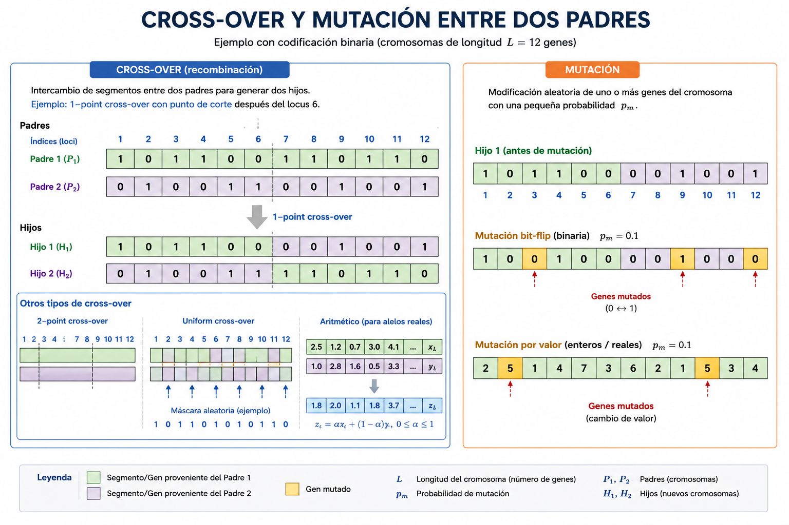]
]
]

---

# Algoritmos genéticos — el algoritmo completo

```
function GENETIC-ALGORITHM(población, fitness) returns un individuo
    repeat
        nueva ← { }
        for i = 1 to TAMAÑO(población) do
            x ← SELECCIÓN-TORNEO(población, fitness)
            y ← SELECCIÓN-TORNEO(población, fitness)
            hijo ← CROSSOVER(x, y)
            if random() < p_m then hijo ← MUTAR(hijo)
            agregar hijo a nueva
        población ← nueva
    until se cumple criterio de parada
    return el mejor individuo de población según fitness
```

.alert[El notebook de esta clase (`03_algoritmos_geneticos.ipynb`)
implementa selección por torneo, crossover de un punto, mutación y
elitismo, pero sobre **OneMax**
($\text{fitness}(x)=\sum_{i=1}^{L}x_i$, alfabeto binario) en vez de
8-reinas — es la misma mecánica con un fitness más simple de
depurar, y trae una actividad para extenderlo a una frase objetivo.
Referencia: AIMA Cap. 4 y CS188 Note 4.]


---

class: middle, center, divider-slide

## Programación lineal

.width-70[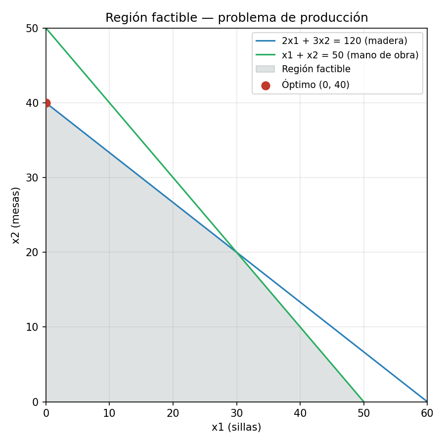]

---

# Programación lineal (LP)

Un **problema de programación lineal** consiste en:

- Un conjunto de **variables de decisión** $x_1, \dots, x_n \in \mathbb{R}$ ¡continuas!.
- Una **función objetivo lineal** a maximizar o minimizar:
  $c_1 x_1 + c_2 x_2 + \dots + c_n x_n$
- Un conjunto de **restricciones lineales** (igualdades o
  desigualdades) sobre esas variables.

*En LP los dominios son continuos y buscamos la *mejor* asignación posible según la función objetivo.*

---

# Ejemplo: problema de producción

Una fábrica produce **sillas** ($x_1$) y **mesas** ($x_2$). Cada
silla deja $20$ de ganancia y cada mesa $30$. Restricciones:

- Madera disponible: $2x_1 + 3x_2 \leq 120$
- Horas de mano de obra: $x_1 + x_2 \leq 50$
- No negatividad: $x_1, x_2 \geq 0$

**Maximizar**: $20x_1 + 30x_2$

La región factible es un polígono convexo; el óptimo de un problema
LP **siempre** se encuentra en un vértice de ese polígono (o en toda
una arista, si hay empates).

---

# Resolviendo LP

- Para 2 variables se puede resolver **gráficamente** (dibujar la
  región factible, evaluar la función objetivo en cada vértice).
- Para problemas reales (decenas/miles de variables) se usan
  algoritmos como **Simplex** (recorre vértices de la región
  factible) o métodos de **punto interior** — no los programamos a
  mano en este curso, usamos un *solver*.
- En Python: `scipy.optimize.linprog` o `PuLP` (más legible, estilo
  "álgebra") resuelven esto en unas pocas líneas — ver el notebook de
  esta clase.

---

# Segundo ejemplo: dos máquinas (minimización)

Una variante útil porque **minimiza** en vez de maximizar, y porque
obliga a convertir una restricción `≥` a la forma estándar `≤` que
esperan los solvers:

- Dos máquinas $x_1, x_2$ (horas de uso). $x_1$ cuesta 50 dólares/hora,
  $x_2$ cuesta 80 dólares/hora. **Minimizar**: $50x_1 + 80x_2$.
- Mano de obra disponible: $x_1$ requiere 5 unidades/hora, $x_2$
  requiere 2 unidades/hora, con 20 unidades totales disponibles:
  $5x_1 + 2x_2 \leq 20$.
- Producción mínima requerida: $x_1$ produce 10 unidades/hora, $x_2$
  produce 12 unidades/hora, y se necesitan al menos 90 unidades:
  $10x_1 + 12x_2 \geq 90$.

`linprog` de scipy solo acepta restricciones en la forma $\leq$, así
que multiplicamos la segunda restricción por $-1$:

$$
-10x_1 - 12x_2 \leq -90
$$
---

```python
import scipy.optimize

# Función objetivo: 50x_1 + 80x_2 (minimizar)
# Restricción 1: 5x_1 + 2x_2 <= 20
# Restricción 2: -10x_1 - 12x_2 <= -90

result = scipy.optimize.linprog(
    [50, 80],                    # coeficientes de la función objetivo
    A_ub=[[5, 2], [-10, -12]],   # coeficientes del lado izquierdo
    b_ub=[20, -90],              # límites del lado derecho
)

if result.success:
    print(f"X1: {round(result.x[0], 2)} horas")
    print(f"X2: {round(result.x[1], 2)} horas")
else:
    print("No solution")
```

.footnote[`linprog` minimiza por defecto. Para maximizar (como en el
ejemplo de sillas/mesas), se minimiza el negativo de la función
objetivo: `-c` en vez de `c`.]

---

# Aplicaciones reales

- **Ruteo de vehículos (VRP)** y logística de última milla: simulated annealing y variantes de búsqueda local.
- **Programación de horarios/turnos**: CSP + optimización combinadas (satisfacer restricciones *y* minimizar costo).
- **Optimización de portafolios financieros**: programación lineal/cuadrática.
- **Diseño de circuitos VLSI**: simulated annealing para colocación de componentes (uso histórico original).
- **Entrenamiento de redes neuronales**: *gradient descent* es, conceptualmente, hill climbing (o su versión de minimización) sobre un espacio de parámetros continuo — lo verán en detalle más adelante en el curso.

---

class: middle, center, divider-slide

## Demo (notebook): N-reinas con hill climbing y simulated annealing

???

Ejecutar en vivo `notebooks/lecture4/Local_Search_NQueens.ipynb`:
comparar cuántas corridas de steepest-ascent hill climbing quedan
atrapadas en un máximo local vs. cuántas resuelve simulated annealing,
y cuántas iteraciones toma cada una en promedio.

---

class: middle, center, divider-slide

## Demo (notebook): problema de producción con programación lineal

???

Ejecutar en vivo `notebooks/lecture4/Linear_Programming_Intro.ipynb`:
formular el problema de sillas/mesas, resolverlo con
`scipy.optimize.linprog`, y graficar la región factible con el óptimo
marcado.

---

# Resumen

- La optimización cambia el paradigma de "encontrar un camino" a
  "encontrar el mejor estado" — el camino deja de importar.
- **Búsqueda local** (hill climbing, simulated annealing) usa memoria
  constante y funciona en espacios de estados enormes o infinitos,
  a costa de perder garantías de completitud/optimalidad (excepto
  bajo condiciones especiales, como random-restart o un buen
  schedule en simulated annealing).
- **Programación lineal** resuelve, de forma exacta y eficiente,
  problemas con función objetivo y restricciones lineales sobre
  variables continuas; forzar variables enteras (ILP) reintroduce la
  dificultad de CSP.
- Los tres paradigmas del curso (búsqueda, CSP, optimización)
  comparten la misma pregunta de fondo — *¿cómo recorrer un espacio
  de posibilidades sin enumerarlo todo?* — con distintas garantías y
  costos.

---

class: middle, center, end-slide
count: false

## Fin de la Clase 4

Próxima clase: Búsqueda adversarial (juegos) — *a confirmar con el coordinador*
