class: middle, center, title-slide

# SI3003 - Inteligencia Artificial

<div class="kicker">Clase 5 — Procesos de Decisión de Markov: Bellman, Value Iteration y Policy Iteration</div>

<br><br>

???

Clase 4 (optimización) cerró sin tocar MDP en absoluto, así que hoy
partimos desde cero. Esta es una clase completa dedicada a un único
tema: decisión secuencial bajo incertidumbre, formalizada como MDP.
Construimos la ecuación de Bellman con derivación explícita (siguiendo
la Lecture 8 de Louppe), Value Iteration con ejemplo trabajado a mano
y en vivo sobre un Gridworld 4×3 estocástico, y Policy Iteration con
comparación directa. Cerramos con la pregunta que abre Clase 6: ¿y si
no conocemos el modelo?

---

### Hoy

.grid[
.kol-1-2[
- De optimización a decisión secuencial bajo incertidumbre
- Formalización: el MDP como tupla
- La ecuación de Bellman (derivación completa)
- Value Iteration
    - Ejemplo trabajado a mano
    - Live-coding: Gridworld 4×3 estocástico
- Policy Iteration
    - Comparación VI vs. PI
- Cierre: ¿y si no conocemos el modelo?
]
.kol-1-2[
.center.width-90[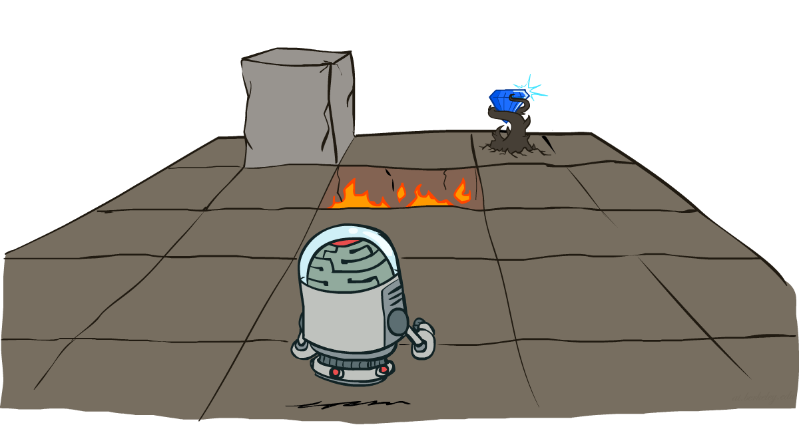]
]
]

.footnote[Figuras: AIMA, 4ta ed., Cap. 17.]

---

class: middle

### De "encontrar el mejor estado" a "decidir bajo incertidumbre"

.alert[En Clase de optimización, un problema de optimización terminaba en **un** estado
final elegido de una vez. Hoy el agente no elige un estado — elige
**acciones**, una tras otra, y el mundo responde de forma **incierta**:
la misma acción puede llevar a resultados distintos. La pregunta ya no
es "¿cuál es el mejor estado?" sino "¿cuál es la mejor **acción** dado
dónde estoy ahora, sabiendo que el resultado no está garantizado?"]

???

Ejemplo para abrir la discusión: un robot de reparto que se mueve por
una cuadrícula, pero cuyas ruedas patinan con cierta probabilidad —
la acción "avanzar" a veces resulta en "girar". No podemos planear una
secuencia fija de movimientos de antemano como hacíamos en búsqueda
(Clase 2): tenemos que decidir **qué hacer en cada estado posible**,
de antemano, para cualquier eventualidad. Eso es una **política**, y
es el objeto central de hoy.

---

### El mundo: Gridworld

.grid[
.kol-2-3[
Imaginemos un agente que vive en un ambiente de grilla $3 \times 4$.

- **Movimientos ruidosos**: las acciones no siempre salen como se planean.
    - Cada acción logra el efecto pretendido con probabilidad $0.8$.
    - El resto del tiempo, con probabilidad $0.2$, la acción mueve al
      agente en ángulo recto respecto a la dirección pretendida.
    - Si hay una pared en la dirección a la que el agente habría sido
      llevado, el agente simplemente se queda donde está.
- El agente recibe una recompensa en cada paso de tiempo.
    - Una pequeña recompensa de "vivir" en cada paso (puede ser negativa).
    - Recompensas grandes llegan solo al final (buenas o malas).

]
.kol-1-3[
.width-100[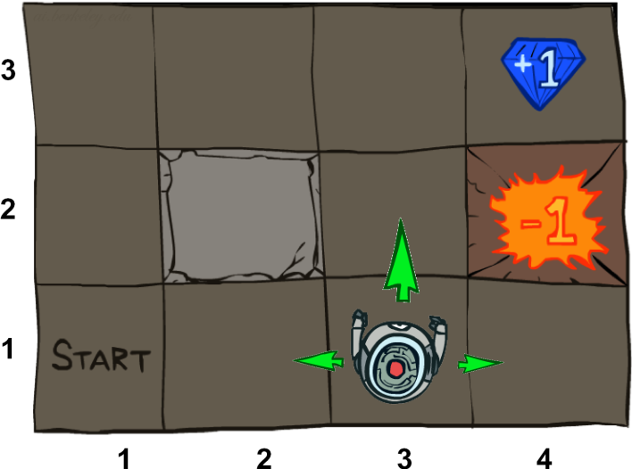]
]
]

**Meta:** maximizar la suma de recompensas — no llegar a ningún lugar
en particular, solo acumular la mayor recompensa posible en el camino.

---

class: middle

.grid.center[
.kol-1-4.center[
Acción determinista

.width-100[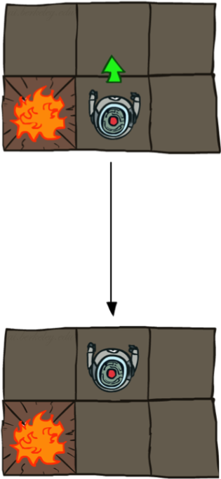]
]
.kol-3-4.center[
Acción estocástica

.width-90[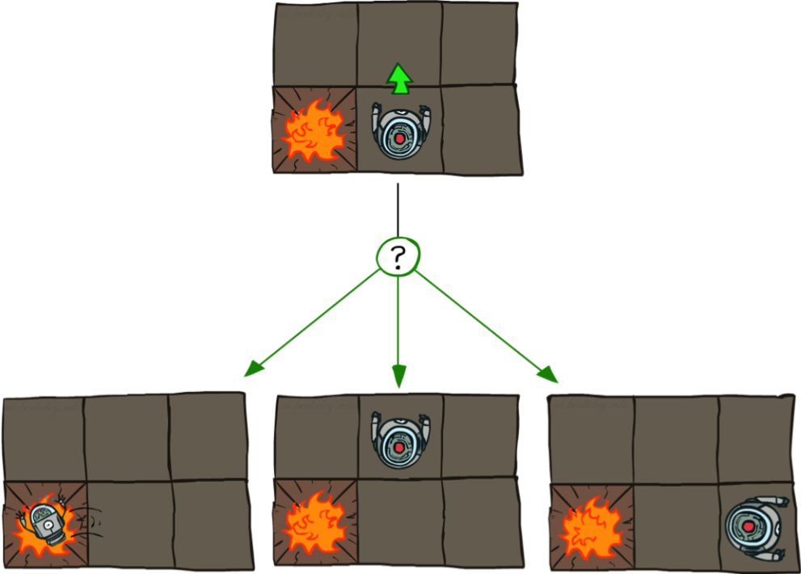]
]
]

.alert[Esta es la diferencia que cambia todo respecto a la búsqueda de
Clase 2: ahí, "ir arriba" significaba ir arriba, punto. Aquí, "ir
arriba" significa "arriba con 80% de probabilidad, y a los lados con
10% cada uno" — el agente nunca tiene control total sobre a dónde
termina.]

---

### El Proceso de Decisión de Markov (MDP)

Un **MDP** es una tupla $(S, A, P, R, \gamma)$:

- $S$: conjunto de **estados**.
- $A$: conjunto de **acciones** disponibles.
- $P(s' \mid s,a)$: **modelo de transición**, estacionario — probabilidad
  de terminar en $s'$ si tomamos la acción $a$ en el estado $s$.
- $R(s)$: **función de recompensa** del estado. (En su forma más
  general la recompensa puede depender de la transición completa,
  $R(s,a,s')$; nosotros usamos la versión simplificada $R(s)$, donde
  solo depende del estado de llegada.)
- $\gamma \in [0,1]$: **factor de descuento**.

La **propiedad de Markov**: $P(s' \mid s,a)$ depende solo del estado actual
$s$ y la acción $a$ — no de cómo llegamos a $s$. Todo el historial
relevante ya está resumido en $s$.

???

Vale la pena remarcar que esta es exactamente la misma propiedad de
Markov que van a ver formalizada de nuevo en HMM más adelante en el
curso (probabilidad). No es casualidad — es la misma idea de "el
estado captura todo lo que importa del pasado" aplicada dos veces.

---

lass: middle

.grid[
.kol-1-5.center[
<br><br><br><br>
$$s'$$
$$r' = R(s')$$
]
.kol-3-5.center[
$$s$$
.width-90[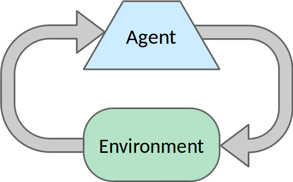]
$$s' \sim P(s'|s,a)$$
]
.kol-1-5[
<br><br><br><br><br>
$$a$$
]
]

---

class: middle

.grid.center[
.kol-1-2.center[
.width-70[]
]
.kol-1-2.center[
.width-70[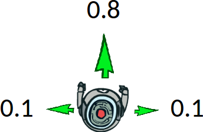]
]
]

### Ejemplo

- $\mathcal{S}$: ubicación $(i,j)$ en el grid.
- $\mathcal{A}$: $[\text{Arriba}, \text{Abajo}, \text{Derecha}, \text{Izquierda}]$.
- Modelo de transición: $P(s'\mid s,a)$
- Recompensa:
$$
R(s) = \begin{cases}
-0.4 & \text{para estados no terminales} \\\\
\pm 1 & \text{para estados terminales}
\end{cases}
$$

---

class: middle

.grid[
.kol-3-4[

### ¿Qué tiene de markoviano un MDP?

Dado el estado presente, el futuro y el pasado son independientes:

$$
P(s\_{t+1} \mid s\_t, a\_t, s\_{t-1}, a\_{t-1}, ..., s\_0) = P(s\_{t+1} \mid s\_t, a\_t)
$$

Esto es similar a los problemas de búsqueda (Clase 2), donde la
función sucesora solo podía depender del estado actual.
]
.kol-1-4.center[
.circle.width-100[]
.caption[Andrey Markov]
]
]

---

### Políticas

.grid[
.kol-2-3[
- En problemas de búsqueda determinista de un solo agente (Clase 2),
  nuestra meta era encontrar un plan óptimo, o *secuencia* de acciones,
  desde el inicio hasta la meta.
- Para MDPs, queremos encontrar una **política** óptima
  $\pi^* : \mathcal{S} \to \mathcal{A}$.
    - Una política $\pi$ mapea estados a acciones.
    - Una política óptima es la que maximiza la utilidad esperada, es
      decir, la suma esperada de recompensas.
    - Una política explícita define un agente reflejo.
- Expectiminimax no calculaba políticas completas, solo alguna acción
  para un único estado.
]
.kol-1-3[
.width-100[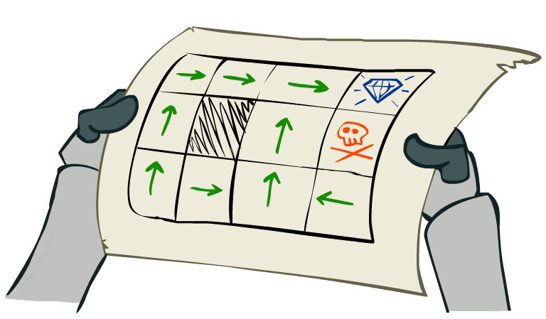]
.center[Política óptima cuando $R(s)=-0.3$ para todos los estados no terminales $s$.]
]
]

---

class: middle

.width-90.center[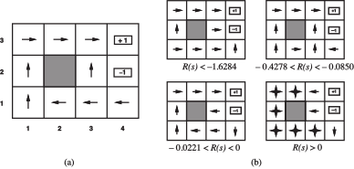]

(a) Política óptima cuando $R(s)=-0.04$ para todos los estados no terminales $s$.
(b) Políticas óptimas para cuatro rangos distintos de $R(s)$.

Dependiendo de $R(s)$, el **balance entre riesgo y recompensa** cambia
de arriesgado a muy conservador.

???

Discutir el balance entre riesgo y recompensa: con $R(s)$ muy negativo,
la política óptima se arriesga a pasar junto al terminal $-1$ para
terminar rápido; con $R(s)$ cercano a cero, prefiere rodear aunque
tome más pasos.

---


# Utilidades a través del tiempo

.center.width-70[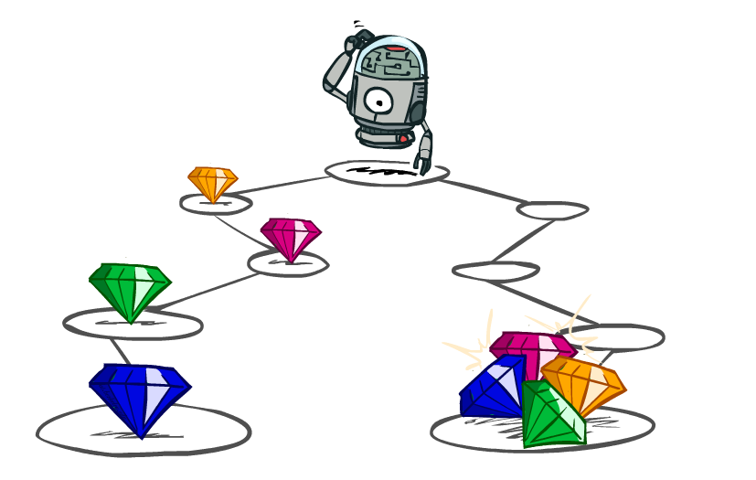]

¿Qué preferencias debería tener un agente sobre secuencias de estados o recompensas?

- ¿Más o menos? $[2,3,4]$ o $[1, 2, 2]$?
- ¿Ahora o después? $[1,0,0]$ o $[0,0,1]$?

---

class: middle

.grid[
.kol-1-2[

## Descuento

- Cada vez que transicionamos al siguiente estado, multiplicamos el
  descuento una vez más.
- ¿Por qué descontar?
    - Las recompensas más próximas probablemente tienen mayor utilidad
      que las recompensas lejanas.
    - Ayuda a que nuestros algoritmos converjan.
]
.kol-1-2[
.width-100[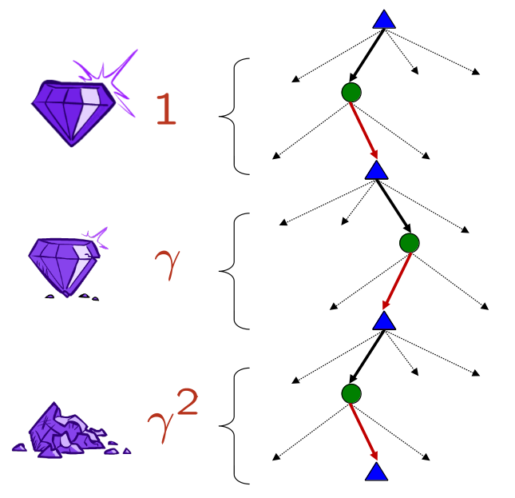]
]
]

Ejemplo: descuento $\gamma=0.5$

- $V([1,2,3]) = 1 + 0.5\times 2 + 0.25 \times 3$
- $V([1,2,3]) < V([3,2,1])$


---


# Política y retorno

Una **política** $\pi : S \to A$ le dice al agente qué acción tomar en
cada estado: $a = \pi(s)$.

Al ejecutar $\pi$ desde un estado inicial $s_0$, el agente genera una
trayectoria:

$$
s\_0 \xrightarrow{a\_0} s\_1 \xrightarrow{a\_1} s\_2 \xrightarrow{a\_2} \dots
$$

donde cada $s_{t+1}$ se muestrea según $P(\cdot \mid s_t, a_t)$ — es
**aleatoria**, no determinista.

El **retorno** de esa trayectoria es la suma de recompensas, **descontada**:

$$
G\_0 = R(s\_0) + \gamma R(s\_1) + \gamma^2 R(s\_2) + \dots = \sum\_{t=0}^{\infty} \gamma^t R(s\_t)
$$

---

### ¿Por qué descontar?

.grid[
.kol-1-2[
- **Convergencia matemática**: sin $\gamma < 1$, esta suma infinita
  puede no converger si las recompensas no se anulan — con $\gamma<1$
  es una serie geométrica, siempre acotada.
- **Preferencia temporal**: un premio hoy vale más que el mismo premio
  mañana — la misma lógica que una tasa de interés.
- **Incertidumbre acumulada**: cada paso hacia el futuro es menos
  seguro que se vaya a realizar tal cual lo proyectamos.
]
.kol-1-2[
.center.width-100[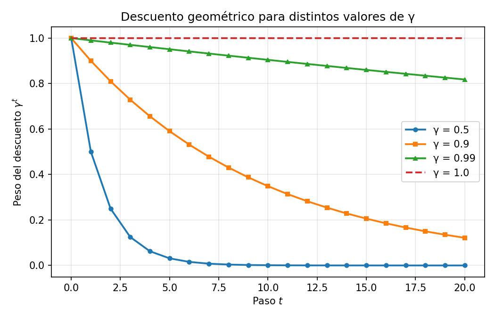]
]
]

.alert[En el Gridworld que vamos a usar hoy, $\gamma=1$ — la
recompensa de vivir $R(s)=-0.04$ en cada paso ya empuja al agente a
terminar rápido, así que no necesitamos descuento adicional para
garantizar convergencia.]

---

### La función de utilidad de una política

.center.width-25[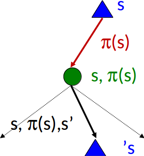]

Definimos $V^\pi(s)$ como el retorno **esperado** empezando en $s$ y
siguiendo $\pi$ de ahí en adelante:

$$
V^\pi(s) = \mathbb{E}\Big[\, \sum\_{t=0}^{\infty} \gamma^t R(s\_t) \;\Big|\; s\_0 = s, \pi \,\Big]
$$

Necesitamos el valor esperado porque $P$ es estocástica: la misma
política, desde el mismo estado, puede generar trayectorias distintas
cada vez. $V^\pi(s)$ promedia sobre todas ellas, ponderadas por su
probabilidad.

???

Aquí es donde conviene pausar y preguntar: ¿por qué no calculamos esto
enumerando *todas* las trayectorias posibles y promediando? Porque hay
infinitas (el proceso no tiene por qué terminar nunca) — necesitamos
una forma de calcular $V^\pi$ sin enumerar. Esa es exactamente la
motivación de lo que sigue.

---

class: middle

## Teorema

Si asumimos preferencias **estacionarias** sobre secuencias de recompensa, es decir, tales que

$$[r\_0, r\_1, r\_2, ...] \succ [r\_0, r\_1', r\_2', ...] \Rightarrow [r\_1, r\_2, ...] \succ [r\_1', r\_2', ...],$$

entonces solo hay dos formas coherentes de asignar utilidades a las secuencias:

.grid[
.kol-1-2.center[
Utilidad aditiva:

Utilidad descontada:
($0<\gamma<1$)
]
.kol-1-2[
$V([r\_0, r\_1, r\_2, ...]) = r\_0 + r\_1 + r\_2 + ...$

$V([r\_0, r\_1, r\_2, ...]) = r\_0 + \gamma r\_1 + \gamma^2 r\_2 + ...$
]
]

???

Explicar qué significa "coherente": que las asignaciones de utilidad no
llevan a contradicciones en las preferencias.

- Si un agente prefiere la secuencia A sobre B, y B sobre C, entonces
  también debe preferir A sobre C.
- Si un agente prefiere una secuencia que empieza con recompensa $r\_0$
  sobre otra que empieza con la misma $r\_0$, entonces también debe
  preferir el resto de esas secuencias en el mismo orden.

---

class: middle

## Secuencias infinitas

¿Qué pasa si el agente vive para siempre? ¿Obtenemos recompensas
infinitas? Comparar secuencias de recompensa con utilidad $+\infty$ es
problemático.

Soluciones:

- **Horizonte finito**: (similar a búsqueda con profundidad limitada)
    - Terminar los episodios después de un número fijo de pasos $T$.
    - Produce políticas no estacionarias ($\pi$ depende del tiempo
      restante).
- **Descuento** (con $0 < \gamma < 1$ y recompensas acotadas por
  $\pm R\_\text{max}$):

$$
V([r\_0, r\_1, ..., r\_\infty]) = \sum\_{t=0}^{\infty} \gamma^t r\_t \leq \frac{R\_\text{max}}{1-\gamma}
$$

  Un $\gamma$ más pequeño resulta en un horizonte más corto.
- **Estado absorbente**: garantizar que, para toda política, un
  estado terminal se alcanza eventualmente.


---

class: middle

### La observación clave: estacionariedad

El proceso que empieza en $s_0$ y sigue $\pi$ **se ve exactamente
igual** al proceso que empieza en $s_1$ y sigue $\pi$ — misma
dinámica, misma política, el mundo no "recuerda" que ya dimos un paso.

.alert[Esto significa que $V^\pi(s_1)$, evaluado sobre la cola de la
trayectoria a partir de $s_1$, es una **copia idéntica** de la
definición de $V^\pi$ — solo que arrancando un paso más tarde. Vamos a
usar esta auto-similitud para evitar sumar infinitos términos.]

---

### Derivación de la ecuación de Bellman (paso a paso)

Partimos de la definición y separamos el primer término de la cola:

$$
V^\pi(s) = \mathbb{E}\big[R(s_0) + \gamma R(s_1) + \gamma^2 R(s_2) + \dots \mid s_0=s\big]
$$

**Paso 1** — $R(s_0)$ no es aleatorio dado $s_0=s$: lo sacamos del valor esperado.

$$
V^\pi(s) = R(s) + \mathbb{E}\big[\gamma R(s_1) + \gamma^2 R(s_2) + \dots \mid s_0=s\big]
$$

**Paso 2** — factorizamos el $\gamma$ común:

$$
V^\pi(s) = R(s) + \gamma \, \mathbb{E}\big[R(s_1) + \gamma R(s_2) + \dots \mid s_0=s\big]
$$

---

### Derivación de la ecuación de Bellman (paso a paso) — cont.

**Paso 3** — por estacionariedad, lo que queda dentro del $\mathbb{E}[\cdot]$
es *exactamente* $V^\pi(s_1)$ evaluado en el estado aleatorio $s_1$:

$$
V^\pi(s) = R(s) + \gamma \, \mathbb{E}_{s_1 \sim P(\cdot \mid s,\pi(s))}\big[\, V^\pi(s_1) \,\big]
$$

**Paso 4** — como $s_1$ es una variable aleatoria discreta con
distribución $P(\cdot \mid s,\pi(s))$, ese valor esperado se escribe
explícitamente como una suma ponderada por probabilidad:

.alert[
$$
V^\pi(s) = R(s) + \gamma \sum_{s' \in S} P(s' \mid s,\pi(s)) \, V^\pi(s')
$$
]

Esta es la **ecuación de Bellman**. No es una aproximación — es la
definición original, reescrita para no necesitar sumar infinitos
términos.

???

Vale la pena remarcar en clase el resultado no obvio: para un MDP de
estados finitos, esto da un sistema de $|S|$ ecuaciones lineales en
$|S|$ incógnitas — resoluble **exactamente**, sin iterar. Eso es
literalmente lo que vamos a usar en la parte de Policy Iteration.

---


### Valores de los estados

La utilidad, o valor, $V(s)$ de un estado se define simplemente como $V^{\pi^\*}(s)$.

- Es decir, la recompensa (descontada) esperada si el agente ejecuta
  una política óptima empezando en $s$.
- Noten que $R(s)$ y $V(s)$ son cantidades bastante distintas:
    - $R(s)$ es la recompensa de **corto plazo** por haber llegado a $s$.
    - $V(s)$ es la recompensa total de **largo plazo** desde $s$ en adelante.
---

class: middle

.center.width-40[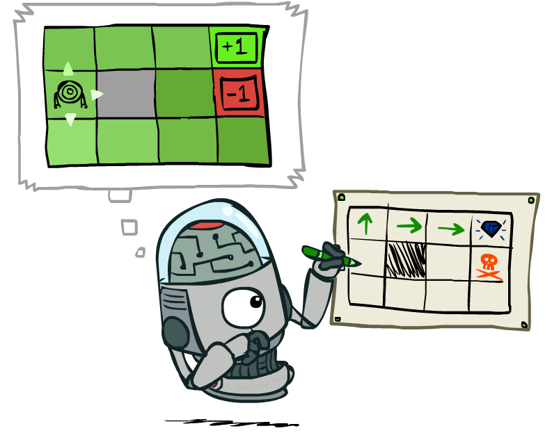]

### Extracción de política

Usando el principio de máxima utilidad esperada, la acción óptima
maximiza la utilidad esperada del estado siguiente. Es decir,

$$\pi^*(s) = \arg \max\_{a} \sum\_{s'} P(s'\mid s,a) V(s').$$

Por lo tanto, podemos extraer la política óptima siempre que podamos
estimar las utilidades de los estados.

???

Señalar la circularidad del argumento.

---

class: middle

$$\pi^*(s) = \arg \max\_{a} \sum\_{s'} P(s'\mid s,a) V(s')$$

.center.width-90[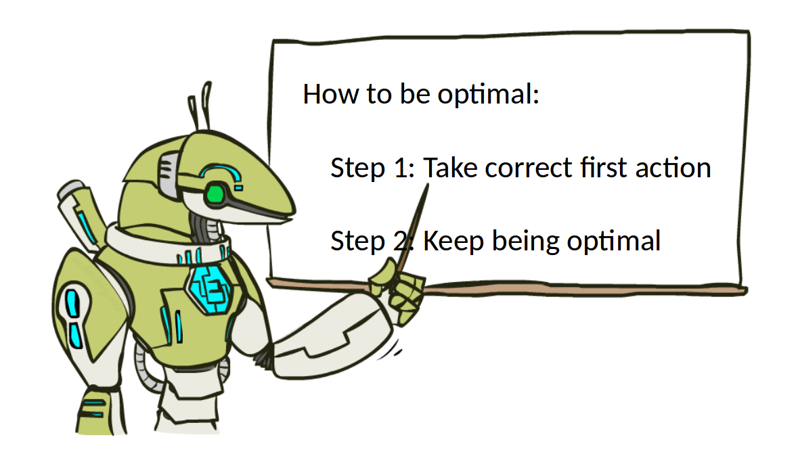]

---

### La política óptima

Ya no fijamos una política — preguntamos: ¿cuál es el mejor retorno
posible, sobre **todas** las políticas?

$$
V^*(s) = \max_{\pi} V^\pi(s)
$$

Adaptamos la ecuación de Bellman reemplazando "seguir la acción fija
$\pi(s)$" por "elegir la mejor acción posible en cada estado":


.alert[
$$
V^\*(s) = R(s) + \max\_{a \in A} \; \gamma \sum\_{s' \in S} P(s' \mid s,a) \, V^\*(s')
$$
]


Esta es la **ecuación de Bellman de optimalidad**. La diferencia con
la anterior es exactamente el $\max_a$ en vez de una acción fija.

La política óptima se extrae tomando el `argmax` en lugar del `max`:

$$
\pi^\*(s) = \arg\max\_{a \in A} \sum\_{s' \in S} P(s' \mid s,a) \, V^\*(s')
$$

---


class: middle

.center.width-50[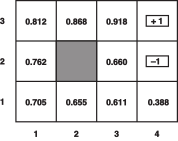]

Utilidades de los estados en el Gridworld, calculadas con $\gamma=1$ y
$R(s)=-0.04$ para los estados no terminales.

---

class: middle

## Ejemplo

$$
\begin{aligned}
V(1,1) = -0.04 + \gamma \max [& 0.8 V(1,2) + 0.1 V(2,1) + 0.1 V(1,1), \\\\
& 0.9 V(1,1) + 0.1 V(1,2), \\\\
& 0.9 V(1,1) + 0.1 V(2,1), \\\\
& 0.8 V(2,1) + 0.1 V(1,2) + 0.1 V(1,1)]
\end{aligned}
$$

---
class: middle, center, divider-slide

## Value Iteration

.width-60[]

---

# Value Iteration

Aplicamos la ecuación de Bellman de optimalidad como una **regla de
actualización**, repetidamente, sobre todos los estados, hasta que
$V$ deje de cambiar:

```
function VALUE-ITERATION(mdp, θ) returns V*
    inicializar V(s) := 0 para todo s
    repeat
        Δ := 0
        for cada estado s:
            V'(s) := R(s) + max_a γ Σ_s' P(s' \mid s,a) V(s')
            Δ := max(Δ, |V'(s) - V(s)|)
        V := V'
    until Δ < θ
    return V
```

**Criterio de parada cuantitativo**: paramos cuando el mayor cambio
absoluto entre dos barridos ($\Delta$) cae por debajo de un umbral
$\theta$ — no "cuando se vea estable".

---

class: middle

## Convergencia

Sean $V\_i$ y $V\_{i+1}$ aproximaciones sucesivas a la utilidad verdadera $V$.

.bold[Teorema.] Para cualesquiera dos aproximaciones $V\_i$ y $V'\_i$,
$$||V\_{i+1} - V'\_{i+1}||\_\infty \leq \gamma ||V\_i - V'\_i||\_\infty.$$

- Es decir, la actualización de Bellman es una contracción por un
  factor $\gamma$ en el espacio de vectores de utilidad.
- Por lo tanto, cualesquiera dos aproximaciones deben acercarse entre
  sí, y en particular cualquier aproximación debe acercarse a la $V$
  verdadera.

$\Rightarrow$ Value iteration siempre converge a una única solución
de las ecuaciones de Bellman siempre que $\gamma < 1$.

.footnote[Con $\gamma=1$ (nuestro caso hoy) la contracción estricta no
aplica formalmente, pero la recompensa de vivir negativa garantiza
convergencia en la práctica — ver AIMA §17.2 para la discusión completa.]
---

### Ejemplo trabajado a mano: franja 1×3

.width-70[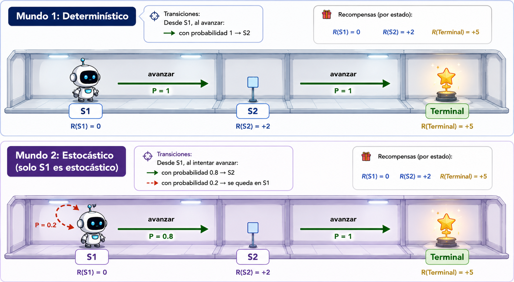]

---

class: middle, center, divider-slide

### Live-coding: Value Iteration en el Gridworld 4×3

.width-70[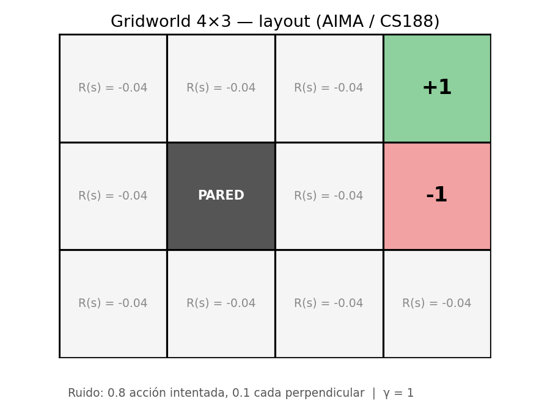]

???

Ejecutar en vivo `notebooks/lecture4/01_value_iteration_gridworld.ipynb`:
construir el ambiente (pared en (2,2), terminales +1/-1, ruido
0.8/0.1/0.1), correr Value Iteration hasta convergencia, extraer la
política óptima, y validar contra AIMA Fig. 17.3. Señalar en vivo el
"rodeo" que hace la política en la celda (2,1) — evita pasar junto al
terminal -1 aunque sea el camino más corto, precisamente por el ruido.

---

### Actividad — calculen a mano, en parejas

Este es $V^{(2)}$, la tabla de utilidades del Gridworld **después de
la iteración 2** de Value Iteration (ya la corrimos en vivo):

```
-0.0800 | -0.0800 | +0.7520 | +1.0000
-0.0800 |  WALL   | -0.0800 | -1.0000
-0.0800 | -0.0800 | -0.0800 | -0.0800
```

**Calculen $V^{(3)}(s)$ para $s=(2,1)$** — la celda justo debajo del
+0.7520, junto al terminal -1. Recuerden: ruido 0.8/0.1/0.1, $R(s)=-0.04$.

3-4 minutos. Después comparamos números.

???

Respuesta: para cada acción $a$, calculen
$Q(s,a)=\sum_{s'} P(s' \mid s,a)\,V^{(2)}(s')$ usando las probabilidades de
la acción intentada (0.8) y las dos perpendiculares (0.1 cada una).
$Q(\text{UP})=0.8(0.752)+0.1(-0.08)+0.1(-1.0)=0.4936$ — es la mayor de
las 4. $V^{(3)}(2,1) = -0.04 + 0.4936 = 0.4536$. Vale la pena mostrar
también por qué `RIGHT` (ir directo al terminal -1) da
$Q=-0.7328$ — clarísimamente peor, porque el ruido del 20% te puede
tirar exactamente ahí aunque no sea la intención.

---

### Solución

$$
Q(s,\text{UP}) = 0.8\cdot V(2,2) + 0.1\cdot V(2,1) + 0.1\cdot V(3,1) = 0.8(0.752)+0.1(-0.08)+0.1(-1.0) = 0.4936
$$
$$
Q(s,\text{DOWN}) = 0.8\cdot V(2,0) + 0.1\cdot V(2,1) + 0.1\cdot V(3,1) = -0.1720
$$
$$
Q(s,\text{LEFT}) = 0.8\cdot V(2,1) + 0.1\cdot V(2,2) + 0.1\cdot V(2,0) = 0.0032
$$
$$
Q(s,\text{RIGHT}) = 0.8\cdot V(3,1) + 0.1\cdot V(2,2) + 0.1\cdot V(2,0) = -0.7328
$$

.alert[
$$
V^{(3)}(2,1) = R(s) + \max_a Q(s,a) = -0.04 + 0.4936 = \mathbf{0.4536}
$$
]

`UP` gana con claridad — aunque parezca ir "lejos" del terminal +1, es
la única acción que no arriesga 10% de probabilidad de caer en el -1.

---

class: middle, center, divider-slide

## Policy Iteration

.width-60[]

---

# Policy Iteration

En vez de iterar la ecuación de Bellman de *optimalidad* (con el
$\max$ adentro), alternamos entre dos pasos:

```
function POLICY-ITERATION(mdp) returns π*
    inicializar π arbitrariamente
    repeat
        V := EVALUAR-POLITICA(π, mdp)     # resolver el sistema lineal
        π' := MEJORAR-POLITICA(V, mdp)    # greedy respecto a V
        si π' == π: return π
        π := π'
```

- **Evaluación de política**: con $\pi$ fija, la ecuación de Bellman
  ya no tiene $\max$ — es un sistema lineal de $|S|$ ecuaciones en
  $|S|$ incógnitas, resoluble **exactamente**.
- **Mejora de política**: igual que extraer $\pi^*$ de $V^*$, pero
  con el $V^\pi$ recién calculado.

---

### Ejemplo Policy Iteration

.width-70[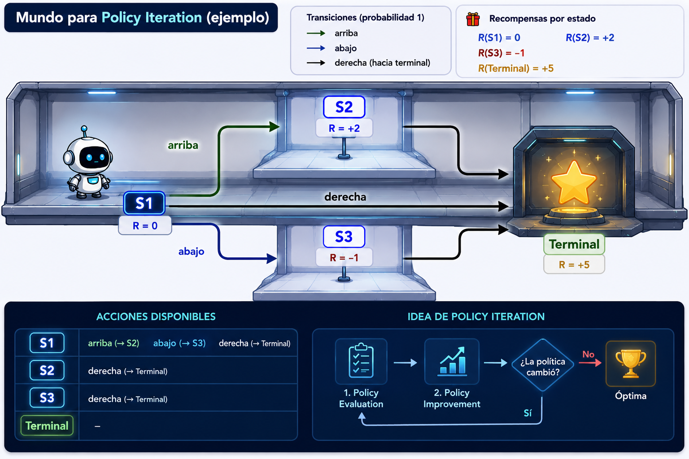]

---

# Un dato que vale la pena remarcar

.alert[A diferencia de Value Iteration, Policy Iteration con un
solver lineal exacto **sí** alcanza la política óptima exacta en un
número **finito** de pasos — no solo converge asintóticamente.]

- El espacio de políticas es finito y discreto: una vez que $\pi$ deja
  de cambiar entre iteraciones, ya es $\pi^*$, punto — no hay "casi
  óptimo" en Policy Iteration.
- Value Iteration, en cambio, siempre tiene un error residual no nulo
  en $V$ hasta el límite — nunca "termina", solo se acerca lo
  suficiente según $\theta$.

---

class: middle, center, divider-slide

## Live-coding: Policy Iteration en el mismo Gridworld

.width-60[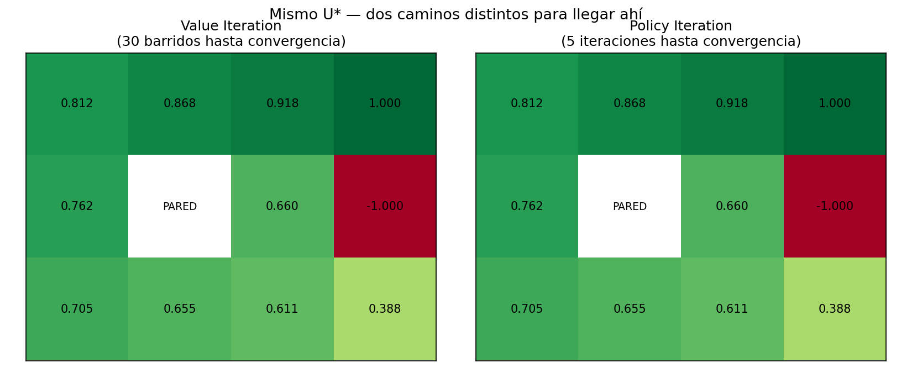]

???

Ejecutar en vivo `notebooks/lecture4/02_policy_iteration_gridworld.ipynb`:
mismo ambiente, evaluar la política actual resolviendo el sistema
lineal con `np.linalg.solve`, mejorar, repetir. Mostrar en vivo que
converge en **5 iteraciones** (contra 30 barridos de Value Iteration)
y que el resultado final —$V^*$ y $\pi^*$— es idéntico al de VI.

---

# Value Iteration vs. Policy Iteration

| | Value Iteration | Policy Iteration |
|---|---|---|
| Qué actualiza | $V(s)$ directamente | Alterna evaluar $V^\pi$ y mejorar $\pi$ |
| Costo por iteración | Barrido sobre estados, más barato | Resolver sistema lineal $\lvert S\rvert\times\lvert S\rvert$, más caro |
| Convergencia | Asintótica (nunca exacta en tiempo finito) | Exacta en número finito de iteraciones |
| En nuestro Gridworld (11 estados) | 30 barridos | **5 iteraciones** |
| MDPs pequeños | Funciona bien | Suele ser el más rápido |
| MDPs grandes ($\lvert S\rvert$ enorme) | Preferido en la práctica | El sistema lineal se vuelve costoso de resolver repetidamente |

.footnote[No hay consenso universal sobre cuál es "mejor" — depende
del tamaño de $\lvert S\rvert$. En la práctica, Value Iteration se usa
más porque escala mejor cuando el espacio de estados crece.]

---


class: middle

# Cierre: ¿y si no conocemos el modelo?

Todo lo que hicimos hoy —Value Iteration, Policy Iteration— asumió que
**conocíamos** $P(s' \mid s,a)$ y $R(s)$ de antemano. El agente nunca
interactuó con el mundo: resolvimos el MDP con álgebra pura, dado un
modelo ya construido.

.alert[¿Qué hacemos cuando **no conocemos** $P$ ni $R$ — cuando la
única forma de aprender algo del mundo es **actuando** en él y
observando qué pasa? Esa pregunta es exactamente donde empieza
Reinforcement Learning, y es el tema completo de la Clase 6.]

---

# Resumen

- Un **MDP** formaliza decisión secuencial bajo incertidumbre:
  $(S,A,P,R,\gamma)$.
- La **ecuación de Bellman** no es una aproximación — es la definición
  de $V^\pi$ reescrita usando estacionariedad, para evitar sumar
  infinitos términos.
- **Value Iteration** itera la ecuación de Bellman de optimalidad
  directamente; converge por ser una contracción, pero solo
  asintóticamente.
- **Policy Iteration** alterna evaluación exacta (sistema lineal) y
  mejora codiciosa; converge en menos iteraciones, cada una más cara.
- Ambos asumen que el modelo ($P$, $R$) es **conocido** — la pregunta
  de qué pasa cuando no lo es abre la Clase 6.

---

class: middle, center, end-slide
count: false

## Fin de la Clase 5

Próxima clase: Reinforcement Learning — Q-learning, exploración vs. explotación
