class: middle, center, title-slide

# SI3003 - Inteligencia Artificial

Clase 5 — Aprendizaje por Refuerzo

  

???

Clases anteriores formalizaron agentes que buscan (Clase 2) y que
planifican con restricciones (Clase 3): en ambos casos, el agente ya
sabía de antemano cómo se comporta el mundo. Hoy cambia la pregunta —
¿qué hace un agente cuando nadie le dice de antemano cuál es la acción
correcta, y solo puede aprenderlo por prueba y error, a partir de
recompensas? Toda la clase converge en un solo algoritmo concreto que
vamos a programar: Q-Learning. Es la puerta de entrada a RL — todo lo
que sigue en el tema (deep RL, políticas con redes neuronales) es una
extensión de esta misma idea.

---

class: smaller

# Reinforcement Learning

El Aprendizaje por Refuerzo .bold[(RL)] es una técnica de inteligencia
artificial en la que un agente aprende a tomar decisiones mediante
prueba y error, recibiendo recompensas o penalizaciones según sus
acciones.

---

class: smaller

# Analogía

Es como aprender a jugar un videojuego: al principio cometemos muchos
errores, pero con cada intento aprendemos qué acciones nos acercan más
a obtener una buena puntuación.

class: middle, center, smaller

.width-70[]

.footnote[Créditos: [Deep RL Course](https://huggingface.co/learn/deep-rl-course), Hugging Face (Thomas Simonini et al.) — entorno inspirado en Frozen Lake / OpenAI Gym.]

---

class: smaller

Vamos a profundizar en uno de los métodos de aprendizaje por refuerzo,
los .bold[métodos basados en el valor], y a estudiar un algoritmo de
aprendizaje por refuerzo: el .bold[Q-Learning].

---

class: smaller

# Hoy

La idea de esta clase es profundizar en los siguientes temas:

- Métodos basados en valores.
- Diferencias entre el aprendizaje de Monte Carlo y el aprendizaje por
  diferencias temporales.
- Estudiaremos e implementaremos un algoritmo de aprendizaje por
  refuerzo (RL): el aprendizaje Q (Q-Learning).

.italic[Nota: el RL es una aproximación a lo que hoy conocemos como
*game-playing agents*.]

---

class: smaller

En RL construimos agentes que toman decisiones inteligentes, por
ejemplo un agente que juega videojuegos o invierte en la bolsa. Siempre
buscando .bold[maximizar sus beneficios].

.center.width-40[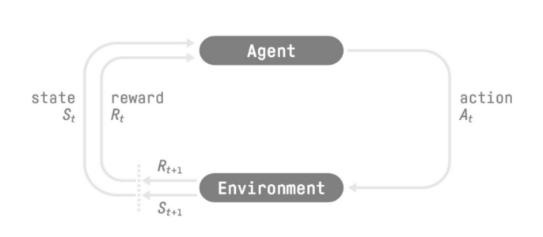]

.footnote[Créditos: [Deep RL Course](https://huggingface.co/learn/deep-rl-course), Hugging Face.]

Para tomar decisiones inteligentes, nuestro agente aprenderá del
entorno interactuando con él mediante el método de prueba y error y
recibiendo recompensas (positivas o negativas) como retroalimentación.

---

class: smaller

El proceso de toma de decisiones del agente se denomina .bold[política]
$\pi$: dada una situación, una política generará una acción o una
distribución de probabilidades sobre las acciones. Es decir, dada una
observación del entorno, una política proporcionará una acción (o
varias probabilidades para cada acción) que el agente debería llevar a
cabo.

---

class: middle, center, smaller

.width-50[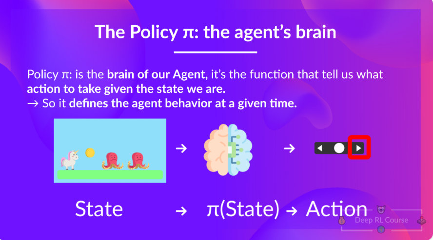]

.footnote[Créditos: [Deep RL Course](https://huggingface.co/learn/deep-rl-course), Hugging Face.]

---

class: smaller

Nuestro objetivo es encontrar una .bold[política óptima] $\pi^\*$, es
decir, una política que conduzca a la mejor recompensa acumulada
esperada.

Y para encontrar esta política óptima (y, por lo tanto, resolver el
problema de RL), existen dos tipos principales de métodos de RL:

- .italic[Métodos basados en políticas]: entrenan directamente la
  política para aprender qué acción tomar dado un estado.
- .italic[Métodos basados en valores]: entrenan una función de valor
  para aprender qué estado es más valioso y utilizan esta función de
  valor para tomar la acción que conduce a él.

---

class: middle, center, smaller

.width-60[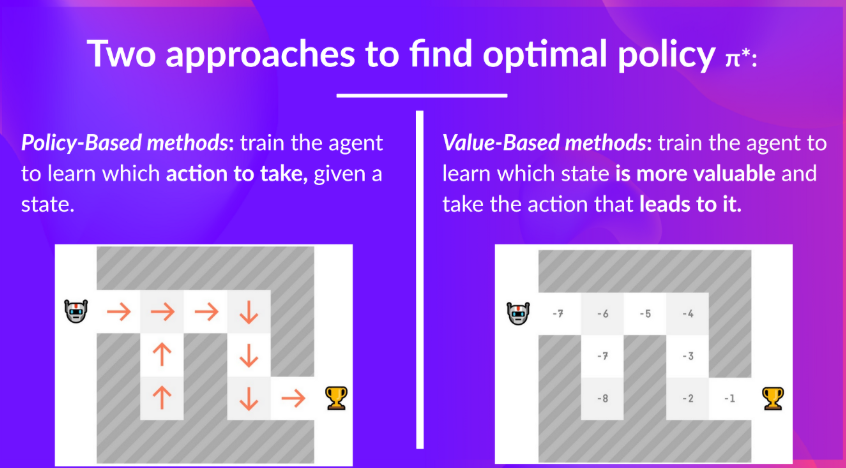]

.footnote[Créditos: [Deep RL Course](https://huggingface.co/learn/deep-rl-course), Hugging Face.]

---

class: smaller

El objetivo de un agente de RL es tener una política óptima
$\pi^\*$.

Para encontrar la política óptima, tenemos 2 métodos diferentes:

---

class: smaller

## Métodos basados en política

Entrenamos directamente la política para seleccionar qué acción tomar
dado un estado (o una distribución de probabilidad sobre las acciones
en ese estado).

En este caso, no tenemos una función de valor. La política recibe un
estado como entrada y devuelve qué acción tomar en ese estado.

.italic[Nota: una política .bold[determinista] es una política que
devuelve una única acción dado un estado, a diferencia de una política
.bold[estocástica], que devuelve una distribución de probabilidad sobre
las acciones.]

---

class: middle, smaller

.center.width-50[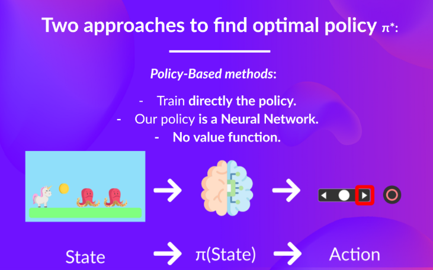]

No definimos manualmente el comportamiento de nuestra política; es el
.bold[entrenamiento] el que lo definirá.

---

class: smaller

## Métodos basados en valores

De forma indirecta, entrenando una función de valor que devuelve el
valor de un estado o de un par estado-acción. Dada esta función de
valor, nuestra política tomará una acción.

Como la política no se entrena ni se aprende, tenemos que especificar
su comportamiento. Por ejemplo, si queremos una política que, dada la
función de valor, tome acciones que siempre conduzcan a la mayor
recompensa, crearemos una .bold[Política Greedy] (codiciosa).

.italic[Nota: *greedy* significa que la política elige en cada momento
la acción que parece mejor según la función de valor.]

.center.width-50[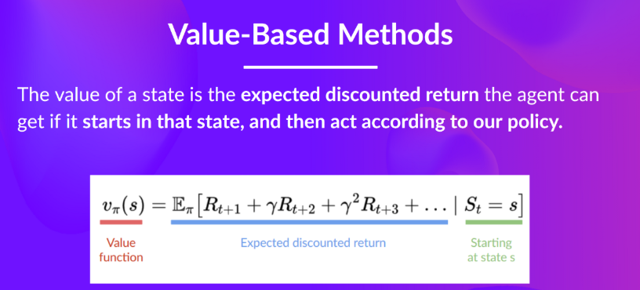]

---

class: middle, smaller

.center.width-60[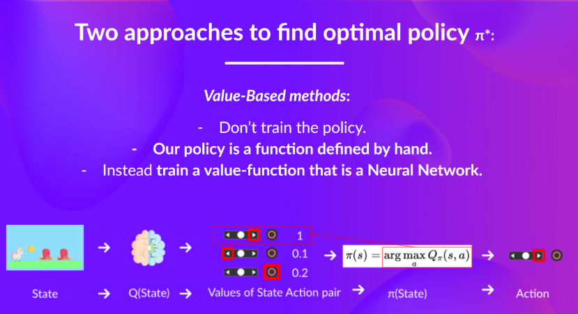]

Dado un estado, nuestra función action-value (la cual entrenamos)
genera el valor de cada acción en ese estado; luego nuestra política
.italic["greedy"] selecciona la acción que proporcionará el mayor valor
para un estado determinado.

---

class: smaller

En consecuencia, independientemente del método que utilices para
resolver tu problema, tendrás una política.

Solo que en el caso de los métodos basados en valores, no entrenas la
política: tu política es simplemente una función predefinida (por
ejemplo, la Política Greedy) que utiliza los valores proporcionados por
la función de valor para seleccionar sus acciones.

---

class: smaller

Entonces, la diferencia es:

- En el entrenamiento basado en políticas, la política óptima (denotada
  como $\pi^\*$) se encuentra entrenando directamente la política.
- En el entrenamiento basado en valores, encontrar una función de valor
  óptima (denotada como $Q^\*$ o $V^\*$) conduce a obtener una política
  óptima.

---

class: middle, center, smaller

.width-50[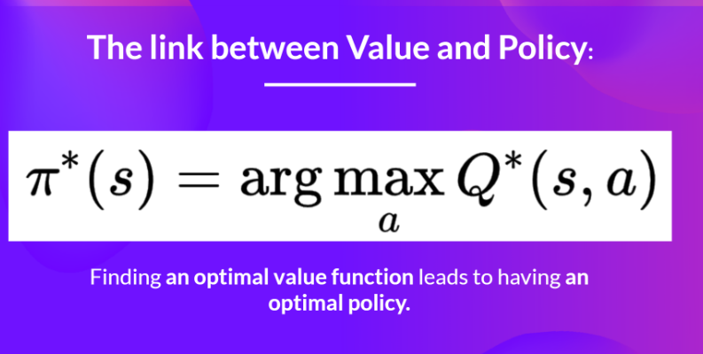]

Encontrar una función de valor óptima lleva a tener una política
óptima.

---

class: smaller

## La función de valor de estado

Escribimos la función de valor de estado bajo una política $\pi$ de la
siguiente manera:

.center.width-40[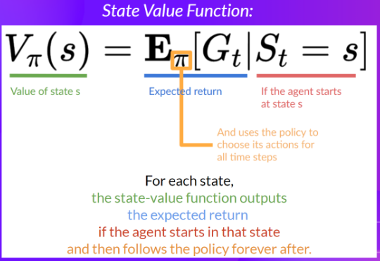]

---

class: smaller

Para cada estado, la función estado-valor devuelve la rentabilidad
esperada si el agente parte de ese estado y, a partir de ahí, sigue la
política de forma indefinida (en todos los pasos temporales futuros, si
lo prefieres).

.center.width-40[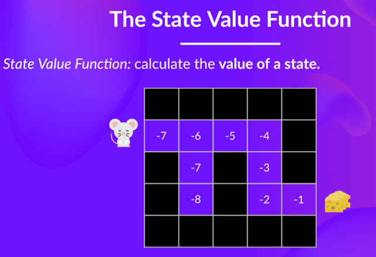]

---

class: smaller

## La función de valor de acción

En la función de valor de acción, para cada par de estado y acción, la
función de valor de acción devuelve el retorno esperado si el agente
comienza en ese estado, toma esa acción y, a partir de entonces, sigue
la política para siempre.

---

class: smaller

El valor de tomar la acción $a$ en el estado $s$ bajo una política
$\pi$ es:

.center.width-40[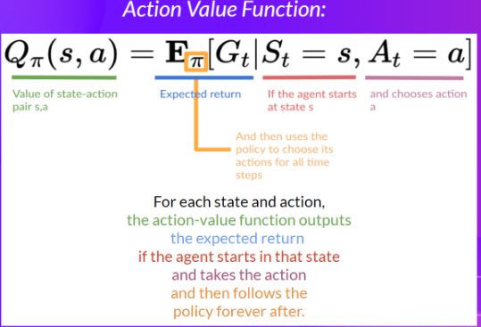]

---

class: middle, center, smaller

.width-50[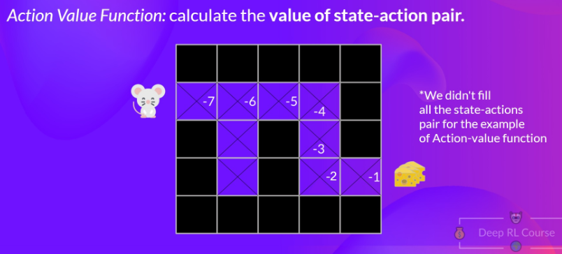]

---

class: smaller

Para la función de valor de estado, calculamos el valor de un estado
$S_t$.

Para la función de valor de acción, calculamos el valor del par
estado-acción $(S_t, A_t)$, es decir, el valor de tomar esa acción en
ese estado.

.center.width-50[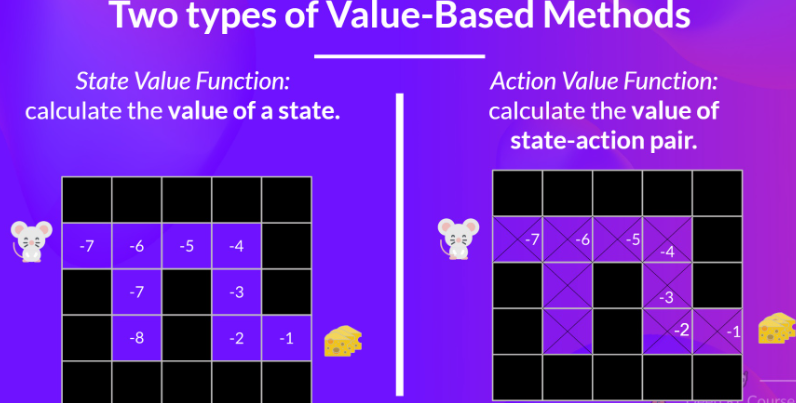]

---

class: smaller

El problema es que para calcular cada valor de un estado o de un par
estado-acción, necesitamos sumar todas las recompensas que un agente
puede obtener si comienza en ese estado.

Este puede ser un proceso computacionalmente costoso, y ahí es donde la
.bold[ecuación de Bellman] entra en juego para ayudarnos.

---

class: smaller

## The Bellman Equation: simplify our value estimation

La ecuación de Bellman simplifica el cálculo del valor de estado o del
valor de estado-acción.

---

class: smaller

Sabemos que si calculamos $V(S_t)$ (el valor de un estado), necesitamos
calcular el retorno comenzando desde ese estado y luego seguir la
política para siempre.

Para calcular $V(S_t)$, necesitamos calcular la suma de las recompensas
esperadas. Por lo tanto:

---

class: middle, smaller

Para calcular el valor del Estado 1: la suma de las recompensas si el
agente comenzara en ese estado y luego siguiera la política greedy
durante todos los pasos de tiempo.

.center.width-50[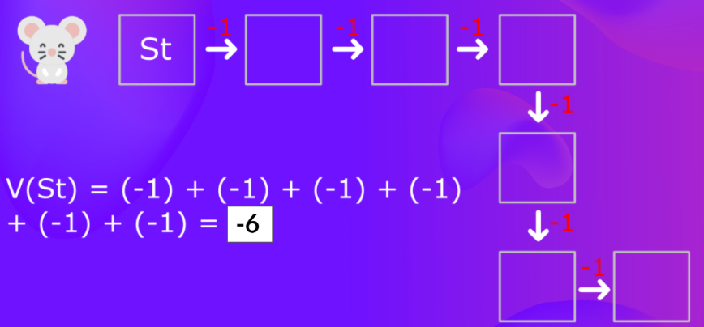]

---

class: middle, smaller

Luego, para calcular $V(S_{t+1})$, necesitamos calcular el retorno
comenzando desde ese estado $S_{t+1}$.

.center.width-50[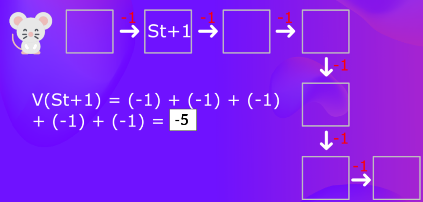]

---

class: smaller

Estamos repitiendo el cálculo del valor de diferentes estados, lo cual
puede resultar tedioso si necesitamos hacerlo para cada valor de estado
o valor de estado-acción.

En lugar de calcular el retorno esperado para cada estado o para cada
par estado-acción, podemos utilizar .bold[la ecuación de Bellman].

---

class: smaller

## Ecuación de Bellman

La ecuación de Bellman es una ecuación .bold[recursiva] que funciona de
la siguiente manera: en lugar de comenzar desde el principio para cada
estado y calcular el retorno, podemos considerar el valor de cualquier
estado como:

La recompensa inmediata + el valor descontado del estado siguiente:

$$R_{t+1} + \big(\gamma * V(S_{t+1})\big)$$

---

class: middle, center, smaller

.width-50[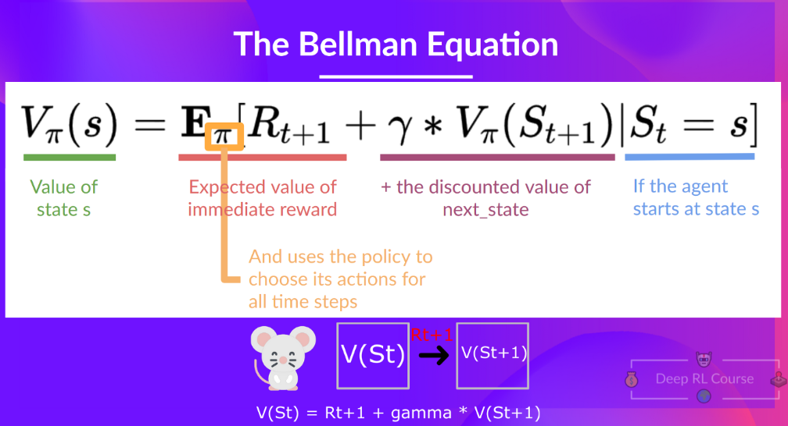]

.footnote[Créditos: [Deep RL Course](https://huggingface.co/learn/deep-rl-course), Hugging Face.]

---

class: middle, smaller

Para simplificar, aquí no aplicamos descuento, por lo que
$\gamma = 1$.

.center.width-40[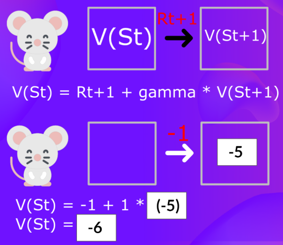]

---

class: smaller

En resumen, la idea de la ecuación de Bellman es que, en lugar de
calcular cada valor como la suma del retorno esperado —lo cual es un
proceso largo—, calculamos el valor como la suma de la .bold[recompensa
inmediata] + el .bold[valor descontado del estado siguiente].

---

class: smaller

# Q-Learning

Método basado en valores y .italic[off-policy] para entrenar su función
de valor de acción:

- .italic[Off-policy]: hablaremos de esto al final de esta unidad.
- .italic[Método basado en valores]: encuentra la política óptima de
  manera indirecta, entrenando una función de valor o una función de
  valor de acción que nos indicará el valor de cada estado o de cada
  par estado-acción.

---

class: smaller

## Q-Learning

Actualiza su función de valor de acción en cada paso, en lugar de
hacerlo al final del episodio.

Q-Learning es el algoritmo que utilizamos para entrenar nuestra función
Q, una función de valor de acción que determina el valor de estar en un
estado determinado y tomar una acción específica en ese estado.

---

class: middle, smaller

Dado un estado y una acción, nuestra función Q devuelve un valor de
estado-acción (también llamado .bold[valor Q]).

.center.width-40[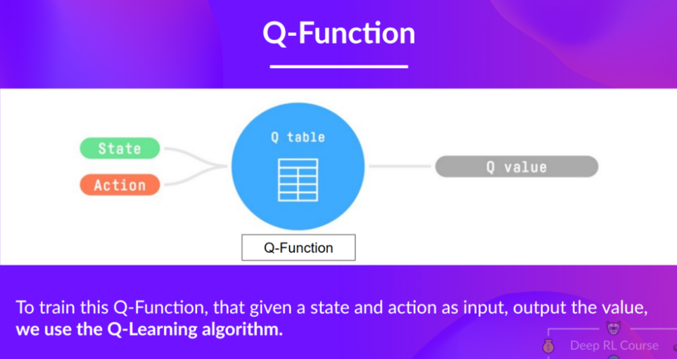]

.footnote[Créditos: [Deep RL Course](https://huggingface.co/learn/deep-rl-course), Hugging Face.]

---

class: smaller

Repasemos la diferencia entre valor y recompensa:

- El .italic[valor de un estado], o de un .italic[par estado-acción],
  es la recompensa acumulada esperada que obtiene nuestro agente si
  comienza en ese estado (o par estado-acción) y luego actúa de acuerdo
  con su política.
- La .italic[recompensa] es la retroalimentación que recibe del entorno
  después de realizar una acción en un estado.

Internamente, nuestra función Q está representada mediante una
.bold[tabla Q], una tabla en la que cada celda corresponde al valor de
un par estado-acción.

---

class: middle, smaller

.center.width-50[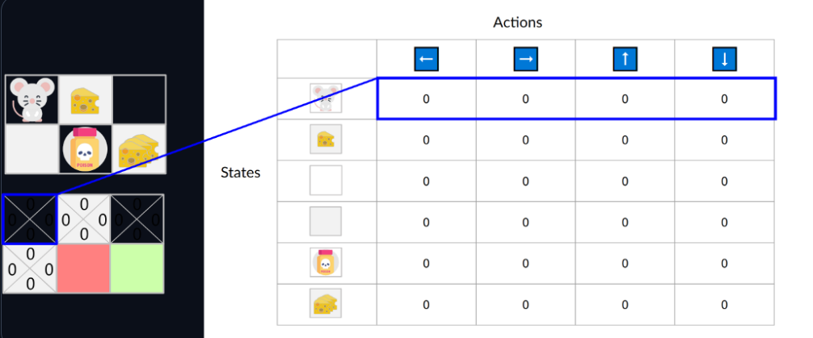]

La tabla Q está inicializada. Por eso, todos los valores son $= 0$.

---

class: smaller

Esta tabla contiene, para cada estado y acción, los valores de
estado-acción correspondientes. En este ejemplo sencillo, el estado
está definido únicamente por la posición del ratón.

Por lo tanto, tenemos $2 \times 3$ filas en nuestra tabla Q, una fila
por cada posición posible del ratón. En escenarios más complejos, el
estado podría contener más información que la posición del agente.

---

class: smaller

.bold[Q-Learning] es el algoritmo de RL que:

- Entrena una .italic[función Q] (una función de valor de acción), que
  internamente es una tabla Q que contiene los valores de todos los
  pares estado-acción.
- Dado un estado y una acción, nuestra función Q buscará en su tabla Q
  el valor correspondiente.
- Cuando termina el entrenamiento, tenemos una función Q .bold[óptima],
  lo que significa que tenemos una tabla Q óptima.
- Y si tenemos una función Q óptima, tenemos una política óptima, ya
  que sabemos cuál es la mejor acción que tomar en cada estado.

---

class: middle, center, smaller

.width-60[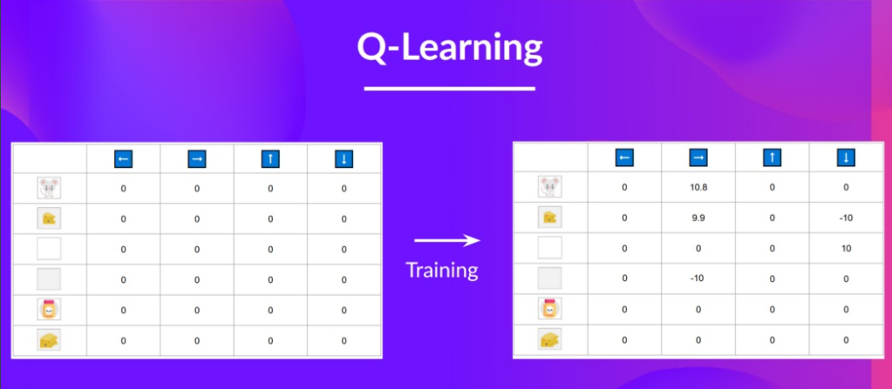]

Con el entrenamiento, nuestra tabla Q mejora, ya que gracias a ella
podemos conocer el valor de cada par estado-acción.

---

class: middle, center, smaller

.width-60[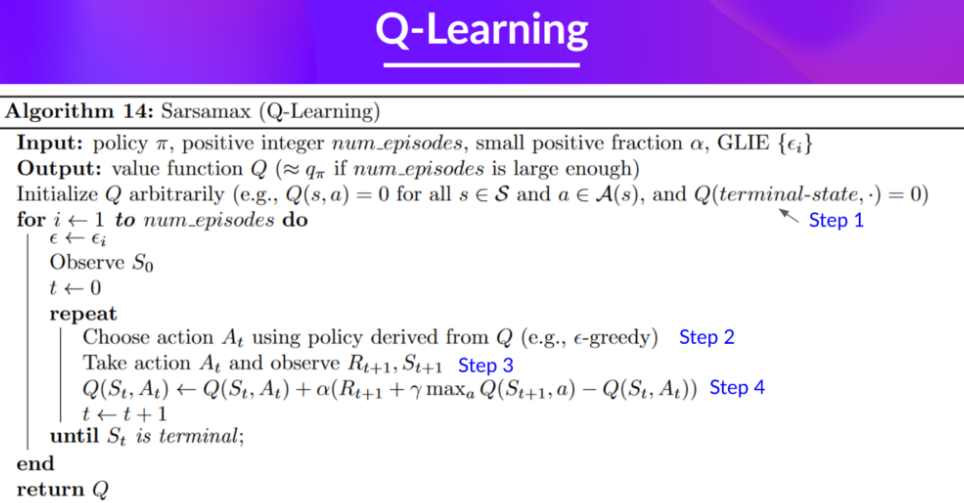]

.footnote[Sarsamax (Q-Learning) — Russell & Norvig, *AIMA*, notación de pseudocódigo estándar.]

---

class: middle, center, smaller

.width-50[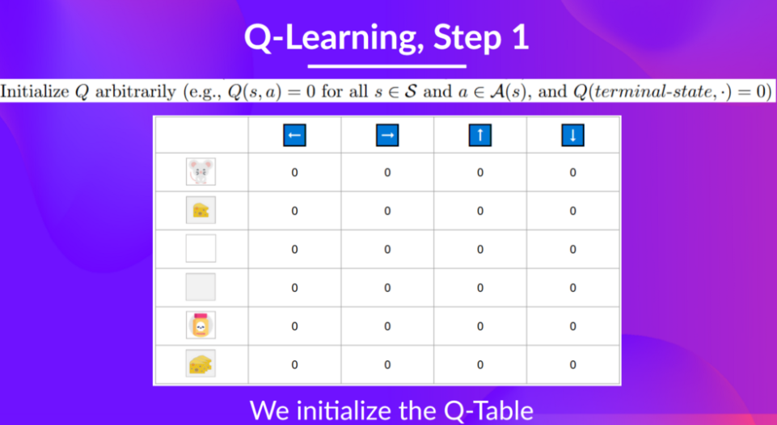]

Inicializamos $Q$ arbitrariamente (ej. $Q(s,a)=0$ para todo
$s \in \mathcal{S}$ y $a \in \mathcal{A}(s)$, y
$Q(\text{estado-terminal}, \cdot)=0$): inicializamos la tabla Q.

---

class: middle, center, smaller

.width-50[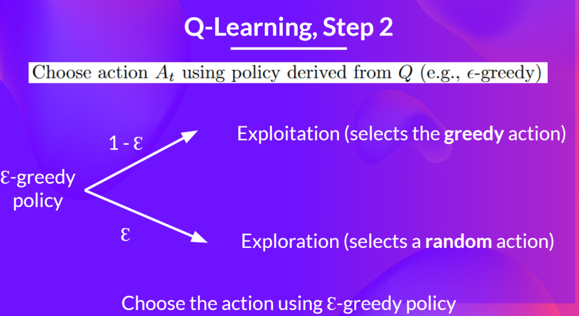]

Elegimos la acción $A_t$ usando una política derivada de $Q$ (ej.
$\epsilon$-greedy).

---

class: smaller

La estrategia .bold[epsilon-greedy] es una política que gestiona el
equilibrio entre exploración y explotación.

La idea es que, con un valor inicial de $\epsilon = 1.0$:

- Con una probabilidad de $1-\epsilon$: hacemos .bold[explotación] (es
  decir, nuestro agente selecciona la acción con el valor más alto para
  el par estado-acción).
- Con una probabilidad de $\epsilon$: hacemos .bold[exploración]
  (probando una acción aleatoria).

---

class: middle, smaller

Al comienzo del entrenamiento, .bold[la probabilidad de realizar
exploración será muy alta], ya que $\epsilon$ es muy alto, por lo que
la mayor parte del tiempo exploraremos.

.center.width-40[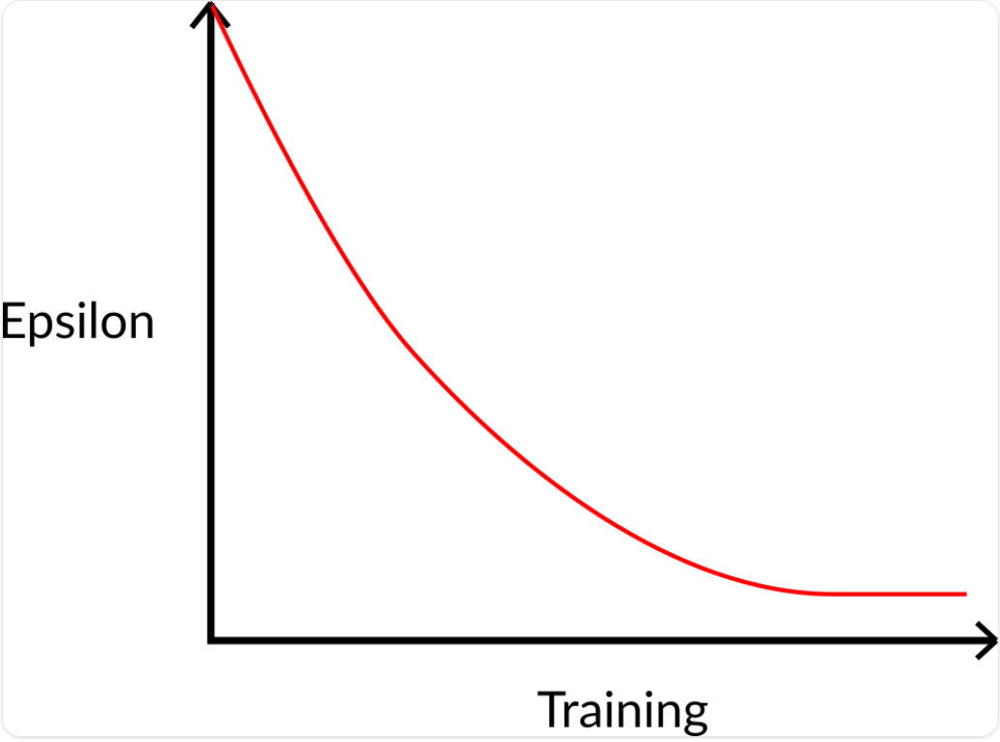]

---

class: middle, center, smaller

Ejecutamos la acción $A_t$ y observamos $R_{t+1}, S_{t+1}$.

.width-50[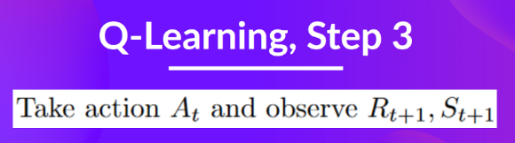]

---

class: middle, smaller

## Paso 4: actualizar $Q(S_t, A_t)$

.center.width-60[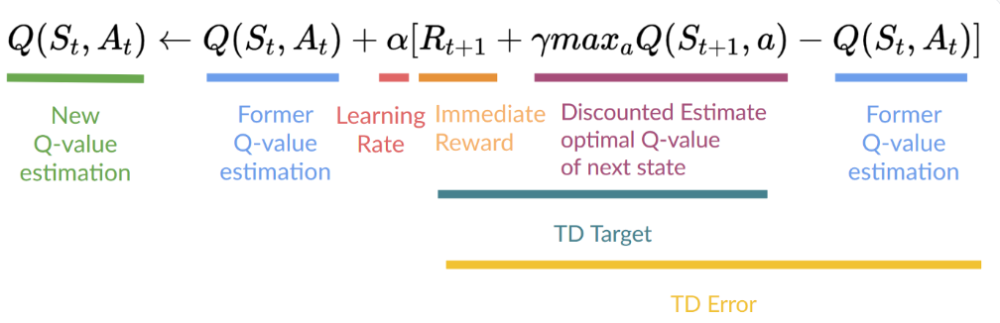]

$$Q(S_t,A_t) \leftarrow Q(S_t,A_t) + \alpha\big[R_{t+1} + \gamma \max_a Q(S_{t+1},a) - Q(S_t,A_t)\big]$$

---

class: smaller

# Resumen

- Un agente de RL aprende su comportamiento por .bold[prueba y error],
  a partir de recompensas — no se le dice de antemano cuál es la
  política correcta.
- .bold[Política] $\pi$: la función que decide qué acción tomar. Se
  puede entrenar .italic[directamente] (métodos basados en políticas) o
  derivarse de una función de valor (métodos basados en valores).
- La .bold[ecuación de Bellman] evita recalcular el retorno completo
  para cada estado: $V(s) = R_{t+1} + \gamma V(S_{t+1})$.
- .bold[Q-Learning] entrena una tabla Q (valor de cada par
  estado-acción) actualizándola en .italic[cada paso], no al final del
  episodio.
- La política .bold[$\epsilon$-greedy] equilibra exploración
  (aleatoria) y explotación (la mejor acción según Q) — $\epsilon$
  empieza alto y decae con el entrenamiento.
- Con una tabla Q óptima, la política óptima es inmediata: tomar en
  cada estado la acción de mayor valor Q.

---

class: middle, center, end-slide
count: false

## Fin de la Clase 5

Próxima clase: Probabilidad, incertidumbre y redes bayesianas
