class: middle, center, title-slide

# SI3003 - Inteligencia Artificial

<div class="kicker">Clase 6 — Aprendizaje Supervisado: Árboles de Decisión</div>

<br><br>

???

La clase pasada el agente aprendía por prueba y error, sin que nadie
le dijera de antemano cuál era la acción correcta (RL). Hoy cambiamos
de escenario: el agente sí tiene ejemplos etiquetados — pares
(entrada, respuesta correcta) — y debe generalizar a partir de ellos.
Este es el marco del aprendizaje supervisado, y hoy lo instanciamos
con un modelo muy interpretable: los árboles de decisión. Cerramos con
una primera mirada a regresión lineal, que retomaremos más adelante.

---

class: smaller

# Aprendizaje: panorama general

.bold[Aprender] es el proceso de mejorar el desempeño de un agente a
partir de la experiencia (RL, la clase pasada, fue un ejemplo).

Hoy vemos:

- La idea general: .italic[generalización a partir de la experiencia].
- .bold[Aprendizaje supervisado]: clasificación con árboles de
  decisión; una primera mirada a regresión lineal.

.italic[Nota: esto es solo una fracción de las ideas de ML — más
adelante veremos aprendizaje bayesiano, perceptrones y redes
neuronales.]

---

class: smaller

# ¿Por qué aprender?

El bebé, asediado a la vez por ojos, oídos, nariz, piel y entrañas,
siente todo como una gran confusión zumbante y floreciente…

.footnote[William James, 1890]

Aprender es esencial en entornos desconocidos — cuando quien diseña al
agente no puede saberlo todo de antemano.

---

class: middle, smaller

En vez de intentar producir un programa que simule la mente adulta,
¿por qué no producir uno que simule la de un niño? Si este se somete
luego a un proceso de educación adecuado, se obtendría el cerebro
adulto. El cerebro del niño es como un cuaderno tal como se compra en
la papelería: poco mecanismo y muchas hojas en blanco.

.footnote[Alan Turing, 1950]

Aprender es útil como método de construcción de sistemas — exponer el
sistema a la realidad en lugar de intentar programarlo a mano. Además,
¡los humanos podemos saber hacer algo sin saber explicar cómo!

.center.width-70[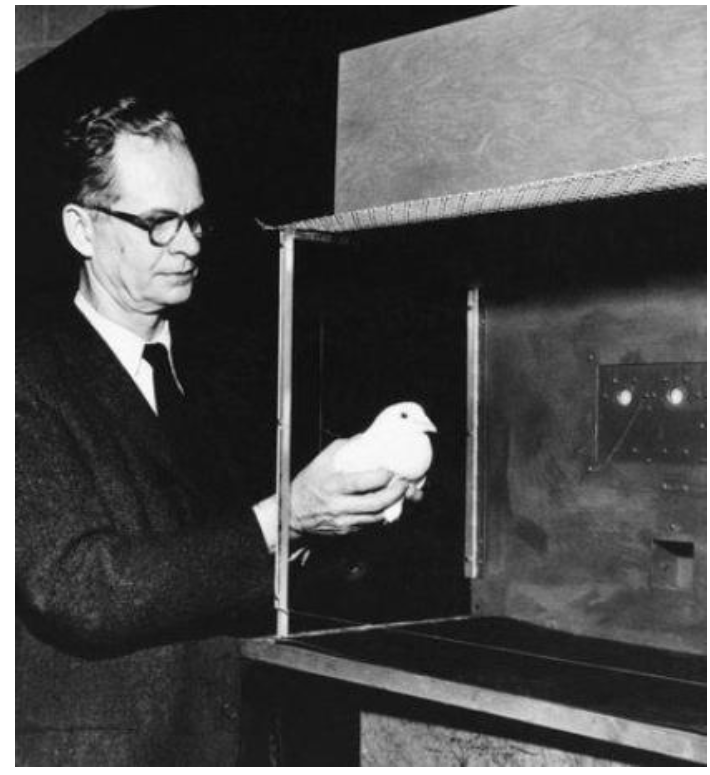]

---

class: middle, center, smaller

.width-90[]

.footnote[Frank Rosenblatt y el Mark I Perceptron, finales de los años 50.]

---

class: smaller

# Preguntas clave al construir un agente que aprende

- ¿Cuál es el diseño del agente que va a implementar el desempeño
  deseado?
- ¿Qué pieza del sistema quiero mejorar y cómo está representada?
- ¿Qué datos hay disponibles relevantes para esa pieza? (¿conocemos
  las respuestas correctas?)
- ¿Qué conocimiento previo ya está disponible?

---

class: smaller

# Tipos de aprendizaje

| Diseño de agente | Componente | Representación | Retroalimentación |
|---|---|---|---|
| Búsqueda MCTS | Función de evaluación | Polinomio lineal | Victoria/derrota |
| Agente MDP | Modelo de transición | Matriz de transición | Resultado de acciones |
| Chatbot | Predictor de la siguiente palabra | Transformer (red neuronal) | Palabra siguiente conocida |

- .bold[Aprendizaje supervisado]: respuesta correcta para cada
  instancia de entrenamiento.
- .bold[Aprendizaje por refuerzo]: secuencia de recompensas, sin
  respuestas correctas (Clase 5).
- .bold[Aprendizaje no supervisado]: "encontrarle sentido a los
  datos", sin ninguna etiqueta.

---

class: smaller

# Aprendizaje supervisado

Para aprender una función objetivo desconocida $f$:

- .bold[Entrada]: un conjunto de entrenamiento de ejemplos etiquetados
  $(x_j, y_j)$ donde $y_j = f(x_j)$.
  - Ej.: $x_j$ es una imagen, $f(x_j)$ es la etiqueta "jirafa".
- .bold[Salida]: una hipótesis $h$ "cercana" a $f$, es decir, que
  prediga bien sobre ejemplos nunca vistos (.italic[conjunto de
  prueba]).

Hay muchas familias de hipótesis posibles para $h$: modelos lineales,
regresión logística, redes neuronales, árboles de decisión,
vecino-más-cercano, gramáticas, etc.

- .bold[Clasificación] = aprender $f$ con salida de valor discreto.
- .bold[Regresión] = aprender $f$ con salida de valor real.

---

class: middle, center, smaller

# Ejemplo de clasificación: reconocimiento de objetos

.width-90[]

---

class: middle, center, smaller

# Ejemplo de regresión: ajuste de curvas

.width-55[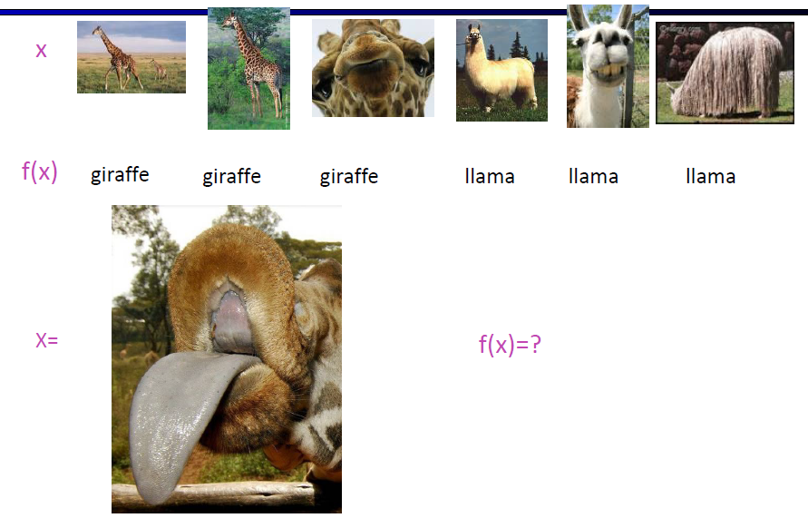]

---

class: middle, center, smaller

.width-55[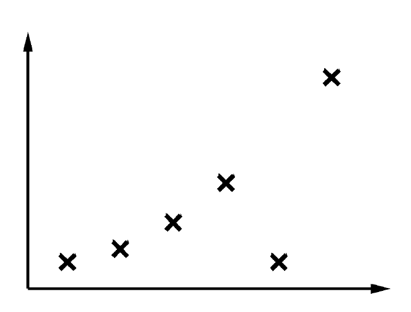]

---

class: middle, center, smaller

.width-55[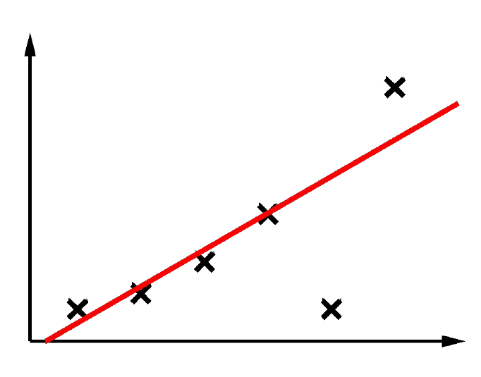]

---

class: middle, center, smaller

.width-55[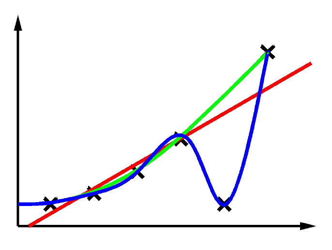]

---

class: smaller

# Preguntas básicas

- ¿Qué espacio de hipótesis $H$ elegir?
- ¿Cómo medir el grado de ajuste?
- ¿Cómo equilibrar ajuste vs. complejidad? — la .bold[navaja de
  Occam].
- ¿Cómo encontramos una buena $h$?
- ¿Cómo sabemos si una buena $h$ va a predecir bien sobre datos
  nuevos?

---

class: middle, center, smaller

.width-45[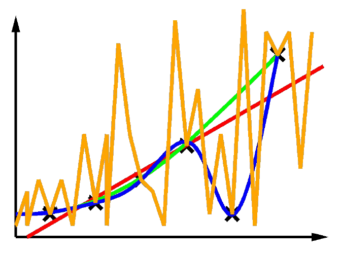]

# Clasificación

---

class: smaller

# Ejemplo: filtro de spam

- .bold[Entrada]: un correo. .bold[Salida]: spam / ham.
- .bold[Setup]: coleccionar muchos correos etiquetados a mano;
  aprender a predecir la etiqueta de correos nuevos. Los filtros de
  spam rechazan 200 mil millones de correos spam al día.
- .bold[Features] (atributos usados para decidir spam/ham):
  - Palabras: FREE!
  - Patrones de texto: $dd, MAYÚSCULAS
  - No-texto: remitente en contactos, enlace-ancla no coincide

.center.width-55[]

---

class: smaller

# Ejemplo: reconocimiento de dígitos

- .bold[Entrada]: imágenes / grillas de píxeles. .bold[Salida]: un
  dígito 0-9.
- .bold[Setup]: MNIST, 60 mil imágenes etiquetadas a mano — alguien
  tuvo que etiquetar todo eso. Queremos predecir dígitos nuevos.
- .bold[Features]: píxel (6,8)=ON; patrones de forma (número de
  componentes, aspect ratio, número de loops); mapas de filtros…

.center.width-40[]

---

class: smaller

# Otras tareas de clasificación

- Diagnóstico médico: síntomas → enfermedad
- Calificación automática de ensayos: documento → nota
- Detección de fraude: actividad de cuenta → fraude / no fraude
- Enrutamiento de correo: queja de cliente → departamento
- Inspección de frutas y verduras: imagen (o análisis de gas) →
  mohoso / OK
- … muchas más

.center.width-45[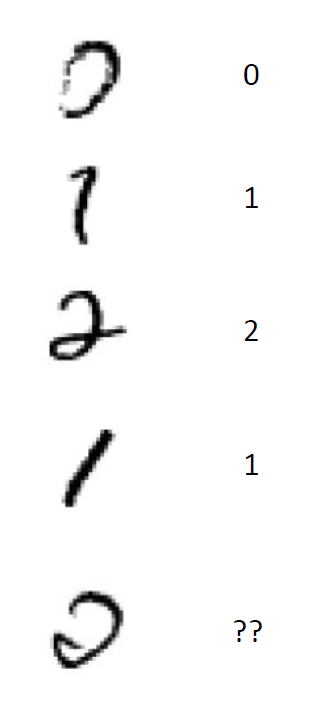]

---

class: middle, center, title-slide

# Árboles de Decisión

.italic[Modelos de árbol · Construcción del árbol · Medir el desempeño]

---

class: smaller

# Árboles de decisión

Representación popular para clasificadores — ¡incluso entre humanos!

Acabo de llegar a un restaurante: ¿debería esperar por una mesa o irme
a otro lado?

.center.width-70[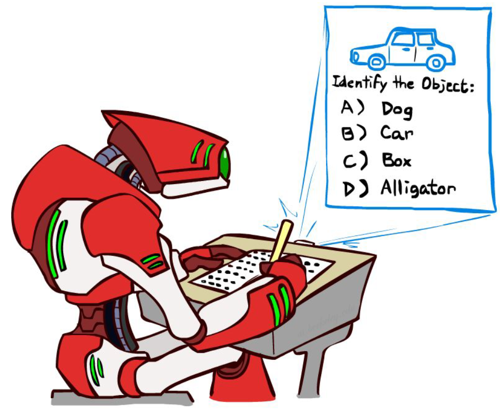]

---

class: smaller

Es viernes en la noche y tengo hambre. Llego a mi lugar de
hamburguesas barato pero muy popular. Está lleno y no tengo reserva,
pero hay una barra. El anfitrión estima 45 minutos de espera. Hay
alternativas cerca pero está lloviendo afuera.

.bold[El árbol de decisión particiona] el espacio de entradas y le
asigna una etiqueta a cada partición.

.center.width-70[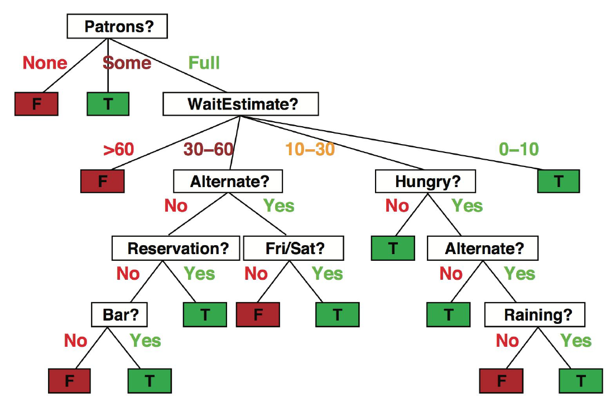]

---

class: smaller

# Expresividad

Los árboles de decisión discretos pueden expresar .bold[cualquier
función] de la entrada.

Ej.: para funciones booleanas, se construye un camino de la raíz a una
hoja por cada fila de la tabla de verdad ($A \text{ xor } B$):

.center.width-65[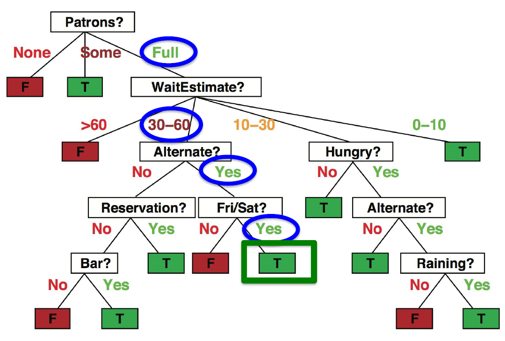]

Trivialmente existe un árbol de decisión consistente que ajusta
exactamente cualquier conjunto de entrenamiento (a menos que la
función real sea no-determinista). Pero un árbol que solo memoriza los
ejemplos es, en esencia, una tabla de búsqueda. Para generalizar a
ejemplos nuevos necesitamos un árbol .bold[compacto].

---

class: smaller

# Quiz

¿Cuántos árboles de decisión distintos hay con $n$ atributos
booleanos?

- = número de funciones booleanas distintas con $n$ entradas
- = número de tablas de verdad con $n$ entradas
- = número de formas de llenar la columna de salida con $2^n$
  entradas
- $= 2^{2^n}$

Para $n=6$ atributos, hay $18{,}446{,}744{,}073{,}709{,}551{,}616$
árboles posibles.

---

class: smaller

# Espacios de hipótesis, en general

Aumentar la expresividad del lenguaje de hipótesis:

- Aumenta la probabilidad de que la función real pueda expresarse.
- Aumenta el número de hipótesis consistentes con el conjunto de
  entrenamiento ⟹ muchas hipótesis consistentes pueden tener error de
  prueba alto ⟹ ¡puede reducir la precisión de predicción!

Con $2^{2^n}$ hipótesis, casi todas requerirán $O(2^n)$ bits para
expresarse en cualquier representación (¡incluso en un cerebro!). Es
decir, ninguna representación comprime todas las hipótesis: los
árboles de decisión, por ejemplo, son malos para funciones "k-de-n".

---

class: middle, center, smaller

# Datos de entrenamiento

.width-100[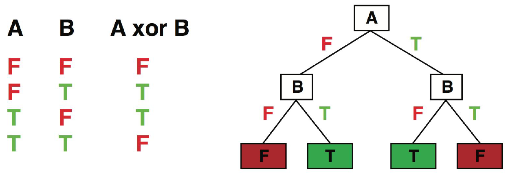]

---

class: smaller

# Aprendizaje de árboles de decisión

```text
function Decision-Tree-Learning(examples, attributes, parent_examples) returns a tree
  if examples is empty then return Plurality-Value(parent_examples)
  else if all examples have the same classification then return the classification
  else if attributes is empty then return Plurality-Value(examples)
  else
    A ← argmax_{a in attributes} Importance(a, examples)
    tree ← a new decision tree with root test A
    for each value v of A do
      exs ← the subset of examples with value v for attribute A
      subtree ← Decision-Tree-Learning(exs, attributes − A, examples)
      add a branch to tree with label (A = v) and subtree subtree
  return tree
```

.footnote[Russell & Norvig, *AIMA*, notación de pseudocódigo estándar.]

---

class: smaller

# Eligiendo un atributo: ganancia de información

Idea: medir la contribución de un atributo a aumentar la "pureza" de
las etiquetas en cada subconjunto de ejemplos.

.center.width-80[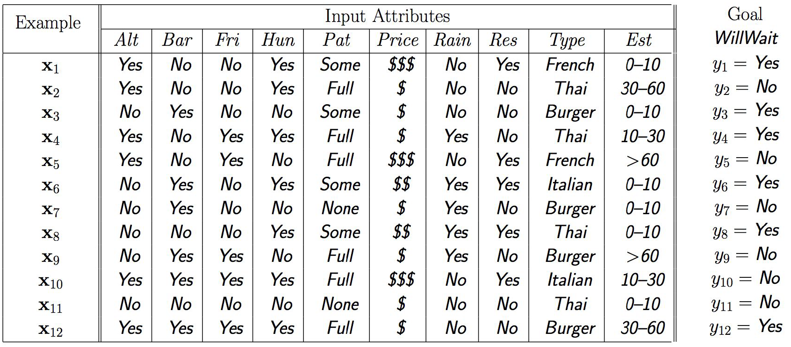]

.bold[Patrons] es mejor elección: da .italic[información] sobre la
clasificación (reduce la .bold[entropía] de la distribución de
etiquetas). .bold[Type] no reduce nada la incertidumbre.

---

class: smaller

# Información

La información responde preguntas. Entre más "en blanco" esté yo sobre
la respuesta inicialmente, más información contiene la respuesta.

Escala: 1 bit = respuesta a una pregunta booleana con prior
$\langle 0.5, 0.5 \rangle$.

La información de una respuesta cuando el prior es
$\langle p_1, \dots, p_n \rangle$ es:

$$H(\langle p_1,\dots,p_n\rangle) = \sum_i -p_i \log p_i$$

Esto es la .bold[entropía] del prior. Notación conveniente:
$B(p) = H(\langle p, 1-p\rangle)$.

---

class: smaller

# Ganancia de información al dividir por un atributo

Supongamos $p$ ejemplos positivos y $n$ negativos en la raíz:

- ⟹ se necesitan $B(p/(p+n))$ bits para clasificar un ejemplo nuevo.
- Ej.: para los 12 ejemplos del restaurante, $p=n=6$, así que
  necesitamos 1 bit.

Un atributo divide los ejemplos $E$ en subconjuntos $E_k$, cada uno
(esperamos) necesita menos información:

- Para un ejemplo en $E_k$ esperamos necesitar $B(p_k/(p_k+n_k))$ bits
  más.
- Probabilidad de que un ejemplo nuevo caiga en $E_k$:
  $(p_k+n_k)/(p+n)$.
- Número .italic[esperado] de bits tras dividir:
  $\sum_k (p_k+n_k)/(p+n)\, B(p_k/(p_k+n_k))$.

$$\text{Ganancia de información} = B(p/(p+n)) - \sum_k \frac{p_k+n_k}{p+n}\, B\!\left(\frac{p_k}{p_k+n_k}\right)$$

---

class: smaller

# Ejemplo

Para .bold[Patrons]:

$$1 - \left[\tfrac{2}{12}B(0) + \tfrac{4}{12}B(1) + \tfrac{6}{12}B(2/6)\right] = 0.541 \text{ bits}$$

Para .bold[Type]:

$$1 - \left[\tfrac{2}{12}B(\tfrac12) + \tfrac{2}{12}B(\tfrac12) + \tfrac{4}{12}B(\tfrac26) + \tfrac{4}{12}B(\tfrac12)\right] = 0 \text{ bits}$$

Patrons gana casi toda la información posible en un solo paso; Type no
gana nada.

---

class: middle, center, smaller

# Resultado sobre los datos del restaurante

.width-70[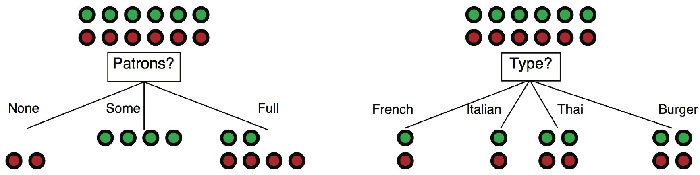]

Árbol aprendido a partir de los 12 ejemplos: .bold[más simple] que el
árbol "verdadero" que vimos al inicio.

---

class: middle, center, smaller

# Entrenamiento y prueba

.width-85[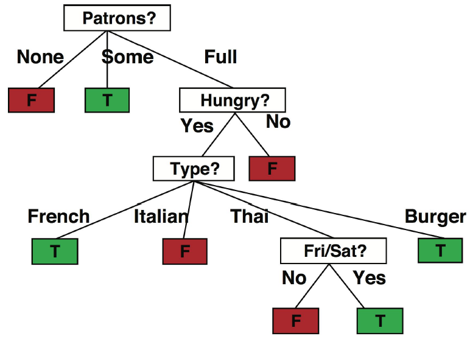]

---

class: smaller

# Conceptos básicos

Datos: instancias etiquetadas (ej. episodios de restaurante):

- .bold[Conjunto de entrenamiento]
- .bold[Conjunto de validación]
- .bold[Conjunto de prueba]

Ciclo de experimentación:

- Generar una hipótesis $h$ a partir del conjunto de entrenamiento.
- (Posiblemente elegir la mejor $h$ probándola en el conjunto de
  validación.)
- Finalmente, calcular la precisión de $h$ sobre el conjunto de
  prueba.
- Muy importante: .bold[nunca espiar el conjunto de prueba]!

Evaluación:

- .bold[Precisión]: fracción de instancias predichas correctamente.
- .bold[Curva de aprendizaje]: precisión sobre el conjunto de prueba
  en función del tamaño del conjunto de entrenamiento.

---

class: middle, center, smaller

# Resultado sobre los datos del restaurante

.width-70[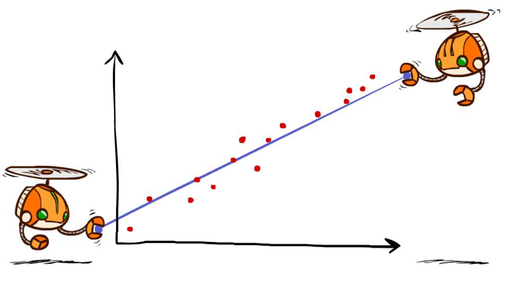]

.footnote[Curva ilustrativa generada para esta clase — la forma (subida rápida y luego estabilización con ruido) reproduce la tendencia típica reportada en AIMA/CS188 para este mismo experimento.]

---

class: middle, center, title-slide

# Regresión Lineal

.italic[Un primer vistazo — la retomaremos más adelante]

---

class: middle, center, smaller

.width-60[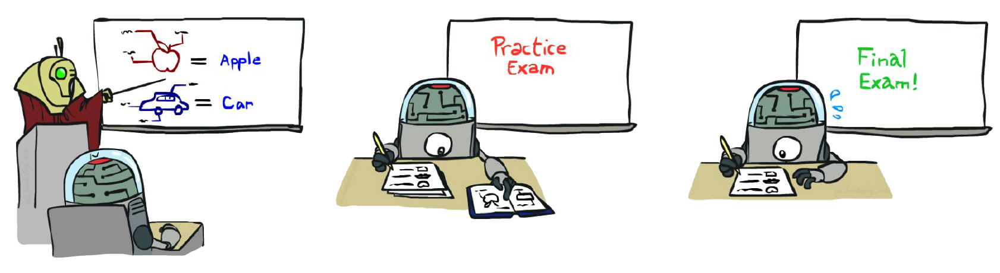]

---

class: smaller

# Regresión lineal = ajustar una línea recta / hiperplano

.center.width-70[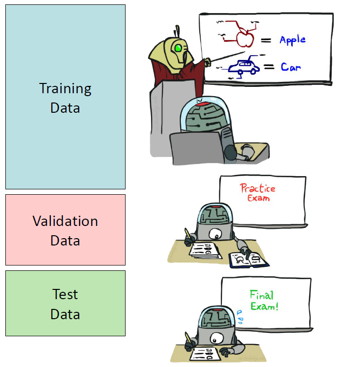]

Predicción: $h_w(x) = w_0 + w_1 x$

---

class: smaller

# Error de predicción

.center.width-80[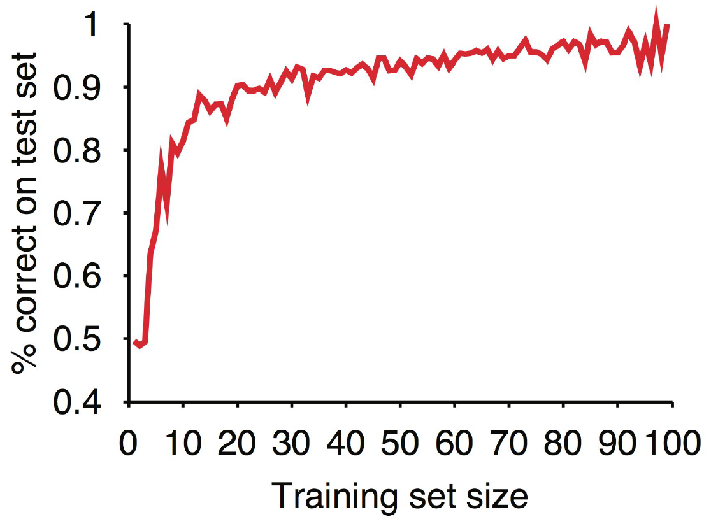]

Error en una instancia: $y - h_w(x)$ — la diferencia entre lo
.bold[observado] y lo .bold[predicho] se llama .italic[residual].

---

class: smaller

# Mínimos cuadrados: minimizar el error cuadrático

Función de pérdida $L_2$: suma de errores al cuadrado sobre todos los
ejemplos:

$$\text{Loss} = \sum_j \big(y_j - h_w(x_j)\big)^2 = \sum_j \big(y_j - (w_0 + w_1 x_j)\big)^2$$

Queremos los pesos $w^*$ que minimizan la pérdida. En $w^*$ las
derivadas de la pérdida respecto a cada peso son cero, lo que da
soluciones exactas para $N$ ejemplos:

$$w_1 = \frac{N\sum_j x_j y_j - (\sum_j x_j)(\sum_j y_j)}{N\sum_j x_j^2 - (\sum_j x_j)^2}, \qquad w_0 = \frac{1}{N}\Big[\sum_j y_j - w_1 \sum_j x_j\Big]$$

Para el caso general con $x$ vector de $n$ dimensiones: $X$ es la
matriz de datos (un ejemplo por fila), $y$ la columna de etiquetas:

$$w^* = (X^TX)^{-1}X^Ty$$

---

class: smaller

# Resumen

- Aprender es esencial en entornos desconocidos, y útil en muchos
  otros. La naturaleza del proceso depende del diseño del agente, qué
  pieza se quiere mejorar, y qué datos/conocimiento previo hay
  disponibles.
- .bold[Aprendizaje supervisado]: aprender una función a partir de
  ejemplos etiquetados. Hipótesis .italic[concisas] generalizan mejor
  — hay que equilibrar concisión y precisión (navaja de Occam).
- .bold[Clasificación]: función de valor discreto — ej. árboles de
  decisión.
- .bold[Árboles de decisión]: se construyen eligiendo en cada paso el
  atributo que .italic[maximiza la ganancia de información] (mínima
  entropía residual). Pueden expresar cualquier función, pero hay que
  preferir árboles .bold[compactos] para generalizar.
- .bold[Entrenamiento/validación/prueba]: nunca evaluar generalización
  con datos ya vistos en entrenamiento.
- .bold[Regresión]: función de valor real — ej. regresión lineal,
  ajustada minimizando el error cuadrático ($L_2$ loss).

---

class: middle, center, end-slide
count: false

## Fin de la Clase 6

