class: middle, center, title-slide

# SI3003 - Inteligencia Artificial

Clase 6 — Aprendizaje Supervisado: Árboles de Decisión

  

.center.width-40[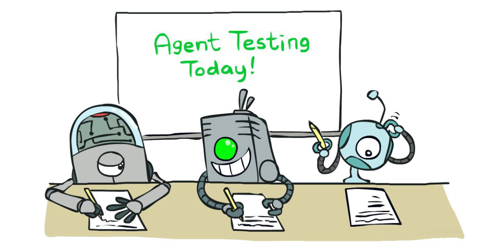]

???

La clase pasada el agente aprendía por prueba y error, sin que nadie
le dijera de antemano cuál era la acción correcta (RL). Hoy cambiamos
de escenario: el agente sí tiene ejemplos etiquetados — pares
(entrada, respuesta correcta) — y debe generalizar a partir de ellos.
Este es el marco del aprendizaje supervisado, y hoy lo instanciamos
con un modelo muy interpretable: los árboles de decisión. Cerramos con
una primera mirada a regresión lineal, que retomaremos más adelante.

---

class: smaller

### Aprendizaje: panorama general

.bold[Aprender] es el proceso de mejorar el desempeño de un agente a
partir de la experiencia (RL, la clase pasada, fue un ejemplo).

Hoy vemos:

- La idea general: .italic[generalización a partir de la experiencia].
- .bold[Aprendizaje supervisado]: clasificación con árboles de
  decisión; una primera mirada a regresión lineal.

---

class: smaller

### ¿Por qué aprender?

- El bebé, asediado a la vez por ojos, oídos, nariz, piel y entrañas,
siente todo como una gran confusión zumbante y floreciente…

.footnote[William James, 1890]

Aprender es esencial en entornos desconocidos — cuando quien diseña al
agente no puede saberlo todo de antemano.

.center.width-70[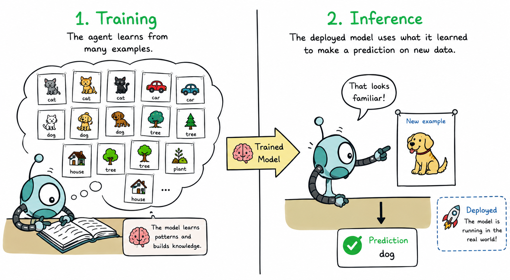]

---

class: middle, smaller

### ¿Por qué aprender?

En vez de intentar producir un programa que simule la mente adulta,
¿por qué no producir uno que simule la de un niño? Si este se somete
luego a un proceso de educación adecuado, se obtendría el cerebro
adulto. El cerebro del niño es como un cuaderno tal como se compra en
la papelería: poco mecanismo y muchas hojas en blanco.

.footnote[Alan Turing, 1950]

Aprender es útil como método de construcción de sistemas — exponer el
sistema a la realidad en lugar de intentar programarlo a mano. Además,
¡los humanos podemos saber hacer algo sin saber explicar cómo!

.center.width-40[]

---

class: middle, center, smaller

### ¿Cómo aprender?

.width-90[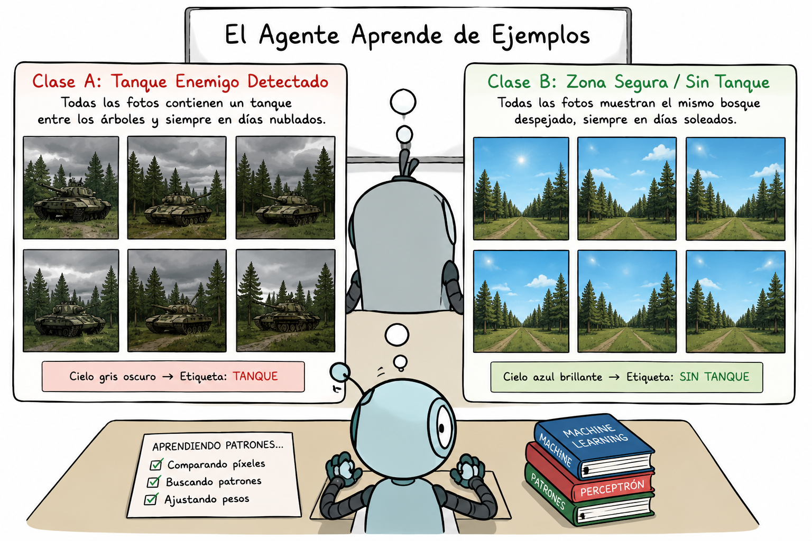]

.footnote[Frank Rosenblatt y el Mark I Perceptron, finales de los años 50.]

---

class: smaller

### Preguntas clave al construir un agente que aprende

- ¿Cuál es el diseño del agente que va a implementar el desempeño
  deseado?
- ¿Qué pieza del sistema quiero mejorar y cómo está representada?
- ¿Qué datos hay disponibles relevantes para esa pieza? (¿conocemos
  las respuestas correctas?)
- ¿Qué conocimiento previo ya está disponible?

---

class: smaller

### Tipos de aprendizaje

<table style="
  width: 100%;
  border-collapse: separate;
  border-spacing: 0;
  border: 1px solid #d9e2ec;
  border-radius: 10px;
  overflow: hidden;
  box-shadow: 0 2px 8px rgba(0,0,0,0.06);
  font-size: 12px;
">

  <thead>
    <tr style="background: #243b53; color: white;">
      <th style="padding: 14px 16px; text-align: left;">Agent design</th>
      <th style="padding: 14px 16px; text-align: left;">Component</th>
      <th style="padding: 14px 16px; text-align: left;">Representation</th>
      <th style="padding: 14px 16px; text-align: left;">Feedback</th>
      <th style="padding: 14px 16px; text-align: left;">Knowledge</th>
    </tr>
  </thead>

  <tbody>

    <tr style="background: #f7fafc;">
      <td style="padding: 14px 16px; font-weight: 700; color: #102a43;">
        MCTS search
      </td>
      <td style="padding: 14px 16px;">
        Evaluation function
      </td>
      <td style="padding: 14px 16px;">
        Linear polynomial
      </td>
      <td style="padding: 14px 16px;">
        Win / loss
      </td>
      <td style="padding: 14px 16px;">
        Rules of the game
      </td>
    </tr>

    <tr style="background: white;">
      <td style="padding: 14px 16px; font-weight: 700; color: #102a43;">
        MDP agent
      </td>
      <td style="padding: 14px 16px;">
        Transition model 
        
          observable environment
        
      </td>
      <td style="padding: 14px 16px;">
        Transition matrix
      </td>
      <td style="padding: 14px 16px;">
        Action outcomes
      </td>
      <td style="padding: 14px 16px;">
        Available actions, possible states
      </td>
    </tr>

    <tr style="background: #f7fafc;">
      <td style="padding: 14px 16px; font-weight: 700; color: #102a43;">
        Utility-based patient monitor
      </td>
      <td style="padding: 14px 16px;">
        Physiology / sensor model
      </td>
      <td style="padding: 14px 16px;">
        Dynamic Bayesian network
      </td>
      <td style="padding: 14px 16px;">
        Observation sequences
      </td>
      <td style="padding: 14px 16px;">
        Human physiology; 
        sensor design
      </td>
    </tr>

    <tr style="background: white;">
      <td style="padding: 14px 16px; font-weight: 700; color: #102a43;">
        Chatbot
      </td>
      <td style="padding: 14px 16px;">
        Context-based word predictor
      </td>
      <td style="padding: 14px 16px;">
        Transformer 
        
          deep neural network
        
      </td>
      <td style="padding: 14px 16px;">
        Known next word
      </td>
      <td style="padding: 14px 16px;">
        Tokenization, vector space
      </td>
    </tr>

  </tbody>
</table>

  Different agent designs require different representations, feedback signals,
  and prior knowledge.

- .bold[Aprendizaje supervisado]: respuesta correcta para cada
  instancia de entrenamiento.
- .bold[Aprendizaje por refuerzo]: secuencia de recompensas, sin
  respuestas correctas (Clase 5).
- .bold[Aprendizaje no supervisado]: "encontrarle sentido a los
  datos", sin ninguna etiqueta.

---

class: smaller

### Aprendizaje supervisado

.width-100[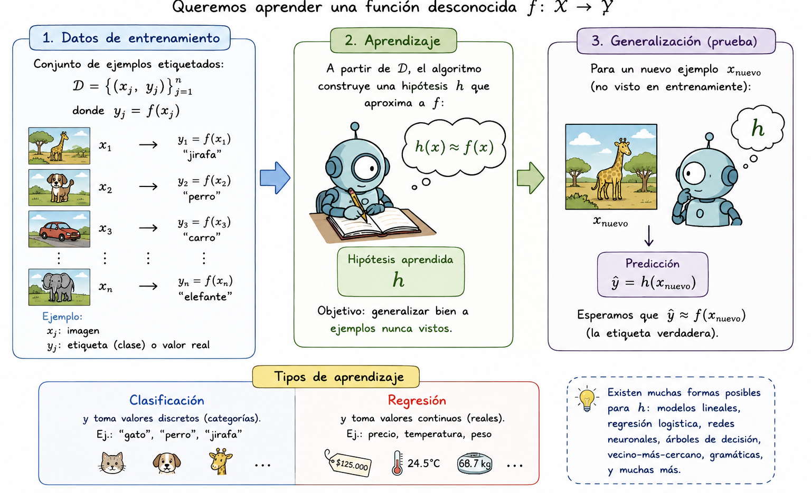]

---

class: middle, center, smaller

### Ejemplo de clasificación

.width-100[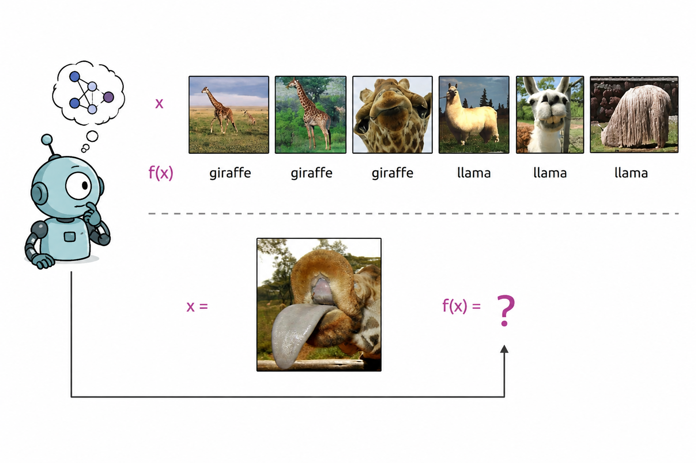]

---

class: middle, center, smaller

### Ejemplo de regresión

.width-100[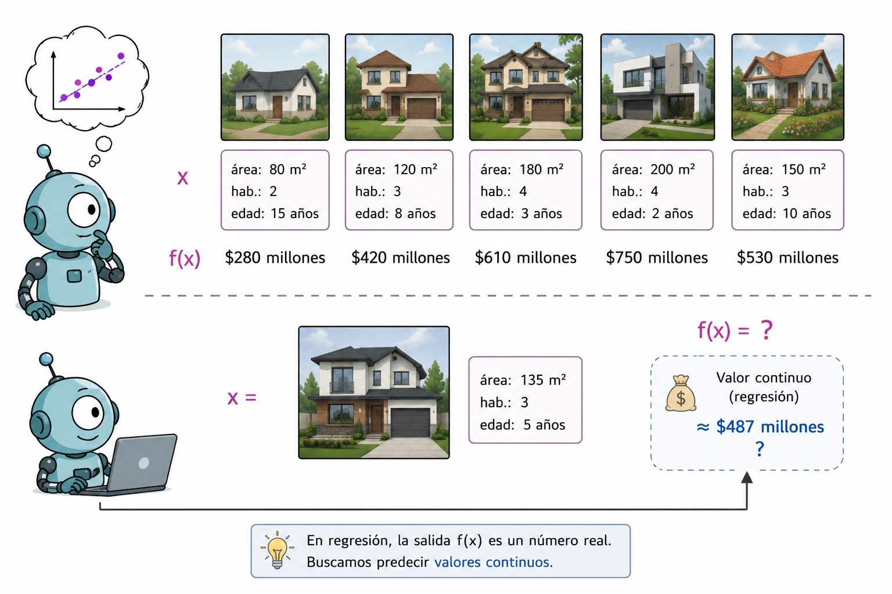]

---

class: middle, center, smaller

### Características

.width-100[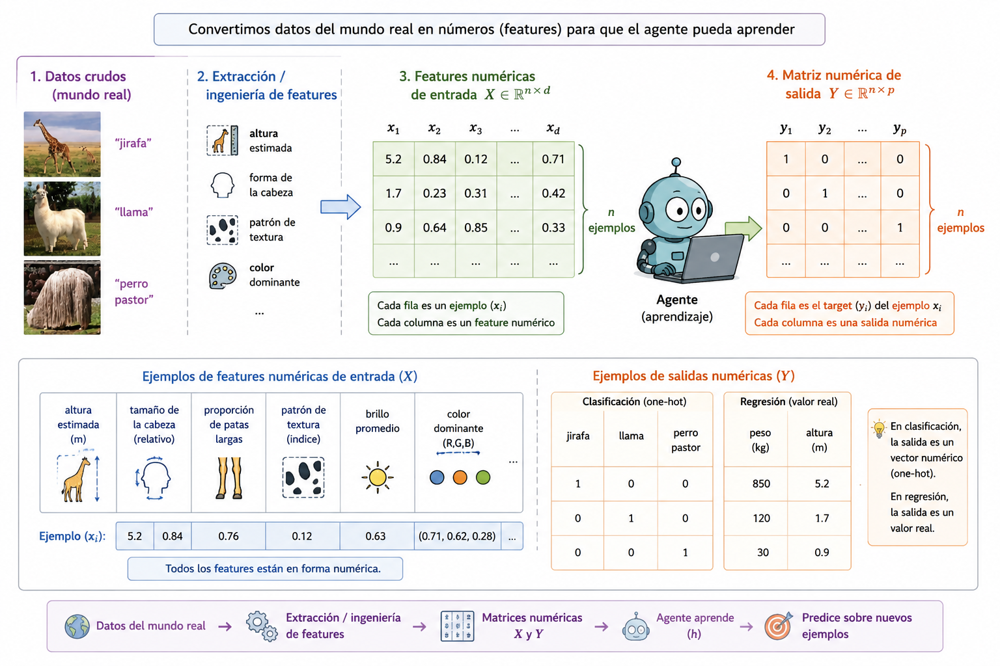]

---

### Pre-procesamiento

.width-100[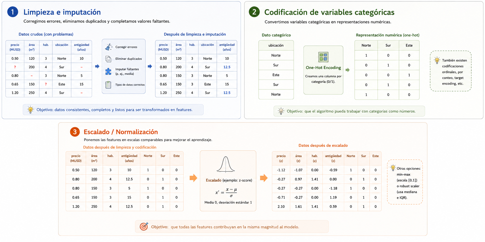]

---

class: smaller

### Preguntas básicas

- ¿Qué espacio de hipótesis $H$ elegir?
- ¿Cómo medir el grado de ajuste?
- ¿Cómo equilibrar ajuste vs. complejidad? — la navaja de
  Occam.
- ¿Cómo encontramos una buena $h$?
- ¿Cómo sabemos si una buena $h$ va a predecir bien sobre datos
  nuevos?

---

class: middle, center, smaller

### Sub/Sobre ajuste

.width-100[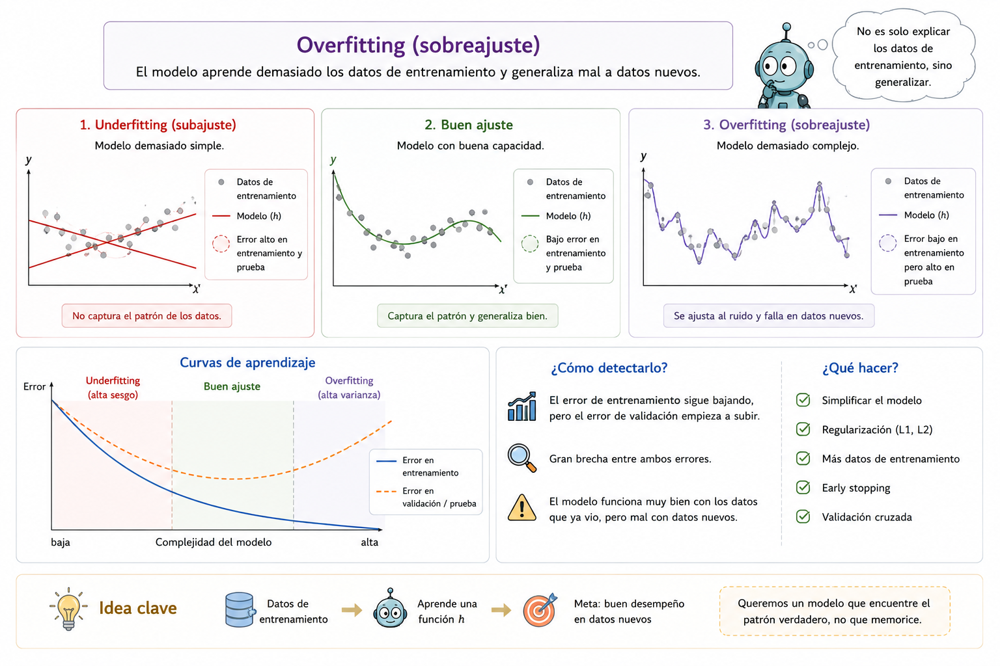]

---

class: middle, center, smaller

### Validación cruzada

.width-100[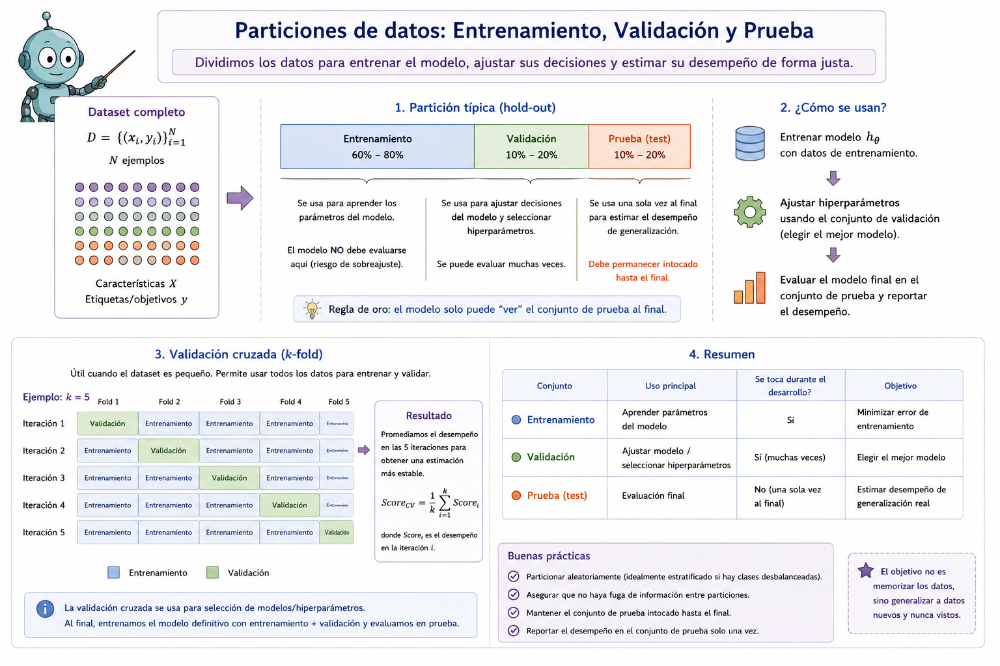]

---

class: smaller

### Ejemplo: filtro de spam

.grid.grid-middle[
.kol-3-5[

.bold[Entrada:] un correo electrónico  
.bold[Salida:] **spam / ham**

 .bold[¿Cómo aprende?]

 Coleccionamos muchos correos etiquetados manualmente y aprendemos a predecir la etiqueta de **correos nuevos**.

.bold[Features]

El correo debe convertirse en atributos que el modelo pueda utilizar:

- .bold[Palabras:] `FREE!`, `WINNER`, `URGENT`
- .bold[Patrones:] `$$$`, MAYÚSCULAS, muchos `!`
- .bold[Metadatos:] remitente conocido o desconocido
- .bold[Enlaces:] texto del enlace ≠ destino real

]

.kol-2-5[
$$
(x_i, y_i)
$$
.center[
.width-100[

]
]
Los filtros de spam rechazan alrededor de **200 mil millones de correos spam al día**.
]
]

---

class: smaller

### Ejemplo: reconocimiento de dígitos

.grid.grid-top[

.kol-3-5[

.bold[¿Cómo aprende?]

Usamos un conjunto de ejemplos etiquetados:

.bold[MNIST:] 60 mil imágenes de entrenamiento.

El objetivo es predecir correctamente el dígito de una **imagen nueva**.

.bold[Features]

La imagen debe representarse mediante atributos numéricos:

- .bold[Píxeles:] intensidad en cada posición
- .bold[Forma:] proporciones, componentes, número de loops
- .bold[Patrones locales:] bordes, trazos, curvas
- .bold[Representaciones aprendidas:] mapas de activación / filtros

]

.kol-2-5[

.bold[Entrada:] imagen / grilla de píxeles  

.bold[Salida:] un dígito entre **0 y 9**

.center[

.width-80[

]

]

]

]

---

class: smaller

### Otras tareas de clasificación

.grid.grid-top[

.kol-3-5[

- .bold[Diagnóstico médico:]  
  síntomas → enfermedad

- .bold[Calificación automática de ensayos:]  
  documento → categoría / nota

- .bold[Detección de fraude:]  
  actividad de cuenta → fraude / no fraude

- .bold[Enrutamiento de correo:]  
  queja de cliente → departamento

- .bold[Inspección de alimentos:]  
  imagen o sensores → mohoso / OK

 

.bold[En todos los casos:]

$$
x \longrightarrow h(x) \longrightarrow \hat{y}
$$

donde $\hat{y}$ pertenece a un conjunto de .bold[categorías posibles].

]

.kol-2-5[

.center.width-100[

]

]

]
---

class: middle, center, title-slide

# Árboles de Decisión

.italic[Modelos de árbol · Construcción del árbol · Medir el desempeño]

---

class: smaller

### Árboles de decisión

Representación popular para clasificadores — ¡incluso entre humanos!

Acabo de llegar a un restaurante: ¿debería esperar por una mesa o irme
a otro lado?

.center.width-70[]

---

class: smaller

### Expresividad

Los árboles de decisión discretos pueden expresar cualquier
función de la entrada.

Ej.: para funciones booleanas, se construye un camino de la raíz a una
hoja por cada fila de la tabla de verdad ($A \text{ xor } B$):

.center.width-60[]

Trivialmente existe un árbol de decisión consistente que ajusta
exactamente cualquier conjunto de entrenamiento (a menos que la
función real sea no-determinista). Pero un árbol que solo memoriza los
ejemplos es, en esencia, una tabla de búsqueda. Para generalizar a
ejemplos nuevos necesitamos un árbol .bold[compacto].

---

class: middle, center, smaller

# Datos de entrenamiento

.width-100[]

---

class: smaller

### Aprendizaje de árboles de decisión

Decision-Tree-Learning

CASOS BASE

<pre style="margin:0;font-family:'Consolas',monospace;font-size:11px;line-height:1.45;"><b>if</b> examples is empty
    <b>return</b> Plurality-Value(parent_examples)

<b>else if</b> all examples have the same classification
    <b>return</b> classification

<b>else if</b> attributes is empty
    <b>return</b> Plurality-Value(examples)</pre>

PASO RECURSIVO

<pre style="margin:0;font-family:'Consolas',monospace;font-size:11px;line-height:1.45;"><b>else</b>
    A ← argmax Importance(a, examples)

    tree ← new decision tree with root test A

    <b>for each</b> value v of A
        exs ← examples where A = v

        subtree ← Decision-Tree-Learning(
            exs,
            attributes − {A},
            examples
        )

        add branch (A = v) → subtree

<b>return</b> tree</pre>

.footnote[Russell & Norvig, *AIMA*, notación de pseudocódigo estándar.]

---

class: smaller

### Eligiendo un atributo: ganancia de información

Idea: medir la contribución de un atributo a aumentar la "pureza" de
las etiquetas en cada subconjunto de ejemplos.

.center.width-80[]

.bold[Patrons] es mejor elección: da .italic[información] sobre la
clasificación (reduce la .bold[entropía] de la distribución de
etiquetas). .bold[Type] no reduce nada la incertidumbre.

---

class: smaller

### Información y entropía

.grid.grid-middle[

.kol-3-5[

.bold[Idea]

La información mide cuánto reduce nuestra .bold[incertidumbre].

- Si casi sabemos la respuesta → poca información.
- Si estamos muy inseguros → mucha información.

.bold[Entropía multiclase]

Para $K$ clases con probabilidades  
$\langle p_1,\dots,p_K\rangle$:

$$
H(Y) =
-\sum_{k=1}^{K} p_k \log_2 p_k
$$

.bold[Caso binario]

$$
H(p)
=
-p\log_2 p
-(1-p)\log_2(1-p)
$$

]

.kol-2-5[

.bold[Intuición binaria]

$$
(0.5,0.5)
\rightarrow H=1
$$

.center[
Máxima incertidumbre
]

$$
(0.9,0.1)
\rightarrow H\approx0.47
$$

$$
(1,0)
\rightarrow H=0
$$

.bold[Multiclase]

$$
\left(\frac13,\frac13,\frac13\right)
\rightarrow
H=\log_2(3)\approx1.58
$$

.center[
.bold[Más incertidumbre  
$\Rightarrow$ mayor entropía]
]

]

]

---

class: smaller

### Ganancia de información

.grid.grid-top[

.kol-3-5[

.bold[Antes de dividir]

Tenemos un conjunto $E$ con clases mezcladas:

$$
H(E)=-\sum_c p(c)\log_2 p(c)
$$

Ejemplo: 6 positivos y 6 negativos

$$
H(E)=H(0.5,0.5)=1\text{ bit}
$$

.bold[Después de dividir por $A$]

$A$ separa los ejemplos en $E_1,\ldots,E_k$.

La entropía después del split es el
.bold[promedio ponderado] de las ramas:

$$
H(E\mid A)=
\sum_k
\frac{|E_k|}{|E|}
H(E_k)
$$

]

.kol-2-5[

.bold[Ganancia de información]

$$
\boxed{
Gain(A)=H(E)-H(E\mid A)
}
$$

.center[
¿Cuánta incertidumbre  
eliminó el atributo?
]

 

.bold[Gain alto]  
→ ramas más puras

.bold[Gain bajo]  
→ poca información

.bold[Gain = 0]  
→ no mejoró la separación

]

]

---

class: smaller

### Ejemplo

.center.width-80[]

Para .bold[Patrons]:

$$1 - \left[\tfrac{2}{12}B(0) + \tfrac{4}{12}B(1) + \tfrac{6}{12}B(2/6)\right] = 0.541 \text{ bits}$$

Para .bold[Type]:

$$1 - \left[\tfrac{2}{12}B(\tfrac12) + \tfrac{2}{12}B(\tfrac12) + \tfrac{4}{12}B(\tfrac26) + \tfrac{4}{12}B(\tfrac12)\right] = 0 \text{ bits}$$

Patrons gana casi toda la información posible en un solo paso; Type no
gana nada.

---

class: middle, center, smaller

### Resultado sobre los datos del restaurante

.width-70[]

Árbol aprendido a partir de los 12 ejemplos: .bold[más simple] que el
árbol "verdadero" que vimos al inicio.

---

class: middle, center, smaller

### Entrenamiento y prueba

.width-70[]

---

class: smaller

### Conceptos básicos

Datos: instancias etiquetadas (ej. episodios de restaurante):

- .bold[Conjunto de entrenamiento]
- .bold[Conjunto de validación]
- .bold[Conjunto de prueba]

Ciclo de experimentación:

- Generar una hipótesis $h$ a partir del conjunto de entrenamiento.
- (Posiblemente elegir la mejor $h$ probándola en el conjunto de
  validación.)
- Finalmente, calcular la precisión de $h$ sobre el conjunto de
  prueba.
- Muy importante: .bold[nunca espiar el conjunto de prueba]!

Evaluación:

- .bold[Precisión]: fracción de instancias predichas correctamente.
- .bold[Curva de aprendizaje]: precisión sobre el conjunto de prueba
  en función del tamaño del conjunto de entrenamiento.

---

class: middle, center, smaller

### Hiperparámetros árboles de decisión

.width-100[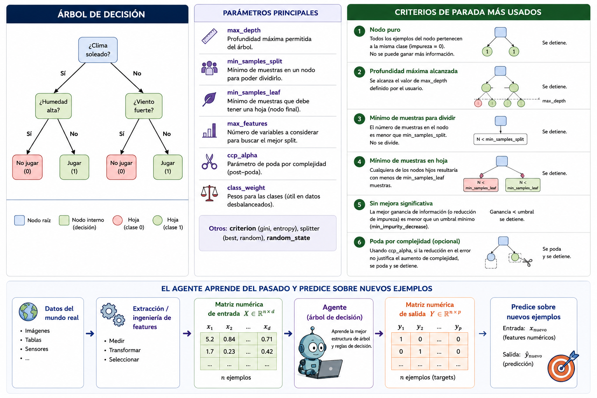]

---

class: smaller

### Regresión lineal = ajustar una línea recta / hiperplano

.center.width-70[]

Predicción: $h_w(x) = w_0 + w_1 x$

---

class: smaller

### Error de predicción

.center.width-80[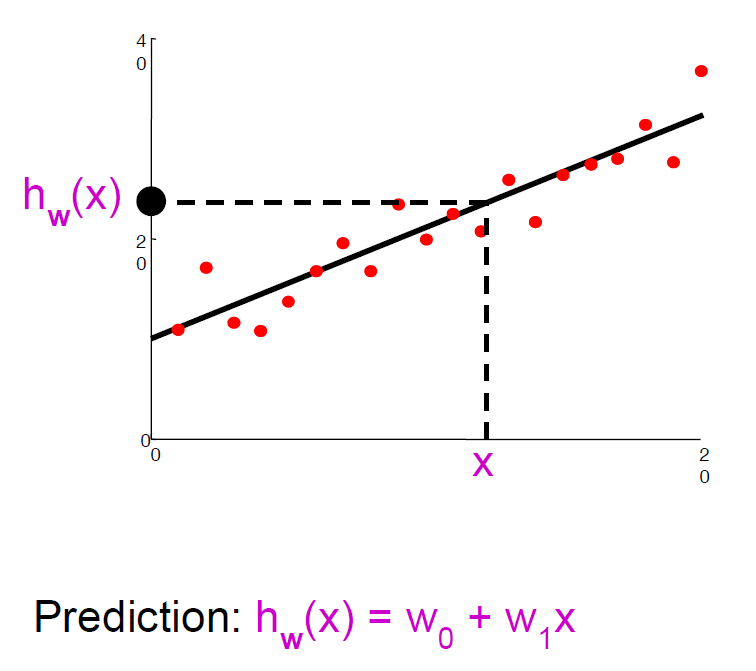]

Error en una instancia: $y - h_w(x)$ — la diferencia entre lo
.bold[observado] y lo .bold[predicho] se llama .italic[residual].

---

class: smaller

### Regresión lineal: función de pérdida

.grid.grid-middle[

.kol-3-5[

Para una recta:

$$
h_w(x)=w_0+w_1x
$$

medimos el error con la pérdida $L_2$:

$$
L(w_0,w_1)
=
\sum_j
\left(y_j-h_w(x_j)\right)^2
$$

$$
=
\sum_j
\left(y_j-(w_0+w_1x_j)\right)^2
$$

.bold[Objetivo:]

$$
w^*=\arg\min_w L(w)
$$

]

.kol-2-5[

En el mínimo:

$$
\frac{\partial L}{\partial w_0}=0
\qquad
\frac{\partial L}{\partial w_1}=0
$$

Esto permite encontrar una
.bold[solución exacta].

.center[
Datos → ajustar $w_0,w_1$ → menor error
]

]
]
---
class: smaller

### Regresión lineal: solución analítica

.grid.grid-middle[

.kol-3-5[

.bold[Una variable]

Para $N$ ejemplos:

$$
w_1 =
\frac{
N\sum_j x_jy_j
-
(\sum_jx_j)(\sum_jy_j)
}{
N\sum_jx_j^2
-
(\sum_jx_j)^2
}
$$

$$
w_0 =
\frac{1}{N}
\left[
\sum_jy_j-w_1\sum_jx_j
\right]
$$

]

.kol-2-5[

.bold[Caso general]

Si cada $x_j$ tiene $d$ features:

$$
X =
\left[
x_1^T,\;
x_2^T,\;
\ldots,\;
x_N^T
\right]^T
\in \mathbb{R}^{N\times d}
$$

Cada .bold[fila] es un ejemplo y cada
.bold[columna] es un feature.

La solución es:

$$
\boxed{
w^*=(X^TX)^{-1}X^Ty
}
$$

.center[
.bold[Ecuación normal]
]

]
]

---

class: smaller

.center.width-100[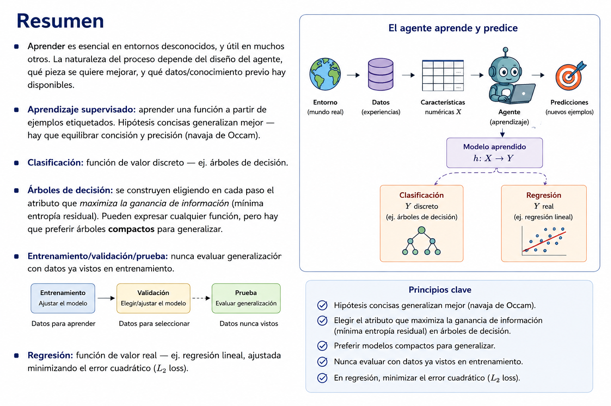]

---

class: middle, center, end-slide
count: false

## Fin de la Clase 6

